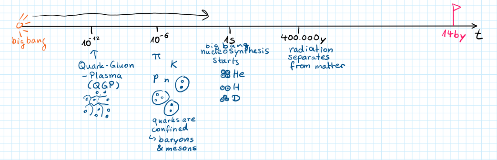
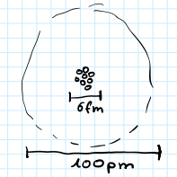
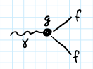
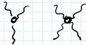
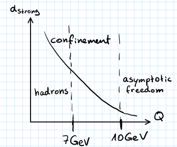

**Presenter**: 

**Note Taker**: 

## Introduction to Hadron Physics and Course Logistics

### Lecture 1: Introduction to Hadron Physics

This lecture introduces hadron physics — its origin, its role in the early universe, and the key concepts needed to understand matter formation.
#### Origin and Role in the Universe

Hadron physics emerged in the earliest stages of the universe and is crucial throughout its evolution. We will discuss how quark physics contributes to matter composition.
#### The Standard Model and Field Equations

We briefly survey the **Standard Model**, then introduce the equations that describe the motion of fields:

  $$\partial_\mu \left( \frac{\partial \mathcal{L}}{\partial (\partial_\mu \psi)} \right) - \frac{\partial \mathcal{L}}{\partial \psi} = 0$$  

This is the **Euler–Lagrange equation** for fields, the starting point for deriving dynamics from a Lagrangian.

### Gauge Groups and the Strong Interaction

We discuss **gauge groups** — the symmetry groups that define the fundamental interactions — and then move to the key property of the strong interaction: **confinement**. Confinement is the force that binds quarks into hadrons and is essential for matter formation.

To illustrate these ideas, we compare the Lagrangians of quantum electrodynamics (QED) and quantum chromodynamics (QCD):

| Property | QED (electromagnetic) | QCD (strong) |
|----------|-----------------------|--------------|
| **Symmetry group** |  $U(1)$  |  $SU(3)$  |
| **Lagrangian** |   $$\mathcal{L}_{QED} = -\frac14 F_{\mu\nu}F^{\mu\nu} + \bar{\psi}(i\gamma^\mu D_\mu - m)\psi$$   |   $$\mathcal{L}_{QCD} = -\frac12 \operatorname{Tr}(G_{\mu\nu}G^{\mu\nu}) + \sum_f \bar{\psi}_f^i (i\gamma^\mu D_\mu^{ij} - m_f\delta^{ij}) \psi_f^j$$   |
| **Covariant derivative** |  $D_\mu = \partial_\mu - i e A_\mu$  |  $D_\mu^{ij} = \partial_\mu \delta^{ij} - i g_s (T^a)^{ij} A_\mu^a$  |
| **Gauge transformation** |   $$\psi \to \psi' = e^{i\alpha(x)}\psi,\; A_\mu \to A_\mu - \partial_\mu\alpha$$   | Local  $SU(3)$  transformation on quark fields and gluon fields |
| **Mediating particle** | Photon  $A_\mu$  | Gluon  $G_\mu^a$  |
| **Confinement?** | No (photons are massless, force is long-range) | Yes (force does not decrease with distance — quarks are permanently bound) |

The QCD Lagrangian explicitly shows the interaction between quarks ( $\psi_f^i$ ) and gluons (via the covariant derivative and the gluon field strength  $G_{\mu\nu}$ ). Confinement emerges from the non-Abelian nature of  $SU(3)$ .

#### Basic Equations for Exercises

We will work with the Euler–Lagrange equation and the Lagrangians above. These are the tools you will need to solve exercises.

#### Logistics and Course Information

Today is the 8th. This is the second time this course is offered. I am reusing material from last year's lectures. Last year we experimented with recording the lectures and transforming them into text. We are working on a project to automate this process — we are still gaining more material to experiment with.

::: callout-note
I would like to ask if anyone minds me recording myself (using this iPhone). The recordings contain no voice from the audience. If you prefer not to be recorded, I already have recordings from last year. The goal is to provide you with a typed version of the lecture. Additionally, if someone makes pictures or fills the board, that content will also be fed into the language model to produce a formal typed version.
:::

## From Big Bang to Quark-Gluon Plasma: A Human-Scale Timeline

It’s helpful to start a lecture course with the timeline of the universe and the numbers for its different epochs and stages. These numbers are hard to imagine—either very small or very large—so we first put them on a human scale.

The present age of the universe is ** $14\,\text{by}$ ** (14 billion years), starting from the Big Bang. To make the scale tangible, try this exercise: I clap my hands—that’s the Big Bang. Watch the distance as the sound travels. The clap reaches the first row (1 m away) first, then the second row, then the back.

The speed of sound is about **300 m/s**, so:

  $$t_{\text{sound}} = \frac{1\,\text{m}}{300\,\text{m/s}} \approx 0.003\,\text{s}$$  

If my clap is the Big Bang, by the time the sound reaches you, most of the stages of the universe have already passed. The hadron physics we will discuss actually happens around this time. We need timescales of ** $10^{-6}\,\text{s}$ ** and ** $10^{-12}\,\text{s}$ **. At around **1 second**, matter is produced. We don’t yet know what kind of matter exists, but we assume structure starts forming already. The seeds of structure were produced during inflation—a rapid expansion of space and time. We have little idea about what goes on there, so we move forward.

Advancing time to ** $10^{-12}\,\text{s}$ **, the electroweak scale has already been passed; the Planck scale is passed. The Higgs potential developed its minimum, and the universe collapsed to the second minimum. At  $10^{-12}\,\text{s}$  matter exists as an equivalent plasma. The dots in this picture represent **quarks**—the constituents of matter. The fields operating in this space are **gluons**. This state is abbreviated **QGP** (quark‑gluon plasma). There is no matter as we know it; just a soup of interacting fields.

At around ** $10^{-6}\,\text{s}$ **, the soup begins to evolve into structure due to the equations of motion at high temperature. In this interval, the **hadronization** process occurs. By the time the sound from the clap reached you, the universe already had elementary matter blocks—mesons and baryons. 

{#fig-fg1}

 Quarks are now confined, and gluon fields are almost entirely sitting inside these objects.

That’s essentially all we need from this picture. What happens afterwards is another 14 billion years of evolution.

Some key milestones along this timeline:

| Epoch / Event | Time after Big Bang | Description |
|---------------|---------------------|-------------|
| Quark‑gluon plasma epoch |  $10^{-12}\,\text{s}$  | Matter as quarks and gluons in a plasma; electroweak and Planck scales already passed. |
| Hadronization |  $10^{-6}\,\text{s}$  | Quarks become confined into mesons and baryons. |
| Nucleosynthesis begins |  $1\,\text{s}$  | Light nuclei form. |
| Radiation separates from matter |  $400{,}000$  years | Atoms form (electrons bind to nuclei). |
| Present |  $14\,\text{by}$  | The current universe. |

<b>Q:</b> When does radiation separate from matter?
<b>A:</b> I think it happens  $400{,}000$  years after the Big Bang.

By that time we already have pions, kaons, and baryons. For the rest of the semester we’ll explore what happens with our just‑created universe—starting with nucleosynthesis and eventually the formation of atoms with electron shells at  $400{,}000$  years.

So what is matter? What is the most abundant element on the crust of the Earth?

<b>Q:</b> (Mixed answers)
<b>A:</b> By mass, the most abundant element is iron; in the crust, it is **oxygen**.

Oxygen has eight protons and eight neutrons, packed together tightly in the nucleus. The size of a single proton or neutron is roughly **1 fm** (one fermi):

  $$r_p \sim 1\,\text{fm}$$  

If we pack 16 nucleons (eight protons + eight neutrons) together, a naive calculation gives a nuclear radius of about **3 fm**:

  $$r_{\text{core}} \sim 3\,\text{fm}$$  

That results in a diameter of **6 fm**:

  $$\text{diameter} \approx 6\,\text{fm}$$  

## Atomic Scale and Orbital Radii

Electrons occupy shells of the atom:  $1s^2\,2s^2\,2p^4$ . The orbital labels: **s** stands for *S orbital*, circular; **p** stands for the *p orbital*, which has a dumbbell shape. 

{#fig-fg2}

The wave function of the electron in the 1s orbital is
  $$\psi_e(1s)=N e^{-r/a_0},$$  
where  $a_0$  is the **Bohr radius** — the scale that gives the size of the atom.
You find this by solving the Schrödinger equation for an electron bound in the electromagnetic field of the core. The Bohr radius is
  $$a_0 = 59,000\ \mathrm{fm} = 59\ \mathrm{pm}.$$  

<b>Q:</b> Doesn't the charge of the nucleus affect the radius?
<b>A:</b> Of course it does. In fact it scales: if  $Z=8$ , you get  $8$  times smaller numbers. However, electrons in outer orbitals get **screened** by the inner electrons, so they feel a smaller effective charge. That is why outer shells have radii of roughly several hundred picometers. So I have a clear estimate of  $100$  picometers.

The average radii for the first orbitals are:

| Orbital |  $\langle r \rangle$  |
|---------|---------------------|
| 1s      |  $\frac{3}{2}a_0$  |
| 2s      |  $6a_0$  |
| 2p      |  $\frac{5}{2}a_0$  |

To get the actual radius for a given atom, take these averages and divide by the **effective charge**. For example, for the 2s orbital:  $6a_0$  divided by an effective charge. The atomic number is  $8$ , but screening reduces it, so the effective charge is probably around  $4$  or  $6$ . 

{#fig-fg3}

 That gives roughly  $a_0$ . That is why  $a_0$  is taken as giving the radius, and why we end up with about  $100$  picometers.

::: callout-note
**Screening:** inner electrons reduce the effective nuclear charge felt by outer electrons, so outer-shell radii are larger than the bare  $Z$  scaling would suggest.
:::

How to imagine this? I was comparing the atom to our solar system. Here is Earth. If I compare the radius of the nucleus to the orbital shells, and compare the radius of the Sun to the orbit of the Earth, I find I must scale the Sun down by a factor of  $150$  to make it smaller, and then the distances in the atom roughly match. This gives you a sense of the scales.

## Two Sectors, Three Charges: Quarks and the Standard Model Forces

To match your preference for seeing the Standard Model as two parts, it is worth expanding. The electroweak sector contains three parts: electromagnetic, weak, and the Higgs (mass‑energy) sector. The strong sector is QCD.

### Particle‑Sector Identification

| Particle | Sector |
|----------|--------|
| Higgs | Higgs sector |
| W boson | Weak sector |
| Z boson | Weak sector |
| Photon | Professor accepts “weak interaction” as a good answer (it belongs to the electroweak sector) |
| Top, Charm (quarks) | Strong interaction (QCD) |

The professor’s exact exchange for the photon:

<b>Q:</b> (Indicating a photon) To which sector does this belong?
<b>A:</b> QCD? … No. Weak interaction is a good answer. (Then adds: “Weak interaction plus electron? Electro… Not electro. Essentially, correct.”)

This classification is a little vague because we will mostly talk about quarks. Electroweak deals with leptons; the electromagnetic part has photons; the weak part has W and Z bosons; and the Higgs is a separate field. However, as soon as a particle has a charge of a certain type, it can interact with the carrier of that charge. Therefore it is worth describing what the charges are.

If you forget the charge of a particle, just draw the diagram: **up, down, charm, strange, top, bottom**. This diagram already tells you a lot.

### Quarks and Their Charges

| Generation | Up‑type (electric +2/3, weak +1/2) | Down‑type (electric −1/3, weak −1/2) |
|------------|--------------------------------------|----------------------------------------|
| 1st        | up                                   | down                                   |
| 2nd        | charm                                | strange                                |
| 3rd        | top                                  | bottom                                 |

Quarks are organized in three generations, arranged in two rows. The top row (up‑type) has electric charge **+2/3** and weak charge **+1/2**; the bottom row (down‑type) has electric charge **−1/3** and weak charge **−1/2**.

So a quark carries both electric and weak charges, and also a **strong charge** (called **color**). Because they possess all three types of charge, quarks are the most diverse particles in the Standard Model.

- A quark can interact with **light** (electromagnetic) because it has an electric charge.
- It can interact with the **Z and W bosons** because it has a weak charge.
- It can interact with **gluons** (carriers of the strong interaction) because it has a strong (color) charge.

::: callout-important
Quarks are the only particles that couple to all three fundamental forces: electromagnetic, weak, and strong. Their versatility makes them central to the strong interaction (QCD).
:::

Color charge is the same as strong charge. Like electric charge (positive/negative), color charge comes in three varieties – we label them **red, green, blue**. The corresponding antiparticles carry **anti‑red, anti‑green, anti‑blue**. Throughout this hadron physics course, we will talk about the strong interaction, which is also the **color interaction**.

## From QED to QCD: Lagrangian Structure, Gauge Symmetry, and Field Interactions

#### QED Lagrangian

The QED (quantum electrodynamics) Lagrangian describes how light interacts with anything that has a charge. It is relevant here for two reasons: quarks have charge, so they interact with photons, and the QED Lagrangian is simpler than the QCD one. 

{#fig-fg4}

 Understanding all its symbols first will make the transition to QCD easier. 

{#fig-fg5}

The Lagrangian is a function of two fundamental fields:  $\psi$  (a fermion field — electron, muon, or quark) and  $A$  (the photon field, a boson). It is a scalar quantity: at any point it evaluates to a single number. This scalar nature comes from contracting all indices using the Einstein summation convention — when an index appears twice, it is summed. Here  $\mu$  is a Lorentz index in four dimensions (three spatial, one time). In  $F_{\mu\nu}F^{\mu\nu}$ ,  $\mu$  and  $\nu$  each appear twice and are summed from 1 to 4.

 $F_{\mu\nu}$  is a  $4\times4$  matrix. It is not multiplied in the usual matrix way; each component is multiplied by itself, and effectively a trace is taken (all elements summed). Each component is computed as:
  $$F_{\mu\nu} = \partial_\mu A_\nu - \partial_\nu A_\mu,$$  
where  $\partial_\nu$  represents  $\frac{\partial}{\partial x^\nu}$ .

There is another set of indices (call them  $\tau, \rho$ ) from the gamma matrices — these come from the fact that particles have spin. The spinor indices are not Lorentz indices; they are matrix indices for which covariant and contravariant are not distinguished. Only Lorentz indices have upper/lower distinction. When gamma matrices are contracted with  $\psi$  and  $\bar{\psi}$ , a matrix in spinor space is obtained. The full Lagrangian must be a scalar, so we also take a trace in spinor space — that is why the mass term  $\bar{\psi} m \psi$  has an implicit identity matrix in spinor space.

The complete QED Lagrangian is:
  $$\mathcal{L}_{\text{QED}} = -\frac{1}{4}F_{\mu\nu}F^{\mu\nu} + \bar{\psi}(i\gamma^\mu D_\mu - m)\psi,
\qquad D_\mu = \partial_\mu - i e A_\mu.$$  

 $\psi$  is a four-component spinor.  $\bar{\psi}$  is not another four-component spinor; it is the row obtained by first taking the conjugate transpose (dagger) and then multiplying by  $\gamma^0$  from the left. That row is ready to contract with the gamma matrix and the field.

One of the exercises is to see the same structure for the QCD Lagrangian — what objects exist in terms of dimensions. Once you do it once, it becomes very clear.

#### QCD Lagrangian

The QCD Lagrangian follows the same structure but with added color indices:
  $$\mathcal{L}_{\text{QCD}} = -\frac{1}{2}\mathrm{Tr}(G_{\mu\nu}G^{\mu\nu}) + \sum_f \bar{\psi}_f^i (i\gamma^\mu D_\mu^{ij} - m_f\delta^{ij})\psi_f^j,$$  
with
  $$G_{\mu\nu}^{ij} = \partial_\mu G_\nu^{ij} - \partial_\nu G_\mu^{ij} + g_s[G_\mu, G_\nu]^{ij},\qquad D_\mu^{ij} = \partial_\mu - i g_s A_\mu^a T_{ij}^a.$$  

- **New object**: generators  $T^a$  (the Gell-Mann matrices), which are  $3\times3$  matrices.
- **Color indices**  $i,j$  run over three color dimensions.
-  $G_{\mu\nu}$  has Lorentz indices  $\mu,\nu$  **and** color indices  $i,j$ .
- The trace in the kinetic term is over color indices.
- The commutator term multiplies two matrices in color space and subtracts the product in reverse order, giving another matrix in color space.
- **Flavor index**  $f$  runs over the six quark flavors: u, d, s, c, b, t.

Each flavor has a spinor with four components **and** an extra index for color (i=1,2,3). The spinor indices are not written explicitly, but think of a field: fix the flavor to up quark, fix the color to red, and then there are four more components for spin projection.

From the Lagrangian, the Euler–Lagrange equation with respect to  $\bar{\psi}$  gives the Dirac equation:
  $$(i\gamma^\mu D_\mu - m)\psi = 0.$$  
For QCD, the same equation holds, with the covariant derivative now containing the gluon field.

#### Gauge Symmetry

Gauge symmetry is an essential concept. In quantum mechanics, multiplying the wavefunction by a global phase  $e^{i\alpha}$  does not change probabilities. However, if the phase is allowed to vary from point to point (a **local gauge transformation**), the free Dirac Lagrangian is no longer invariant. Under
  $$\psi \rightarrow \psi' = e^{i\alpha(x)}\psi,$$  
the derivative acquires an extra term:
  $$\partial_\mu \psi' = e^{i\alpha(x)}\partial_\mu\psi + i(\partial_\mu\alpha)e^{i\alpha(x)}\psi.$$  

To restore invariance, we introduce the **covariant derivative**  $D_\mu = \partial_\mu - i e A_\mu$  and require that the photon field transforms as
  $$A_\mu \rightarrow A_\mu - \partial_\mu\alpha.$$  
The extra  $\partial_\mu\alpha$  term is then cancelled, producing a gauge-invariant Lagrangian. This structure dictates exactly how photons and fermions interact, with coupling strength  $e$ .

From the equations of motion, you can see how different fields are coupled. Using the pendulum analogy, the motion of the upper marble affects the pendulum, and vice versa. Similarly, the motion of the fermion fields is affected by the motion of the photons, and photons are affected by fermions. Gauge symmetry enforces the precise way they interact. The structure is very simple: it all comes from the gamma matrices (4×4) and the contraction of indices.

#### Weak Interaction (Transition to QCD)

Before moving to QCD, consider the weak interaction. Here the wavefunction lives in a two‑dimensional space (up and down components). The weak charge for quarks is  $\pm 1/2$ . The fields are still fermions with four hidden spinor components, but the transformation that rotates the two components must be unitary to keep observables like  $\psi^\dagger\psi$  unchanged. These unitary  $2\times2$  matrices form the group SU(2) (determinant = 1). Any such matrix can be written as:
  $$U = e^{i\alpha_i \sigma_i},$$  
where  $\sigma_i$  are the Pauli matrices:
  $$\sigma_1 = \begin{pmatrix}0&1\\1&0\end{pmatrix},\quad
\sigma_2 = \begin{pmatrix}0&-i\\i&0\end{pmatrix},\quad
\sigma_3 = \begin{pmatrix}1&0\\0&-1\end{pmatrix}.$$  

#### Comparison of Gauge Theories

| Feature | QED | Weak Interaction | QCD |
|---------|-----|-----------------|-----|
| **Gauge group** | U(1) | SU(2) | SU(3) |
| **Gauge boson** | Photon  $A_\mu$  |  $W^\pm, Z$  bosons | Gluons  $G_\mu^a$  |
| **Gauge coupling** |  $e$  |  $g$  (weak) |  $g_s$  (strong) |
| **Fermion internal space** | 4‑component spinor | 2 weak‑isospin  $\times$  4‑spinor | 3 color  $\times$  4‑spinor |
| **Covariant derivative** |  $D_\mu = \partial_\mu - i e A_\mu$  |  $D_\mu = \partial_\mu - i g W_\mu^a \tau^a$  |  $D_\mu^{ij} = \partial_\mu - i g_s A_\mu^a T_{ij}^a$  |
| **Group generators** | 1 (trivial) |  $\tau^a$  (Pauli matrices,  $2\times2$ ) |  $T^a$  (Gell‑Mann matrices,  $3\times3$ ) |

The same gauge principle underlies all three theories: local gauge invariance dictates the interactions.

::: callout-tip
Once you understand the index structure in the QED Lagrangian, the same pattern extends to QCD — just replace U(1) with SU(3) and add color indices. The counting of dimensions (Lorentz, spinor, color) is similar.
:::

## Generators of SU(2) and SU(3) in Gauge Theory

The matrix exponentiation approach defines any element of the **SU(2)** group:

  $$M = e^{\alpha}, \qquad \det M = e^{\operatorname{Tr}(\alpha)} \;\Rightarrow\; \operatorname{Tr}(\alpha)=0.$$  

The three traceless **generators** are the **Pauli matrices**  $\sigma_1,\sigma_2,\sigma_3$ :

| Matrix | Definition |
|--------|------------|
|  $\sigma_1$  |  $\begin{pmatrix}0&1\\1&0\end{pmatrix}$  |
|  $\sigma_2$  |  $\begin{pmatrix}0&-i\\i&0\end{pmatrix}$  |
|  $\sigma_3$  |  $\begin{pmatrix}1&0\\0&-1\end{pmatrix}$  |

Given three real numbers  $\alpha_1,\alpha_2,\alpha_3$ , we form

  $$\alpha = \sum_{i=1}^3 \alpha_i \sigma_i,$$  

exponentiate, and obtain a group element. This spans the entire **SU(2)** group.

<b>Q:</b> Is there a reason why we fix the determinant?
<b>A:</b> Yes, because the group is **SU(2)**. U(2) factorises as

  $$U(2) = U(1) \cdot SU(2).$$  

The U(1) part is a simple scalar phase; the **SU(2)** part is the nontrivial matrix. This scalar phase is the same as in 2D, while the new **SU(2)** matrix gives the interesting structure.

<b>Q:</b> I see the relationship, but I don't know why we need to fix the determinant then.
<b>A:</b> **SU(2)** is one of the standard groups — we know everything about it: how many **generators** it has, how to exponentiate them. It is a nice object to work with. Choosing **SU(2)** (instead of the more complicated U(2)) is a matter of convenience and a standard classification. The same philosophy applies to higher dimensions.

For the three‑component wave function of quantum chromodynamics (colors red, blue, green), the transformation is a  $3\times3$  matrix with an overall phase – that part is not complicated – and a nontrivial part of matrices with determinant 1. Again, exponentiation requires the exponent to be traceless. All bases of traceless 3×3 matrices that satisfy this have anti-commutation properties.

In three dimensions the traceless Hermitian matrices have eight **generators** (the Gell‑Mann matrices  $T_i$ ):

  $$\alpha^\dagger = \alpha,\quad \operatorname{Tr}(\alpha)=0 \;\Rightarrow\; \alpha = \sum_{i=1}^8 \alpha_i T_i.$$  

The number of **generators** is related to the number of charge carriers in the field. Each **generator** matrix appears in the interaction term, which "knows" about the matrix. When you attach the field  $\psi$ , you also attach the interaction field  $A$  together with the **generator** matrix.

For **SU(2)**, the three **generators** correspond to three charge carriers:  $Z$ ,  $W^+$ ,  $W^-$ .
For **SU(3)**, the eight **generators** correspond to eight gluons.

| Group | **Generators** | Charge carriers |
|-------|----------------|----------------|
| **SU(2)** | 3 |  $Z,\,W^+,\,W^-$  |
| **SU(3)** | 8 | 8 gluons |

::: callout-note
The naming of the eight gluons is often schematic (e.g., color combinations) because there is no single set of distinct names – as the lecture says: "unfortunately we lack imagination to give them all proper names."
:::

The same derivative that introduced the extended derivative in the 2‑component case will appear, together with the appropriate matrix, when we move to higher dimensions. Thus  $\alpha$  is now a  $2\times2$  traceless Hermitian matrix, and the transformation is

  $$\psi \to e^{i\alpha}\psi.$$  

These **generator** matrices –  $\sigma_i$  for **SU(2)** or  $\lambda_i$  (Gell‑Mann) for **SU(3)** – penetrate the interaction vertex.

## Gluon Matrices, Confinement, and Cross-Section Types

#### Matrix Structure in QCD

In the electroweak interaction, there is a matrix diagonal in the weak isospin space that corresponds to the  $Z$  boson; the  $W$  and  $Z$  bosons are charged similarly to the gluon field. In QCD, some matrices are diagonal in **color space**, and we identify an extra hypercharge for the states. Other matrices are off-diagonal, like  $W_2$  or  $W^\pm$  if you think of the electroweak matrix structure. The same matrix structure appears in the homework exercise.

The eight gluons can be thought of as having different matrix forms. They act differently on the quark fields, and the interaction vertex changes depending on which gluon interacts with the quark—this is driven by the **structure constants**. It is a good exercise to think about the interaction term.

#### Confinement

::: callout-important
**Confinement** is a property of the strong interaction: the interaction strength **grows** when objects are pulled apart. In contrast, the electromagnetic interaction between an electron and a positron decreases with distance. For quarks the opposite is true—the strong interaction that governs the color charge **increases** as you separate the objects, confining quarks to small scales. The only way to experience a strong interaction is to zoom into the smallest objects: mesons and baryons.
:::

Confinement means that the strong interaction is confined inside a **bubble**. There is no strong interaction outside the bubble of a meson or baryon. If you try to pull them apart with a huge force, they will eventually split, and each fragment will again form a confined, color‑neutral object.

| Property | Strong Interaction | Electromagnetic Interaction |
|----------|-------------------|----------------------------|
| Behavior with distance | Attraction grows (confinement) | Attraction decreases (Coulomb law) |
| Effective coupling  $\alpha_s$  vs  $\alpha_\text{EM}$  | Large at low  $Q$ , small at high  $Q$  | Small at low  $Q$ , grows logarithmically |
| Charge type | Color (3 charges) | Electric (1 charge) |
| Force carriers | Gluons (self‑interacting) | Photons (no self‑interaction) |

<b>Color neutral</b> means zero net color charge with respect to the strong interaction. As soon as a particle carries a color charge, gluons can interact with it, and it would not be confined. (see @fig-fg4) Matter forms these little bubbles where the strong interaction resides; outside, particles do not feel the strong field—they are color neutral.

I am not deriving confinement from the Lagrangian; it is a **postulate** of the theory, and it has been proven by the fact that life exists. Confinement plays a crucial role in binding quarks. However, looking at the QCD Lagrangian, you cannot directly see that it is a confined theory. (see @fig-fg5) There are indications, one of which is the **gluon self‑interaction**. 

{#fig-fg6}

 The QCD Lagrangian is

  $$\mathcal{L}_\text{QCD} = -\frac12 \operatorname{Tr}\left( G_{\mu\nu} G^{\mu\nu} \right) + \sum_f \bar\psi_f^i \left( i\gamma^\mu D_\mu^{ij} - m_f \delta^{ij} \right) \psi_f^j,$$  

with the field strength tensor

  $$G_{\mu\nu}^{ij} = \partial_\mu G_\nu^{ij} - \partial_\nu G_\mu^{ij} + g_s [G_\mu, G_\nu]^{ij},$$  

where the term  $g_s[G_\mu, G_\nu]^{ij}$  gives rise to **three‑ and four‑gluon vertices**. The gluon self‑interactions are one indication of confinement, though not a proof. The covariant derivative is  $D_\mu^{ij} = \partial_\mu - i g_s A_\mu^a T_{ij}^a$ , where  $A_\mu^a$  are the gluon fields and  $T_{ij}^a$  are the generators of  $SU(3)$ .

Among all possible field theories, some exhibit confinement and some do not. Confinement remains **one of the unsolved problems**; there is a €1 000 000 prize for a person who can explain it—the Paris Prize? There is another phenomenon as well.

#### Effective Coupling and Asymptotic Freedom

The effective strong coupling  $\alpha_s$  depends on the momentum transfer  $Q$  with which you probe the quark. 

{#fig-fg7}

 For **high  $Q$ **, the coupling is small—a regime called **asymptotic freedom**. For **low  $Q$ **—around the GeV scale—the coupling is large, and this is the regime of confinement. Hadrons live in this low‑energy region. When quarks exchange gluons, the gluon momentum is small, below 1 GeV, so the interaction is very strong. As the transfer momentum becomes very high, the coupling becomes small.

#### Cross‑Section Types

We will use three types of cross‑sections:

| Type | Definition |
|------|------------|
| **Inclusive** | Measure only the outgoing electron; integrate over all other produced particles. |
| **Exclusive** | Measure the electron **and at least one other** particle (e.g., a proton or a pion). |
| **Semi‑inclusive** | Measure the electron **and one other** particle, ignoring the rest. |

