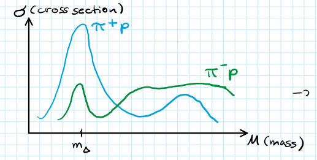
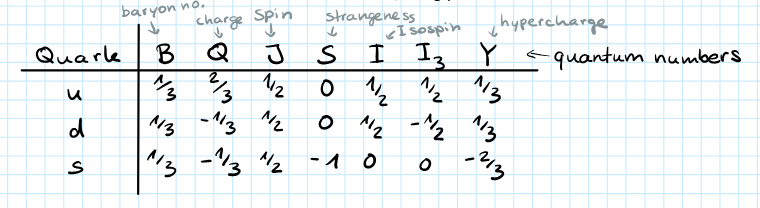
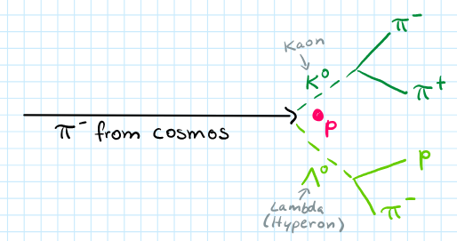
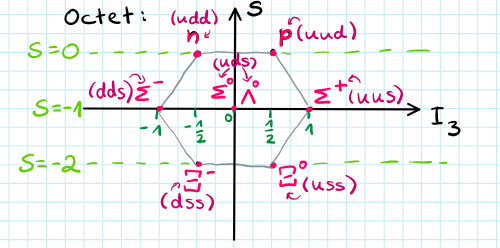
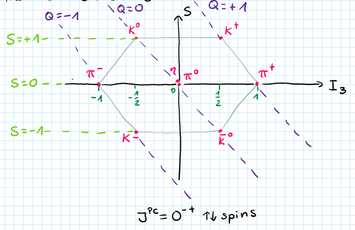
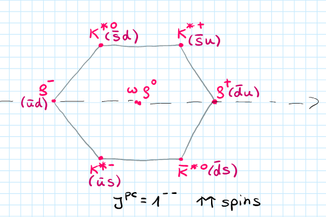
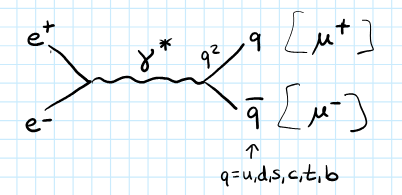

**Presenter**: 

**Note Taker**: 

## The Hadron Zoo and the Search for Order

Welcome everyone to today's lecture. It will be mostly about **classification of hadrons**. I will walk you through the history of how important discoveries were made, what we learned about hadrons, and how we can group them together.

In the 1950s and 1960s, many new large accelerators were built, such as the **Bevatron**. It came into operation in 1954. The Bevatron was a proton accelerator with energies up to **13 GeV**. These high‑energy protons were shot at a fixed target. Many different particles were produced and detected.

::: callout-note
They found over 100 new particles. This was called the **particle zoo**. Physicists of the time had to think how to organize these particles: Is there some pattern? Are these all fundamental particles?
:::

Consider the **periodic table** for example. We had all these atoms and grouped them according to their proton and neutron numbers. We knew how many electrons were in the outermost shells. This helped us group them in the periodic table. This is what we want to do now: we are looking at the hadrons.

| Periodic Table (atoms) | Hadron Classification |
|------------------------|-----------------------|
| Grouped by proton/neutron numbers | Grouped by **quantum numbers** |
| Electron shells determine chemical properties | Quantum numbers determine physical properties and interactions |
| Organization revealed underlying patterns | Pattern identification aids understanding of hadrons |

Let me start. In the context of particle physics, the characteristics we choose to group hadrons are their **quantum numbers**. We will now discuss different quantum numbers, why they were introduced, and how they helped group certain particles.

## Isospin: The Proton-Neutron Doublet

In 1932 Chadwick discovered the neutron. Different experiments, including those at the Bevatron, showed that:

- photon‑proton,
- proton‑neutron,
- and neutron‑neutron interactions all had nearly identical interaction strengths.

The masses of the proton and neutron are almost equal:  $m_p \approx m_n \approx 939\,\text{MeV}$ .

This similarity led to the proposal that the proton and neutron can be considered the same particle — the **nucleon** — existing in two different states. Those two states are described by **isospin**.

The strong interaction does not distinguish between the proton and the neutron. They only appear as different particles in the presence of an electromagnetic field. Otherwise they are the same, and they are placed into an **isospin doublet**.

This is analogous to spin: an electron can be spin‑up or spin‑down. Here, the proton and neutron correspond to the two possible isospin projections. 

{#fig-fg1}

At the quark level, protons and neutrons are composed of **up** ( $u$ ) and **down** ( $d$ ) quarks. The strong interaction does not distinguish between these two flavors. The up and down quarks also form an isospin doublet, with the following isospin states:

  $$u = \left|\frac{1}{2}, +\frac{1}{2}\right\rangle,\quad d = \left|\frac{1}{2}, -\frac{1}{2}\right\rangle$$  
 $$I_3|u\rangle = \frac{1}{2}|u\rangle,\quad I_3|d\rangle = -\frac{1}{2}|d\rangle$$  

| Particle | Isospin doublet |  $I_3$  eigenvalue (where given) |
|---|---|---|
| Nucleon (proton  $p$ , neutron  $n$ ) |  $p$  and  $n$  | — (not stated in this chunk) |
| Up quark  $u$  |  $\left|\frac12,+\frac12\right\rangle$  |  $+\frac12$  |
| Down quark  $d$  |  $\left|\frac12,-\frac12\right\rangle$  |  $-\frac12$  |

::: callout-important
The strong interaction treats all hadrons (and their quark constituents) identically as long as only up and down flavors are involved. It cannot distinguish between these flavors.
:::

## Isospin and SU(2) Algebra in Particle Systems

Isospin is not a property like spin, but mathematically it can be treated the same way and follows the SU(2) algebra. The generators are the Pauli matrices  $\sigma_i$ ; we use the isospin operator  $\mathbf{I}$  instead of  $\mathbf{J}$ .

States are written as  $|I, I_3\rangle$ :

  $$u = |\tfrac12,+\tfrac12\rangle,\qquad d = |\tfrac12,-\tfrac12\rangle$$  

  $$I_3|u\rangle = \tfrac12|u\rangle,\qquad I_3|d\rangle = -\tfrac12|d\rangle$$  

The commutation relations are  $[I_i,I_j]=i\epsilon_{ijk}I_k$ , and the raising/lowering operators are  $I_\pm = I_1\pm iI_2$ . For a given isospin  $I$ , the third component  $I_3$  takes values  $I, I-1, \dots, -I$ , giving  $2I+1$  projections.

#### Combining a quark and an antiquark

A meson consists of a quark and an antiquark. For up and down quarks, each has  $I=\frac12$ , so combining them uses the same Clebsch–Gordan coefficients as spin- $1/2$  addition: (see @fig-fg1)

  $$\tfrac12\otimes\tfrac12 = 1\oplus0 ,\qquad (2\otimes2=3\oplus1)$$  

The resulting states are a triplet ( $I=1$ ) and a singlet ( $I=0$ ). In matrix terms, you have a  $4\times4$  matrix that decomposes into a  $3\times3$  and a  $1\times1$  block. The explicit states are:

|  $|I,I_3\rangle$  | Quark content |
|----------------|----------------|
|  $|1,1\rangle$  |  $-|u\bar{d}\rangle$  |
|  $|1,0\rangle$  |  $\frac{1}{\sqrt{2}}\bigl(|u\bar{u}\rangle - |d\bar{d}\rangle\bigr)$  |
|  $|1,-1\rangle$  |  $|d\bar{u}\rangle$  |
|  $|0,0\rangle$  |  $\frac{1}{\sqrt{2}}\bigl(|u\bar{u}\rangle + |d\bar{d}\rangle\bigr)$  |

The antiquarks are assigned  $I_3 = -\tfrac12$  for  $\bar{u}$  and  $I_3 = +\tfrac12$  for  $\bar{d}$ , so that they transform under SU(2) in the same way as quarks. This sign convention leads to the minus sign in the  $I=1, I_3=0$  state and the plus sign in the singlet.

These states correspond to particles:

- The triplet states are the pions:  $\pi^+, \pi^0, \pi^-$ .
- The  $\rho$  mesons have the same isospin but differ in spin: pions have antiparallel spins (spin  $0$ ),  $\rho$  mesons have parallel spins (spin  $1$ ).
- The singlet state  $|0,0\rangle$  can be associated with  $\omega$  and  $\eta'$  mesons.

#### Combining a meson (I=1) with a nucleon (I=1/2)

Consider a pion beam on a proton target: pion has  $I=1$ , nucleon has  $I=\frac12$ . The combination gives:

  $$1\otimes\tfrac12 = \tfrac32\oplus\tfrac12,\qquad (3\otimes2=4\oplus2)$$  

In matrix terms, this corresponds to a  $6\times6$  matrix that decomposes into a  $4\times4$  block and a  $2\times2$  block — irreducible representations. For small numbers it is easy, but for larger ones there are systematic methods; we won't go into that. The resulting isospin multiplets are:

-  $I = \frac32$  (quartet): four projections  $I_3 = +\frac32,+\frac12,-\frac12,-\frac32$ . These correspond to the  $\Delta$  baryons:  $\Delta^{++}, \Delta^{+}, \Delta^{0}, \Delta^{-}$  with mass  $m_\Delta = 1232$  MeV.
-  $I = \frac12$  (doublet): two projections, corresponding to nucleons  $p$  and  $n$ .

#### Combining three quarks to form baryons

Baryons are made of three quarks, each with  $I=\frac12$ . The combination of three isospin- $1/2$  particles proceeds step by step:

  $$2\otimes2\otimes2 = (2\otimes2)\otimes2 = (3\oplus1)\otimes2 = (3\otimes2) \oplus (1\otimes2) = 4 \oplus 2 \oplus 2$$  

Thus we obtain:

- One  $I=\frac32$  quartet (the  $\Delta$  baryons)
- Two distinct  $I=\frac12$  doublets (the nucleon doublet and a second doublet, e.g., the  $\Lambda$  or  $\Sigma$  etc., depending on additional quantum numbers)

## Isospin and Cross Section Ratios

#### Isospin and Cross Section Ratios 

{#fig-fg2}

Consider the mass plotted against the cross section. In the  $\Delta$  mass region, the measured cross section ratio is:

  $$\sigma_{\pi^+ p} : \sigma_{\pi^- p} \approx 3 : 1$$  

The isospin quantum number explains why the cross sections differ. This will be derived in the exercises and classwork.

#### Historical Origin of Isospin

Isospin was introduced in the 1950s, before quarks were known. Physicists observed patterns among newly discovered particles — first pions, later  $\rho$  mesons — and looked for symmetries to group them mathematically.

### Isospin Multiplets

| Particle family | Isospin  $I$  |  $I_3$  values | Members |
|---------------|-------------|--------------|---------|
|  $\pi$  mesons  | 1           |  $+1, 0, -1$  |  $\pi^+, \pi^0, \pi^-$  |
|  $\rho$  mesons | 1           |  $+1, 0, -1$  |  $\rho^+, \rho^0, \rho^-$  |
|  $\Delta$  baryons |  $3/2$  |  $+3/2, +1/2, -1/2, -3/2$  |  $\Delta^{++}, \Delta^+, \Delta^0, \Delta^-$  |

The quark content of the pions is:

  $$|1,1\rangle = -|u\bar{d}\rangle \rightarrow \pi^+, \qquad
|1,0\rangle = \frac{1}{\sqrt{2}}(|u\bar{u}\rangle - |d\bar{d}\rangle) \rightarrow \pi^0, \qquad
|1,-1\rangle = |d\bar{u}\rangle \rightarrow \pi^-$$  

The  $\Delta$  baryons fill an isospin quadruplet with  $I=3/2$  and  $I_3$  ranging from  $+3/2$  (for  $\Delta^{++}$ ) to  $-3/2$  (for  $\Delta^-$ ).

Later, larger patterns were seen, and that is where this lecture is headed. Next we will look at strangeness, hypercharge, and so on.

#### Nucleons and Strong Interaction Symmetry

Why introduce isospin for protons and neutrons? If you look just at protons and neutrons, you might think about spin and charge, so why introduce isospin? But consider reactions like proton–proton, proton–neutron, and neutron–neutron. When you look at cross sections, you see that certain reactions are stronger, yet here they were quite similar. The reaction rates for these scatterings are nearly the same. This indicates that the strong interaction does not distinguish between protons and neutrons.

The proton and neutron are thus placed in an isospin doublet: 

{#fig-fg4}

 

{#fig-fg5}

  $$\begin{pmatrix} p \\ n \end{pmatrix}, \qquad I = \frac{1}{2}, \quad I_3 = +\frac{1}{2} \text{ (proton)},\; -\frac{1}{2} \text{ (neutron)}$$  

At the quark level, this symmetry means the strong interaction does not care about up and down quarks. Hence the up and down quarks also form an isospin doublet. (The quark model was developed later.)

::: callout-note
Isospin was originally a purely mathematical grouping; the connection to quarks came afterwards.
:::

## Strangeness, Isospin, and the Eightfold Way

### Historical Context

Physicists initially identified an isospin doublet. Later they discovered pions, rhos, and other particles. They grouped these particles together, looking for larger patterns and introducing **strangeness** as a new quantum number. The **Delta** resonance was first found around the 1960s. (see @fig-fg2)

With the **Bevatron** experiment — one of the first bubble‑chamber experiments — large accelerators became accessible. Over 100 particles were discovered, and physicists did not know what to do with them. They asked: *Are they like atoms?* Later they found that the particles could be decomposed into smaller constituents, a process still being studied.

### Strangeness

Some detected particles behaved strangely. In cosmic‑ray experiments, pions hitting a copper target produced a characteristic **V‑shaped track** in a cloud chamber, consisting of two pions, a proton, and another pion. These particles always appeared in pairs and had an unusually long lifetime. (see @fig-fg4)

A new quantum number, **strangeness**  $S$ , was introduced. Strangeness is conserved in strong and electromagnetic interactions but not in weak interactions. Isospin is also conserved in strong interactions (a point mentioned earlier). 

{#fig-fg3}

#### Assigning Strangeness

| Particle species | Quark content | Strangeness  $S$  |
|-----------------|---------------|-----------------|
| Pions, neutron, proton |  $u$ ,  $d$  only |  $0$  |
| **Lambda** ( $\Lambda$ ) | contains  $s$  quark |  $-1$  |
| **Kaons** ( $K$ ) | contain  $s$  or  $\bar{s}$  |  $+1$  or  $-1$  |

Particles containing a strange quark are called **hyperons**. Types include the  $\Lambda$ ,  $\Sigma$ ,  $\Xi$  (cascade), and  $K$  mesons. (see @fig-fg5)

The kaons form two isospin doublets:

-  $K^+$  and  $K^0$  with  $S = +1$ 
-  $K^-$  and  $\bar{K}^0$  with  $S = -1$ 

Since strangeness always appears in pairs in strong production, it must be conserved (but not in weak decays).
For example,  $\Lambda \to p + \pi^-$ : both final particles have  $S=0$ , yet the decay occurs — it is a weak decay. The long lifetime signals weakness.
In contrast, strong production:  $\pi^- p \to \pi^- p K_1 \Lambda$  conserves strangeness.

#### Hypercharge

Hypercharge  $Y$  is defined as:

  $$Y = B + S$$  

where  $B$  is baryon number:  $+1$  for baryons,  $-1$  for antibaryons,  $0$  for mesons.

#### Baryon Number Conservation

In a reaction like  $\pi^-$  on a proton target, the final state cannot contain only mesons — a baryon must appear. Thus baryon number is conserved.

#### Gell‑Mann–Nishijima Formula

From isospin, we have the pion triplet with  $I_3 = +1, 0, -1$  corresponding to charges  $\pi^+, \pi^0, \pi^-$ . The relation between isospin and charge is:

  $$Q = I_3 + \frac{Y}{2}$$  

Check for the proton:  $I_3 = +1/2$ ,  $Y = 1$  ( $B=1, S=0$ ) →  $Q = 1/2 + 1/2 = 1$ .
For the neutron:  $I_3 = -1/2$ ,  $Y = 1$  →  $Q = -1/2 + 1/2 = 0$ .

### The Eightfold Way

Using strangeness (hypercharge) together with isospin, Murray Gell‑Mann and Yuval Ne'eman discovered a larger pattern: particles could be arranged into **multiplets** within  $SU(3)_{\text{flavor}}$ . At the time quarks were unknown, but we now understand the pattern in terms of quarks.

#### Quark Quantum Numbers (Ground State) 

{#fig-fg6}

| Quark | Charge  $Q$  | Baryon Number  $B$  | Strangeness  $S$  | Spin |
|-------|------------|-------------------|-----------------|------|
|  $u$    |  $+2/3$      |  $1/3$             |  $0$              |  $1/2$  |
|  $d$    |  $-1/3$      |  $1/3$             |  $0$              |  $1/2$  |
|  $s$    |  $-1/3$      |  $1/3$             |  $-1$             |  $1/2$  | (see @fig-fg1)

#### Baryon Composition

Baryons are made of three quarks ( $u$ ,  $d$ , or  $s$ ). The decomposition of the tensor product is:

  $$3 \otimes 3 \otimes 3 = 10 \oplus 8 \oplus 8 \oplus 1$$  

This gives an **octet** and a **decuplet** for the ground‑state baryons. Plotting  $I_3$  (x‑axis) against strangeness  $S$  (or hypercharge  $Y$ ) yields the patterns.

<b>Baryon Octet ( $J^P = 1/2^+$ )</b>:

| Particle | Quark Content |  $I_3$  |  $S$  |  $Q$  |
|----------|---------------|-------|-----|-----|
|  $n$       |  $udd$          |  $-1/2$ |  $0$  |  $0$  |
|  $p$       |  $uud$          |  $+1/2$ |  $0$  |  $+1$  |
|  $\Sigma^-$  |  $dds$        |  $-1$   |  $-1$ |  $-1$ |
|  $\Sigma^0$  |  $uds$        |  $0$    |  $-1$ |  $0$  |
|  $\Sigma^+$  |  $uus$        |  $+1$   |  $-1$ |  $+1$ |
|  $\Xi^-$     |  $dss$        |  $-1/2$ |  $-2$ |  $-1$ |
|  $\Xi^0$     |  $uss$        |  $+1/2$ |  $-2$ |  $0$  |

<b>Baryon Decuplet ( $J^P = 3/2^+$ )</b>:

| Particle |  $I_3$  |  $S$  |  $Q$  | Quark Content (all possible) |
|----------|-------|-----|-----|------------------------------|
|  $\Delta^-$  |  $-3/2$  |  $0$  |  $-1$  |  $ddd$  |
|  $\Delta^0$  |  $-1/2$  |  $0$  |  $0$   |  $udd$  |
|  $\Delta^+$  |  $+1/2$  |  $0$  |  $+1$  |  $uud$  |
|  $\Delta^{++}$  |  $+3/2$  |  $0$  |  $+2$  |  $uuu$  |
|  $\Sigma^{*-}$  |  $-1$  |  $-1$  |  $-1$  |  $dds$  etc. |
|  $\Sigma^{*0}$  |  $0$   |  $-1$  |  $0$   |  $uds$  |
|  $\Sigma^{*+}$  |  $+1$  |  $-1$  |  $+1$  |  $uus$  |
|  $\Xi^{*-}$  |  $-1/2$  |  $-2$  |  $-1$  |  $dss$  |
|  $\Xi^{*0}$  |  $+1/2$  |  $-2$  |  $0$   |  $uss$  |
|  $\Omega^-$  |  $0$   |  $-3$  |  $-1$  |  $sss$  |

::: callout-note
The mass difference between strange and non‑strange quarks is  $\Delta m \approx 150\ \text{MeV}$  ( $m_u = m_d \neq m_s$ ). This leads to the mass splittings within the multiplets.
:::

## Isospin Symmetry and Baryon Mass Patterns

The masses of baryons reveal patterns of symmetry breaking. Small mass differences occur along the horizontal axis (isospin multiplets), while larger differences appear along the vertical axis (changing strangeness).

| Direction | Example mass differences | Size |
|-----------|--------------------------|------|
| **Horizontal (isospin)** |  $m_n-m_p=1.3\ \text{MeV}$   $m_{\Sigma^-}-m_{\Sigma^0}=7\ \text{MeV}$  | Small |
| **Vertical (strangeness)** |  $m_\Xi-m_N=250\ \text{MeV}$   $m_{\Xi^-}-m_{\Sigma^-}=130\ \text{MeV}$  | Large | (see @fig-fg5)

A similar small difference holds for the kaons. (see @fig-fg4) (see @fig-fg6) 

{#fig-fg8}

 

{#fig-fg9}

These numbers tell us that isospin symmetry ( $SU(2)$ ) is a good symmetry, but including the strange quark makes it only approximate—otherwise all masses would be equal. 

{#fig-fg7}

The third component of isospin,  $I_3$ , and strangeness  $S$  label the particles. In the baryon octet and decuplet,  $I_3$  runs along the horizontal axis and  $S$  along the vertical axis, taking values  $0$ ,  $-1$ ,  $-2$ ,  $-3$ . Each isospin multiplet has a characteristic  $I_3$  pattern:

- Nucleon doublet:  $I_3 = \pm\frac12$ 
-  $\Sigma$  triplet:  $I_3 = -1, 0, +1$ 
-  $\Xi$  doublet:  $I_3 = \pm\frac12$ 
-  $\Lambda$  singlet:  $I_3 = 0$ 

All baryons in the octet share spin–parity  $J^P = \tfrac12^+$ , while those in the decuplet have  $J^P = \tfrac32^+$ . For the octet, the spins of the three quarks can be arranged in various permutations to give total  $J=\frac12$ ; for the decuplet, all three spins are aligned, giving  $J=\frac32$ .

## Gell-Mann's Prediction of the Omega Minus

When Gell-Mann discovered the pattern (the eightfold way), the **Ω⁻** baryon had not yet been observed. (see @fig-fg6) Predicting its existence was a major success for Gell-Mann, and the particle was found two years later.

The discovery was made in a bubble‑chamber experiment via the reaction
  $$K^- p \to \Omega^- + K^+ + K^0$$  
— strangeness conservation requires the two additional kaons.

The **Ω⁻** then decays through the chain
  $$\Omega^- \to \Xi^0 \pi^- \to \Lambda^0 \pi^0 \to p \pi^- \gamma \gamma.$$  

{#fig-fg10}

Beyond predicting the particle’s existence, Gell‑Mann also estimated its mass roughly. The masses within the **decuplet** (the “horizontal lines” of the pattern) are: (see @fig-fg2) (see @fig-fg7)

| Particle | Approximate mass |
|----------|------------------|
| Δ (Delta) | 1232 MeV |
| Σ (Sigma) | — |
| Ω (Omega) | ≈ 5680 MeV |

The spacing between these levels is roughly constant:  $\Delta m \approx 150$  MeV.

These group‑theoretic considerations allowed physicists to describe many particles symmetrically. The mass difference between the **octet** and the **decuplet** arises because their spins differ; the shift can be attributed to a spin‑spin or spin‑orbit interaction, i.e., it originates from the dynamics. (see @fig-fg8) (see @fig-fg9)

## From Patterns to Quarks: Symmetries, Color, and the Pauli Principle

### Evidence for Three Colors from  $e^+e^-$  Annihilation (see @fig-fg3) (see @fig-fg9) (see @fig-fg10)

The process produces a virtual photon that can decay into quark–antiquark pairs or into lepton pairs like  $\mu^+\mu^-$ . The ratio 

{#fig-fg11}

  $$R = \frac{\sigma_{\text{had}}}{\sigma_{\mu^+\mu^-}} \propto N_{\text{color}} \sum q_i^2$$  

is proportional to the number of colors.
At energies where only  $u$ ,  $d$ ,  $s$  quarks are accessible, the ratio gives  $N_{\text{color}}=3$ .
When charm and bottom thresholds are crossed, the ratio jumps by precise amounts consistent with three colors.

