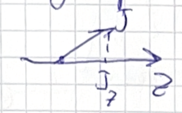

**Presenter**: 

**Note Taker**: 

### Kinematics of Two-to-Two Scattering and Three-Body Decays

Today we are at lecture number five. We'll discuss angular distributions and partial wave analysis.

But before going there I would like to start with a recap. The last lecture we discussed the phase space for particle reactions and we discussed different experiments and their kinematics. We went through the list of experiments around the world that study hadrons and look at their production mechanisms and some peculiarities.

## Kinematics Recap: 2→2 Scattering Processes

We start with a recap on kinematics. The first question: how many variables does one need to describe the two-to-two scattering process? We have two particles in the initial state and two particles in the final state.

- Initial state: two 0⁻ scalar particles
- Final state: two 0⁻ scalar particles

- Example: 0⁻ + 0⁻ → 3⁻ + 1⁺ scattering

::: callout-note
The "blob" in scattering diagrams represents the interaction region where strong, electromagnetic, or gravitational interactions occur. These are not Feynman diagrams but sometimes called unitarity diagrams.
:::
The number of kinematic variables needed depends only on the external particles - whatever happens inside the interaction blob does not affect this count.

## Counting Kinematic Variables

Let's calculate systematically:

**Step 1: Initial counting**

- 4 particles × 4 momentum components each = 16 variables

**Step 2: Apply conservation laws**

- 4-momentum conservation (E, pₓ, pᵧ, p₂) removes 4 constraints → 12 remaining variables

**Step 3: Remove redundant degrees of freedom**

- 3 rotations and 3 boosts can be eliminated → subtract 6 more variables

**Final count: 2 independent variables**

::: callout-important
Both scalar and spinning particle cases require **only 2 variables** to fully describe 2→2 scattering kinematics. The difference is that spinning particles have more scattering amplitudes, but all amplitudes still depend on the same 2 kinematic variables.
:::
## Choosing the Two Variables

**Primary Mandelstam variables:**
$$s = (p_1 + p_2)^2 = (p_3 + p_4)^2$$
$$t = (p_1 - p_3)^2$$
$$u = (p_1 - p_4)^2$$

These variables are related by: $s + t + u = \sum m_i^2$, so only two are independent.

**Physics meaning:**

- **$s$**: Total center-of-mass energy squared
- **$t$**: Momentum transfer squared between particles 1 and 3
- **$u$**: Alternative momentum transfer variable

**Center of Mass Frame Variables:**

- $\sqrt{s}$: Center-of-mass energy
- $\cos\theta_{CM}$: Scattering angle between initial and final state particles

**Other possibilities:**

- Lab frame energies $E_1$ and $E_3$
- Any two independent variables that characterize the process

::: callout-tip
Mandelstam variables are preferred because they are Lorentz invariant and provide an undistorted representation of phase space density. The transformation to these variables has a constant Jacobian.
:::
## Scattering Amplitudes and Spin Dependence

**For scalar particles:** The scattering amplitude is a single scalar function $A(s,t)$

**For spinning particles:** The scattering amplitude becomes a multi-component object:

- Spin-3 particle: 7 dimensions
- Spin-1 particle: 3 dimensions
- Total amplitude dimension: 7 × 3 = 21 components

However, all 21 amplitudes are still functions of the same 2 variables ($s$ and $t$).

## Extension to Three-Body Decays

Now considering three-body decays (1 particle → 3 particles):

**Kinematic variables:** Still 2 variables needed, same as 2→2 scattering

**Dalitz plot variables:** Typically use two invariant mass squared variables:
$$m_{34}^2 = (p_3 + p_4)^2$$
$$m_{24}^2 = (p_2 + p_4)^2$$

**Three-body phase space formula:**
$$d\Phi_3 = d\Phi_2(m_{12}^2) \times d\Phi_2(m_{34}^2) \times \frac{dm_{34}^2}{2\pi}$$

**Two-body phase space element:**
$$d\Phi_2 = \frac{1}{8\pi} \frac{2|\vec{p}|}{\sqrt{s}} \frac{d\Omega}{4\pi}$$

::: callout-important
The phase space for three-body decay is **flat** when plotted against Mandelstam variables. (see Figure~1) This means the differential width directly reveals the dynamics of the interaction without kinematic distortions. (see Figure~2) (see Figure~3) (see Figure~6)
:::
## Applications and Homework

We will continue discussing angular distributions after the Dalitz plot. The homework exercise on Dalitz plots connects directly to hadron spectroscopy, which is the focus of upcoming lectures.

**Key realization:** For any N-body process, once you specify the kinematic variables, you can completely reconstruct the "rigid body" configuration of all momentum vectors in the center-of-mass frame.

The recursive phase space formula demonstrates that the Jacobian for transformation to Mandelstam variables is constant, making these variables ideal for studying interaction dynamics through Dalitz plot analyses.

{#fig-fg2}

### Decoding the Λc Dalitz Plot

You can see the example of the triple decay that I have here of the $\Lambda_c$ baryon going to the proton, kaon, and pion:
$$\Lambda_c^+ \to p + K^- + \pi^+$$

We measure $\Lambda_c$ produced in proton-proton collisions or any other collisions. In experiments, they observe $\Lambda_c$ abundantly. This is one of the particles that lives long enough and is produced copiously.

Particles with charm ground states are produced abundantly and live sufficiently long to fly from the primary vertex. That’s why we have a good sample and a good understanding of their decay kinematics—not only kinematics, but dynamics as well. (see Figure~6)

In this decay, there is a charm quark in the initial state and no charm quark in the final state, indicating that this occurs via **weak interaction**. The charm quark disappears between initial and final states: the charm quark decays, transitioning into a strange quark that ends up in the kaon.
This $c \to s$ transition happens within one generation and is **not suppressed**—it is an allowed process.

This decay is considered a **golden channel** for detection because:

- The final state contains three charged particles—there are no neutrals.
- The proton is charged, travels well, and is stable.
- The kaon and pion are stable in our accelerator experiments.

These particles fly from the decay without distraction, and we see their tracks clearly through all detectors. They point away from the primary interaction vertex.

There is roughly a **1 cm shift** between the primary vertex and the secondary vertex in $\Lambda_c$ decays. This displacement occurs due to the boost and the fact that $\Lambda_c$ lives longer in the laboratory frame than in its rest frame.

::: callout-note
The decay length in the laboratory frame is given by:
$$L = \beta\gamma c\tau$$
At the LHC, $\Lambda_c$ is produced with energies of a few hundred GeV, making this decay particularly clean and well-suited for study.
:::
We have studied this decay extensively. Here is the result of an analysis that resembles experimental data. If I showed you actual experimental data, you wouldn’t distinguish it from this plot—the statistics are so high that the distribution appears very smooth.

- On the **x-axis**: invariant mass of the proton and kaon, $m_{12}^2$
- On the **y-axis**: invariant mass of the kaon and pion, $m_{23}^2$

All allowed kinematic values for the decay are shown in color. (see Figure~6) The white area corresponds to kinematics where no physical configuration exists—energy and momentum cannot be conserved there.

If you select a point inside the colored region, you can compute angles between particles and reproduce the configuration with a 3D-printed rigid body. But if you choose a point in the white region, you quickly find that energy conservation cannot be satisfied.

The range of possible values for the invariant masses is limited, and this surface is called the **Dalitz plot**. The kinematic boundaries are defined by:

$$m_{12}^2 + m_{23}^2 + m_{13}^2 = m_{\Lambda_c}^2 + m_p^2 + m_K^2 + m_{\pi}^2$$

Different colors in the plot indicate different probabilities for the decay to occur at that kinematic point. (see Figure~6) The differential decay rate in the Dalitz plot is:

$$\frac{d^2\Gamma}{dm_{12}^2  dm_{23}^2} \propto |\mathcal{M}|^2$$

We measure the decay by reconstructing particle tracks and identifying from which kinematic point the decay originated. There is an unambiguous relation between four-vectors and kinematic points. (see Figure~3)

It turns out that certain kinematics are more probable than others—particles prefer specific directions. For example, one configuration may be more common, while another is rare. On the border of the Dalitz plot, particles are aligned in one line, whereas inside the surface they always have an angle between them.

Think about how to maximize the invariant mass and where on the border such a point lies.

### Dalitz Plot Kinematics in Three-Body Decay

Let's consider the three-body decay $\Lambda_c^+ \to pK^-\pi^+$ and its kinematics. (see Figure~1) We want to maximize the invariant mass of the proton–Kaon system. (see Figure~6)

There are three outgoing momenta. The idea is that if the three momenta are arranged in opposite directions, the total three-momentum sum should be as small as possible. (see Figure~6)

If we add both momentum vectors, the forward momentum—or more precisely, the magnitude of the sum of the momentum vectors—should be as large as possible. Therefore, we should be on the right side of the Dalitz plot diagram.

Now, consider the mass on the y-axis: should it be as large or as small as possible? (see Figure~3) It should be as small as possible.

Why? Because when the three momenta are collinear and we subtract them appropriately, the invariant mass is minimized.

One way to think about this is to go to the rest frame of the Kaon and pion. If they are flying nearly together, their relative momentum is small. In their mutual rest frame, they could both be at rest, so their invariant mass would simply be the sum of their rest masses—this is the minimum possible.

::: callout-important
The minimum invariant mass for any two-particle system is given by
$$M_{ij}^{\text{min}} = m_i + m_j$$
This occurs when the two particles are at rest relative to each other.
:::
You are correct: we are looking for the minimal invariant mass of the proton–Kaon system.

Let's identify what this point corresponds to kinematically. In certain configurations, two particles can be nearly at rest while the third carries away the momentum. (see Figure~6) That corresponds to the minimal invariant mass case.

This plot is likely from experimental data. How would we reconstruct such an event experimentally if we don't detect the proton directly? Even though measurements occur in the lab frame (which is boosted), the analysis is often performed in the center-of-mass frame.

The point of maximum invariant mass occurs when the two particles move back-to-back with maximum momentum. The point we are discussing minimizes the invariant mass.

For three-body decays, there is a similar way to define angular variables. (see Figure~1) Let me briefly mention this.

I will boost into the rest frame for each kinematic setup. To clarify, I am referring to the proton, Kaon, and pion. Suppose I fix the invariant mass of the proton–Kaon system.

The approach is to work in the center-of-momentum frame of the $\Lambda_c$, where the three final-state particles have momenta summing to zero. Then, I boost to the rest frame of the Kaon and pion. (see Figure~6) In that frame, the Kaon and pion have equal and opposite momenta. (see Figure~7)

If I fix the invariant mass of the proton–Kaon system and explore phase space along a line where that mass is fixed, the magnitudes of the momenta are fixed—only the angle $\theta$ changes.

As $\theta$ varies from $0$ to $\pi$, one extreme ($\theta = 0$) corresponds to the proton and Kaon moving in the same direction, yielding a small invariant mass. The other extreme ($\theta = \pi$) corresponds to them moving oppositely, giving the maximum invariant mass.

::: callout-note
The invariant mass squared for two particles is
$$M_{ij}^2 = (p_i + p_j)^2 = (E_i + E_j)^2 - (\vec{p}_i + \vec{p}_j)^2$$
This quantity is Lorentz invariant and is used to define Dalitz plot axes.
:::
For angle $\theta = 0$, the invariant mass is small. As the angle increases, the invariant mass grows. The same logic applies to the other pairings.

A straightforward analysis method is to go to the rest frame of the proton–Kaon system, where all quantities are fixed, and scan by changing the angle between the proton and Kaon relative to the pion direction. (see Figure~6)

Thus, lines in the Dalitz plot represent configurations where the angle is varied in some rest frame.

Another variable in $2 \to 2$ scattering kinematics is the $U$ variable, which offers a more symmetric treatment. For three-body decays, we also have the invariant mass of the pion–proton system.

If I fix the invariant mass of the proton–Kaon system and scan the angle, which line do I move along? This follows from the relation that the $U$ variable is a linear combination of the invariant masses.

In fact, the coefficients are such that the motion corresponds to a diagonal in the Dalitz plot. This line represents a fixed pion–proton invariant mass, moving from one kinematic endpoint to the other.

The standard representation in experimental analyses uses Dalitz plots with the x-axis as the invariant mass squared of one pair and the y-axis as the invariant mass squared of another pair—exactly what is shown here.

In homework, you may encounter a more symmetric Dalitz plot where all variables enter symmetrically. This uses the geometry of an equilateral triangle, where every point inside satisfies a conservation relation.

::: callout-tip
In the symmetric representation, the coordinates are
$$x = \frac{\sqrt{3}}{2}(M_{12}^2 - M_{23}^2), \quad y = M_{13}^2 - \frac{1}{2}(M_{12}^2 + M_{23}^2)$$
The factor $\frac{\sqrt{3}}{2}$ arises from the 60° angles in an equilateral triangle.
:::
If you sum the perpendicular distances from any interior point to the three sides of an equilateral triangle, the total is constant. This allows us to define symmetric variables representing the sum of the invariant masses.

The variables are interpreted as distances to the sides. This gives a very symmetric and elegant representation.

Essentially, this is equivalent to the standard plot—they are related by a linear transformation, not just a rotation but also a skew. To plot experimental data in this form, one must apply the correct coordinate transformation.

Yesterday, I worked through the algebra relating Cartesian coordinates to the heights in the triangle—it's straightforward but interesting.

This symmetric representation is nice, while the standard one is more common and easier to plot directly. Both capture the same kinematics.

In the Dalitz plot, regions with higher event density indicate kinematic enhancements. The purpose of this kinematic representation is to identify the dynamics and underlying processes governing the decay.

{#fig-fg6}

Looking ahead, we will see that $\Lambda_c$ decay to three particles often proceeds via intermediate resonances. Temporarily, two particles form a resonant state that then decays, increasing the decay rate in certain invariant mass regions.

When the energy of two particles matches a resonance, their interaction is stronger, making the decay more probable. This is why we observe enhanced densities along certain bands in the Dalitz plot.

### Resonance Structures and Angular Distributions in Three-Body Decays

You might have seen cross sections for two-particle resonances. These exhibit a characteristic bump known as a **hadronic resonance**. The underlying physics is that when you have a system of two particles, and the quantum numbers of that system match those of an intermediate resonance, the interaction probability increases dramatically at specific energies.

::: callout-important
The **Breit-Wigner resonance cross section** describes this enhancement:
$$
\sigma(E) \propto \frac{\Gamma^2/4}{(E - E_R)^2 + \Gamma^2/4}
$$
where $E_R$ is the resonance energy and $\Gamma$ is the resonance width.
:::
By adjusting the system energy, you explore how likely two particles are to interact. When passing through the resonance region, the probability increases significantly. This creates bent structures in the **Dalitz distribution**—when projected onto one axis, you see the characteristic resonance shape.

This example is particularly interesting because it shows **resonances in all three particle pairs**:

* **Horizontal lines** correspond to fixed $K\pi$ mass → $K^*$ resonances
* **Vertical lines** correspond to fixed proton-$K\pi$ mass → $K$-nucleon resonances
* **Diagonal lines** correspond to pion-proton combinations → $\Delta$ resonances

::: callout-note
The **Dalitz plot density** for three-body decays is:
$$
\frac{d^2\Gamma}{dm_{12}^2  dm_{23}^2} = \text{constant} \times |\mathcal{M}|^2
$$
where $m_{ij}$ are invariant masses and $\mathcal{M}$ is the decay amplitude. (see Figure~1)
:::
The lines appear parallel to the sides of the Dalitz triangle:

* $K^*$ resonances parallel to one side
* $\Lambda$ resonances parallel to another side
* $\Delta$ resonances parallel to the third side

![The Dalitz plot, a representation of the phase-space for the three-body decay. (see Figure~6) It appears as an ellipse-shaped area where the internal region corresponds to allowed kinematics and the outside region is forbidden. On the x-axis lies the squared mass of two final-state particles, while the y-axis corresponds to the other subsystem. A horizontal line represents a slice of the phase-space with one mass fixed. The borders of the area correspond to configurations where all three momenta are aligned in the rest frame of the decaying particle, or equivalently, where the scattering angle in the relevant rest frame is either 0 or π.](images/fig3.png){#fig-fg3}

Now let's examine **angular distributions within resonance bands**. When traversing phase space while keeping the mass combination fixed, you're effectively changing the decay angle. This angle dependence reveals important physics:

* Within a resonance band, probability can be **inhomogeneous**
* Particles often prefer aligned vs. perpendicular configurations
* These preferences occur because **intermediate resonances have spin**

::: callout-tip
Angular distributions are powerful tools for measuring:

* **Spin**
* **Parity**
* **Other quantum numbers**
:::
**Key observations:**

* Higher spin particles produce more structured angular distributions
* Scalar particles produce no angular asymmetries
* The number of nodes in angular distribution often equals the spin value
* For spin-$J$ particles: $N_{\text{states}} = 2J + 1$ spin projections

When dealing with particle spins, we need to understand how quantum states transform under rotations. For a particle with spin $J$, there are $2J+1$ possible projections along a quantization axis.

::: callout-important
The **Wigner D-function** describes rotations using Euler angles $(\phi, \theta, \gamma)$:
$$
D^J_{m'm}(\phi, \theta, \gamma) = e^{-i m' \phi}  d^J_{m'm}(\theta)  e^{-i m \gamma}
$$
where $d^J_{m'm}(\theta)$ is the Wigner small d-matrix.
:::
**Rotation conventions in particle physics:**
1.

{#fig-fg4}

 Rotate by $\phi$ about Z-axis

2. Rotate by $\theta$ about Y-axis
3. Rotate by $\gamma$ about Z-axis again

::: callout-caution
**Be careful with conventions!** Mathematica uses opposite sign conventions compared to standard particle physics. Wikipedia and Python's sympy library are reliable references.
:::

Let's construct a model for three-body decays via cascade processes: initial particle → intermediate resonance $X$ → particles 1 + 2, plus particle 3.

{#fig-fg5}

 The arrows show the initial and final state particles, and the blob stands for the interaction that transforms the initial state into the final state.](images/fig1.png)

The general **cascade decay amplitude** structure:

$$
A_{\lambda_0, \lambda_1, \lambda_2, \lambda_3}(s, \theta) = \sum_{\lambda'_X} H^X_{\lambda_0 \lambda'_X} D^{j_X}_{\lambda'_X \lambda_X}(\theta_X, \phi_X) H^Y_{\lambda_X \lambda_Y} D^{j_Y}_{\lambda_Y \lambda_3}(\theta_Y, \phi_Y)
$$

**Component breakdown:**

* **$H$ factors**: Contain dynamics from strong/weak/EM interactions
* **$D$ functions**: Handle rotational kinematics and angular distributions
* **$\lambda_i$**: Helicity projections along particle directions of motion

::: callout-note
In the **helicity formalism**, we quantize spins along the direction of motion, making $\lambda_i$ the helicity projections.
:::
**Special case: aligned kinematics** ($\Phi = \theta = 0$)

* Rotation matrices simplify significantly
* Many summations collapse due to delta functions
* Final expression becomes much cleaner:

The simplified amplitude becomes:
$$
\mathcal{A} = H_0 D(\theta)^{J_X}_{\lambda_X, \lambda_0 + \lambda_3} D(\theta)^{\lambda_0 + \lambda_3}_{\lambda_1 - \lambda_2}
$$

**Key insight**: Angular distributions are determined primarily by **rotational group properties**, with only the production preferences coming from specific interactions.

{#fig-fg7}

 This separation makes angular analysis a powerful model-independent tool for determining particle properties.

### Angular Distributions and Partial Wave Analysis

How many numbers do I need in order to compute electromagnetic interactions or gravity? Specifically, to predict the angular distribution, what input parameters are required? The current framework appears to miss some fundamental components.

What is inside these interaction vertices or amplitude blocks? To predict all observable values, I need the transition amplitudes for different spin configurations.

The number of independent amplitudes is given by the spin degeneracy factor:
$$(2j_1 + 1)(2j_2 + 1)$$
where $j_1$ and $j_2$ are the spins of the particles involved. These amplitude values might also be functions of particle masses, particularly the masses of the intermediate states.

A similar number of parameters is needed for the final state amplitudes, but there are reasonable approximation methods available.

::: callout-important
In experimental analysis, we often make the initial assumption that these amplitude coefficients are constant, representing fundamental particle properties rather than dynamic functions. This simplification allows us to compute angular distributions without knowing the detailed internal dynamics.
:::
With this constant amplitude assumption, I can compute the angular distribution while fixing the mass parameters and intensity normalization.

The differential decay rate with respect to $\cos\theta$ is given by:
$$\frac{d\Gamma}{d\cos\theta} \propto |\mathcal{M}|^2$$

Using $\cos\theta$ rather than $\theta$ itself is preferable because it has a simpler Jacobian—we avoid the $\sin\theta$ factor that appears in the $\theta$ distribution. The matrix element squared $|\mathcal{M}|^2$ is typically treated as constant in this approximation.

The angular distribution spans from $\cos\theta = -1$ to $\cos\theta = 1$:

- A flat distribution indicates isotropic decay
- For particles with spin, we often observe parabolic distributions (second-order polynomials in $\cos\theta$)
- Other characteristic patterns may appear depending on the spin structure

It's crucial to recognize that $A$ represents the quantum transition amplitude—a complex-valued quantity that gets squared to give the observed probability. In experiments, we only measure the squared magnitude of amplitudes.

For unpolarized decays, the distributions are averaged over initial spin projections and summed over final spin projections:
$$\frac{d\sigma}{d\Omega} \propto \frac{1}{(2s_1+1)(2s_2+1)} \sum_{\text{spins}} |\mathcal{M}|^2$$

When analyzing experimental data, we don't initially guess the amplitude form directly. Instead, we project the angular distributions onto orthogonal polynomials, particularly Legendre polynomials:
$$\frac{d\sigma}{d\cos\theta} = \sum_{\ell=0}^{L_{\text{max}}} a_\ell P_\ell(\cos\theta)$$

This Legendre polynomial basis connects directly to the spins of the produced particles, forming the foundation of:

- **Partial wave analysis**: Modeling cross sections with amplitude parameters to learn about internal dynamics
- **Moment analysis**: Projecting differential cross sections onto polynomial moments

The initial projection onto polynomials doesn't directly reveal the internal amplitude structure but provides combinations of these parameters that can be measured experimentally.

This approach isn't straightforward, and we'll have more opportunities to discuss it in detail. We've only briefly touched on the differences between canonical states (defined in the rest frame) and helicity states introduced later.

For comprehensive coverage of this subject, I recommend Martin Spearman's *Elementary Particle Theory*, particularly Chapter 4, which covers:

- Lorentz group fundamentals
- Vector construction methods
- Accessible group theory applications
- Particle state definitions

The chapter provides substantial insights without overwhelming mathematical complexity.

**Exercise Assignment**: I will distribute Dalitz plots from CLEO and BaBar experiments with removed particle labels. You'll receive:

- One $D$ meson decay dataset
- One $D_s$ meson decay dataset
Using your kinematic knowledge, your task is to:

- Determine particle masses from the kinematic boundaries
- Identify the specific decay processes
Each group will analyze one case initially, then examine additional examples.

### Office Hours Arrangement

---
**People, I have to leave now.**

::: callout-note
This portion of the lecture contains only administrative announcements about homework distribution and scheduling—**no physics formulas or technical content** are present in this segment.
:::
**Homework Distribution:**

- If you don't want to take the homework now, I'll distribute it from my office.
- Please come with me to collect it.
- This applies to all of you.

**Schedule & Apologies:**

- Thank you for coming, and I apologize for being slightly late.
- Will you have time tomorrow at **8am**?
- You may leave now.

