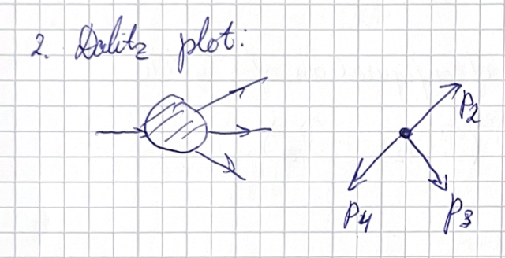

**Presenter**: 

**Note Taker**: 

### Production Mechanisms and Experimental Setups

All right, let's start this lecture. Today we have lecture number five, which will be dedicated to the production mechanisms in different directions across the world to study hadron spectroscopy. We will also go into depth on the kinematics of different reactions, discuss numerical algorithms to produce distributions of particles, particularly decays, and look at one of the most important kinematic setups: frames and then kinematic representation of the phase space for different reactions. 

{#fig-fg4}

Before starting, we go through the recap and I ask you quickly to give me the answers. Who feels confident on question number one? Let's break it down. So I would ask you in the first row to translate the words one by one.

- **What does flavor mean?** It's the charge of the strong interaction. In this context, flavor refers to a quantum number for the multiplet. There are many quantum numbers, so this is a flavor quantum number.
- **What do you mean exactly?** Flavor quantum number — not colors like red, green, and blue, but flavors like up, down, strange, charm. Don't mix up flavor and color.
- **What is a multiplet?** There are singlets and multiplets. It's different possible combinations for one quantum number. For example, with one total spin, multiple configurations are possible — those are called multiplets. In the context of flavor multiplets, we talk about different combinations or configurations.

Very good. So we break down two, three words. What remains for you? The whole question: **What are the flavor multiplets of $\Sigma_b$?** Flavor is clear, multiplet is clear, $\Sigma_b$ is the name of the baryon with specific quark content. We are looking for flavor multiplets of this baryon — which other baryons belong to the same multiplet, meaning they have the same quantum numbers but different projections of the flavor wave function.

::: callout-note
The **Gell-Mann–Nishijima formula** relates electric charge to flavor quantum numbers:
$$
Q = I_3 + \frac{B + S + C + B' + T}{2}
$$
This explains charge differences in isospin multiplets, such as between $\Sigma_b^0$ and $\Sigma_b^-$.
:::
If I only change one quark to an antiquark, this does not work because of baryon number conservation — you always need three quarks. So, different quark combinations make a multiplet. We want to know the **multiplicity** of this multiplet: which particles belong there, and how they differ — for example, changing up to down, or strange to charm.

Once you see this question, think about which flavors you are allowed to change. Here, flavor is up, strange, and bottom. When we ask about flavor multiplets, we discuss groups like **isospin SU(2)**, where you change up quark to down quark — this is a flavor symmetry, part of the larger flavor symmetry.

- Changing $u$ to $d$ gives $d s b$, which is the same particle name but with different isospin projection and charge.
- Charge of $\Sigma_b$ with $u$ quark is $\Sigma_b^0$ (charge 0); replacing $u$ with $d$ gives $\Sigma_b^-$ (charge -1).
- So there are two particles in the isospin multiplet: $\Sigma_b^0$ and $\Sigma_b^-$.

Now, what about the **SU(3) multiplet**? When allowed to flip quarks to others, you get a decuplet — this refers to lecture number two. For three quarks, the direct product $3 \otimes 3 \otimes 3$ decomposes into multiplets like the decuplet (dimension 10) and octet (dimension 8).

::: callout-important
The dimension of an **SU(3) flavor multiplet** is given by:
$$
\text{Dim}(p,q) = \frac{1}{2}(p+1)(q+1)(p+q+2)
$$
For example, the baryon decuplet corresponds to $(p=3, q=0)$ with dimension 10, while the octet is $(p=1, q=1)$ with dimension 8.
:::
What is the spin of the $\pi\pi$ system in D-wave? Let's break it down: spins of two pions. Pions are scalar mesons with quantum numbers $J^{PC} = 0^{-+}$. For two identical scalar particles:

- In S-wave ($\ell=0$): $J^{PC} = 0^{++}$
- In P-wave ($\ell=1$): $J^{PC} = 1^{--}$
- In D-wave ($\ell=2$): $J^{PC} = 2^{++}$

So, the spin of the D-wave two-pion system is $J=2$.

::: callout-note
For two identical scalar mesons, the total spin $J$ equals the orbital angular momentum $\ell$:
$$
J = \ell
$$
In a D-wave ($\ell=2$), the system has $J=2$ and possible quantum numbers $J^{PC}=2^{++}$.
:::
Is flavor symmetry gauge and Lorentz symmetry gauge? Let's break this down again:

- **What is gauge symmetry?** It's a symmetry where you can make local transformations without changing the dynamics — the key is **locality**.
- In the first lecture, we drew a Lagrangian: global symmetry means updating the phase everywhere; electromagnetic fields appear for Dirac spinors when you change the phase locally — that's what makes it a **gauge symmetry**.
- **Flavor symmetry** is **global**, not local — so it is **not** a gauge symmetry.
- **Lorentz symmetry**: Can you boost or rotate different points in spacetime independently? No — in standard treatment, Lorentz transformations are applied uniformly, so Lorentz symmetry is **not** considered a gauge symmetry here, though in some advanced theories (like gravity) it can be treated as such.

Today we start this lecture on particle production. The first section is **"A Dictionary and Slang of Particle Production,"** which discusses follow-up to different production mechanisms. When we talk about production kinematics, it makes sense to distinguish a few different classes.

We will see this classification depending on the reaction kinematics, but also depending on practicalities. So I want to start by separating two different classes of experiments:

1. **Fixed target experiments**: You install a target and shoot a beam at it.
2. **Collider experiments**: You collide two beams.

There are practical differences:

- **Energy**: Much higher achievable energy in colliders when two particles collide.
- **Decay products**: More boosted in fixed-target experiments.

Depending on what you want — higher collision energy or more forward-boosted decay products — you choose different reactions. Historically, fixed-target experiments were easier: you only need a target and a beam, and the setup is simpler.

::: callout-note
The **Mandelstam variable $s$** represents the squared center-of-mass energy:
$$
s = (p_a + p_b)^2
$$
In fixed-target experiments, one particle is at rest, limiting $s$, while colliders achieve higher $s$ by colliding two beams, impacting particle production thresholds and decay kinematics.
:::
As an example, consider fixed-target production of particles and experimental study of hadron spectroscopy:

- **GlueX**: Photon beam on a hydrogen target.
- **Compass**: Pion or proton beam, sometimes a mixed beam of kaon and neutron, on targets like lead, ammonia (for polarized targets), or hydrogen.

Most hadron spectroscopy studies use a hydrogen target. Imagine a 1-meter pipe, 30 cm in diameter, filled with liquid hydrogen — highly explosive, requiring careful handling. It must be kept liquid under high pressure, and not every experiment can operate such a target. At CERN, setting up Compass required significant security inspections — a leak or explosion could crush the entire building.

The beam interacts with a proton in the hydrogen somewhere inside the target. By reconstructing final-state particles and tracing them back, you locate the interaction vertex. If you plot the vertex distribution over several days, it resembles the target shape. One funny observation: the target wasn't always filled to 100%, so in an XY plot, you see empty regions and filled regions — a transverse cut of the target.

The beam diameter is Gaussian and slightly larger than the target in Compass, so the whole target is exposed. Ideally, you'd focus the beam to avoid wasting particles that miss the target, but here the beam and target widths were roughly matched, leading to tails that don't intersect the target.

::: callout-note
The vertex density in a fixed-target experiment is described by:
$$
\frac{dN}{dV} = \rho \sigma \Phi
$$
where $dN/dV$ is interactions per unit volume, $\rho$ is target density, $\sigma$ is cross-section, and $\Phi$ is beam flux. This explains the spatial distribution of interaction vertices within the target.
:::

### Target Design and Photon Production

A **beryllium target** typically appears as a **3 cm diameter disk** that is a few centimeters thick.
This target is simply inserted into the setup.
It is the **cheapest and simplest** target one can use.

With this thickness, there is a **significant production rate** of particles from beryllium.
**Lead** is an even higher-**Z** material.
Therefore, the **cross section** is even higher.

The **Bremsstrahlung cross section scales with Z**, the number of protons in the target nucleus.
For some physics programs within experiments, **high-Z targets** are used.
The experimental setup is slightly different in these cases.

::: callout-note
The Bremsstrahlung cross section follows the relation:
$\sigma_{\text{brems}} \propto Z^2$
This means the probability of photon emission increases **quadratically** with atomic number $Z$, making heavy elements like lead particularly efficient for photon production.
:::

To direct **photons** toward the experiments, they must be produced via the **Bremsstrahlung process** from electron scattering.
When a **few hundred micrometers thin foil** is placed in the beam path and an electron passes through, a photon is emitted.
Essentially, a **beam of electrons is converted into a beam of photons**.

The electrons that generate Bremsstrahlung photons **lose momentum** and are **bent away** from the beam by a magnet, while the photons continue forward.
A **magnetic field** is placed immediately after the Bremsstrahlung foil, removing all electrons.
The **photon beam continues unimpeded** and strikes the target.

### Exclusive and Inclusive Reactions in Particle Production

To discuss the physics of the production mechanism, we draw diagrams like this, where the incoming particles enter the interaction region on the left side and outgoing particles appear on the right side.

When we account for all particles and none are unobserved, we call the production **exclusive**, which should be contrasted with **inclusive processes**.

In inclusive processes, we characterize the class of reactions as statistical ensembles. We say we don't care about each individual state either—whether two pions, three pions, two kaons, or additional particles are produced. We only care that a specific particle (e.g., a kaon) is produced, along with anything else.

Different reactions—exclusive and inclusive—are complementary to each other. If one wants to understand the exact details of the production mechanism, such as where a kaon comes from or which particular resonance it originates from, one must study exclusive processes. Inclusive processes average over different production mechanisms and thereby provide access to average quantities that may not be accessible otherwise.

For example, to study how strangeness is produced, one might consider a muon scattering process, as studied in the COMPASS experiment. Here, a muon minus gets scattered, and a kaon is detected.

To make these computations more physical—for instance, to study the strangeness content inside the proton—we examine a reaction where the electromagnetic current from the muon interacts with the proton, and a kaon is produced. This gives access to the gluon probability distribution function inside the proton and reveals how strange quarks are produced from the gluon sea.

This is a typical example of an inclusive process. For now, let's focus on the kinematics of exclusive reactions.

I will now introduce two important kinematic frames used in studying these reactions. In particle physics, we deal with **four-vectors**, which transform under boosts and rotations according to Lorentz group representations. We know how to boost and rotate four-vectors, and the frame in which computations are performed does not affect the physical results.

However, for practical considerations, some frames are better suited than others. When discussing quantities like angles or specific energy values, it is essential to specify the reference frame. Translating between frames is mathematically straightforward—conceptually, there are no complications. You start in one frame, apply a boost, and energies and angles change. Still, it requires practice, which is why it is worth discussing.

Let's begin with the **center of momentum frame**. In this frame, the four-vectors of the beam and target add to zero—they are back-to-back. For example, a photon and a proton in the center of momentum frame have three-momenta of equal magnitude.

Then, we have scattered particles: a recoiling proton and a combination of two pions. These two vectors are also equal in magnitude and back-to-back, defining a **reaction plane**.

::: callout-important
The total energy is introduced as the square of the four-vector sum of the target and beam:
$$ s = (p_{\text{target}} + p_{\text{beam}})^2 $$
This is the **Mandelstam variable** $s$, representing the center of mass energy squared.
:::
A useful trick for evaluating momenta lengths uses the relation:
For the target four-vector $p_{\text{target}} = p_{\text{total}} - p_{\text{beam}}$, squaring gives:
$$ p_{\text{target}}^2 = s + m_{\text{beam}}^2 - 2 p_{\text{total}} \cdot p_{\text{beam}} $$
Since $m_{\text{beam}} = 0$ for a photon, this simplifies.

In any rest frame, the energy of each particle is:
$$ E_i = \frac{s + m_i^2 - m_j^2}{2\sqrt{s}} $$

Another relation comes from computing $E_{\text{beam}}^2 - m_{\text{beam}}^2$ and taking the square root, yielding the **breakup momentum**:
$$ |\vec{p}| = \frac{\sqrt{\lambda(s, m_1^2, m_2^2)}}{2\sqrt{s}} $$

Here, $\lambda$ is the **Källén (triangle) function**:
$$ \lambda(x, y, z) = x^2 + y^2 + z^2 - 2xy - 2xz - 2yz $$
This function is symmetric in its arguments and appears frequently in decay kinematics. 

{#fig-fg6}

Now, let's compute momenta for final-state particles. The expression remains the same, but the arguments change. For instance, in the center of mass frame, the momentum of the $\pi\pi$ system and the recoil proton is:
$$ |\vec{p}| = \frac{\sqrt{\lambda(s, m_{\pi\pi}^2, m_{\text{proton}}^2)}}{2\sqrt{s}} $$

A natural question arises: How can we treat two pions as a single particle? This is a **kinematic** simplification, not a physical one. We use energy-momentum conservation:
$$ p_{\text{target}} + p_{\text{beam}} = p_{\pi^+} + p_{\pi^-} + p_{\text{recoil}} $$
We replace $p_{\pi^+} + p_{\pi^-}$ with $p_{\pi\pi}$, a composite four-vector with its own energy and momentum. The individual pions may not move in the same direction; their momenta sum vectorially.

To further analyze the $\pi\pi$ system, we go to its **rest frame**—the **Gottfried-Jackson frame**—commonly used in spectroscopy. In this frame, the two pions are back-to-back. The beam is aligned along the Z-axis, and the XZ-plane contains the target and recoil.

This frame is obtained by boosting along the resonance direction and rotating so the beam lies along Z. We consider all four particles: two in the initial state (beam and target) and two in the final state (recoil and the $\pi\pi$ system). In this frame, the pions are back-to-back, and the beam is back-to-back with the difference between the target and recoil momenta.

::: callout-note
Key kinematic formulas:

- **Mandelstam variable**: $s = (p_{\text{target}} + p_{\text{beam}})^2$
- **Energy in CM frame**: $E_i = \frac{s + m_i^2 - m_j^2}{2\sqrt{s}}$
- **Breakup momentum**: $|\vec{p}| = \frac{\sqrt{\lambda(s, m_1^2, m_2^2)}}{2\sqrt{s}}$
- **Källén function**: $\lambda(x, y, z) = x^2 + y^2 + z^2 - 2xy - 2xz - 2yz$
- **Energy-momentum conservation**: $p_{\text{target}} + p_{\text{beam}} = p_{\pi^+} + p_{\pi^-} + p_{\text{recoil}}$
:::

### Collider Experiments and Weak Decay Signatures

Absolutely.
The same trick I applied here can work for these two vectors.
We know that in this frame, the four-vector of the π⁺ and the four-vector of the π⁻ result in a vector with no spatial coordinate—meaning it's in the rest frame.
Therefore, it's just $(m_{\pi\pi}, 0, 0, 0)$.
So I can apply this trick.
For completeness, π⁺ + π⁻ equals $(m_{\pi\pi}, 0, 0, 0)$.

I will probably try to add a few more exercises on kinematics because that's something worth practicing—how you derive these particular expressions—and it appears frequently.
It's a very important skill to be able to operate with four-vectors.

We continue with discussing another class of experiments, particularly **collider experiments**.
There are several collider experiments worldwide, and depending on the colliding particles, you explore different physics processes.
For example, antiproton beams were once collided at Fermilab.
Currently, the largest running machine is the **LHC** (Large Hadron Collider), where two protons are collided.
Hadron spectroscopy and hadrons are studied by essentially all four LHC experiments, but the most dedicated experiment for studying strong interactions is **LHCb**.
Then we have **electron-positron machines**, such as the currently running **BESIII** and **Belle II** experiments.

Two important concepts to introduce are **production** and **decays**.
When discussing certain reactions, we refer to hadrons produced directly from the colliding beams as **prompt**—or promptly from the primary vertex.
The other mechanism occurs when a long-lived particle flies away from the primary vertex and then decays.
Studying this system is what we refer to as **production and decays**.

::: callout-note
Strong interaction is called "strong" because it leads to large cross sections and rapid processes.
Weak interaction is "weak" due to its smaller cross section.
Particles that decay weakly have very small widths and large lifetimes.
:::
If a particle does not decay strongly but weakly, it will have a very small width and a very large lifetime.
Considering different heavy-flavor particles—such as **B meson**, **D meson**, **Σ_b baryon**, **Λ_b baryon**, **Λ baryon**, **Ω baryon**, **Σ_c baryon**, and **Ω_c baryon**—all decay weakly because strong interaction cannot change flavor.
Once a particle decays weakly, its lifetime is large, meaning it flies away from the primary vertex before decaying.

As an example, consider a proton collision producing a **B⁰ meson** that decays at a delayed vertex into, say, three pions.
Interestingly, despite the b-quark being much heavier than the charm quark, the lifetime of B baryons is larger than that of charm.
In QCD, for energies around 70 GeV, the momentum of the B meson is a few hundred GeV, allowing it to fly roughly **20 millimeters**.
For charm, the distance is smaller—about **5 millimeters**, roughly a factor of three difference.

One interesting question is: how is the decay distance distributed?
If I say 2 cm, is it always exactly 2 cm, or does it vary?
What does it depend on?

The distance depends on the **momentum** and is related to the **mean decay length** in the lab frame.
In relativistic physics, a particle in its rest frame lives for a certain time $\tau$, but in the lab frame, we observe **time dilation**, so it lives longer.
For example, the B meson lifetime is around $10^{-9}$ seconds.
With a boost to 500 GeV and a mass of 4 GeV, the Lorentz factor is:

$$
\gamma = \frac{E}{m} \approx 100
$$

This means the particle lives **100 times longer** in the lab frame.
Instead of $10^{-9}$ seconds, we get approximately $10^{-7}$ seconds.
Multiplying by the speed of light gives a distance of about **2 centimeters**.

However, this is not the full story.
In the rest frame, the particle's lifetime is not constant—it follows an **exponential distribution**.
The number of remaining particles decreases as:

$$
N(t) = N_0 e^{-t/\tau}
$$

This exponential decay law applies to B, D, and other weakly decaying particles.
When we say the B meson flies 2 cm from the primary vertex, this is really a **convoluted distribution** due to uncertainties in production momentum, gamma factor, and the stochastic nature of decay.

::: callout-important
The lab-frame distance between primary and secondary vertices is **not** the mean free path—it is the **decay length**, influenced by relativistic boosts and exponential decay statistics.
:::
We discussed the B meson term and have already covered this.
In experiments, you do not measure the decaying particle directly.
The only way to observe such events is by **tracking final-state particles**.
You obtain a track for each pion and trace them back; without a magnetic field, they are straight lines.
With a magnetic field, they curve, and you solve differential equations for particle motion.
If the tracks do not point to the primary vertex, they must come from a **common secondary vertex**.
By measuring the **distance** and **sum of momenta**, you determine the momentum and mass of the B meson.

For every track, we define the **closest distance to the primary vertex** and call it the **impact parameter (IP)**.
We also compute the **IP $\chi^2$**, which accounts for measurement uncertainty.
To convert the distance into a significance measure, we divide by the uncertainty, yielding a number that indicates how inconsistent the track is with originating from the primary vertex.
These variables are accessible to analysts.
By requiring a large IP $\chi^2$, we select events inconsistent with the primary vertex—useful for identifying B decays or Λ decays.

In experiments like **GlueX**, Λ particles can fly several meters from the primary vertex due to high boosts.
The observed length depends on where the decay occurs along the exponential tail—some may even fly hundreds of meters, though such events are rare.

A typical analysis involves processing millions of events and selecting those where three particles have:

- A **large impact parameter** with respect to the primary vertex
- A **small impact parameter** with respect to a common secondary vertex

We then compute the **invariant mass**:

$$
M = \sqrt{(p_1 + p_2 + p_3)^2}
$$

using the four-vectors measured in the experiment.
The square root gives the mass of the three-particle system, and the spectrum peaks around $m_B$.

I would like to discuss **three features** of the invariant mass spectrum that are always present:

1. **Peaking in the spectrum**:
The number of counts is small at lower masses, rises, and forms a **bell-shaped curve** around the B mass.
Theoretically, the spectrum should be a **delta function** at $m_B$, but experimental uncertainties—such as track measurement errors—smear it into a nearly Gaussian shape.

2. **Combinatorial background**:
The peak sits on a roughly constant background arising from **random associations of pions** that pass the selection criteria.
In proton collisions at 7 TeV, thousands of particles are produced, leading to a huge number of combinations—all contributing to the background.

3. **Additional peaks from misidentification**:
Sometimes, extra peaks appear due to misidentified particles or other decay channels.

The shape and position of the peak are driven by:

- The true mass of the decaying particle
- Experimental resolution effects

For weakly decaying particles, the intrinsic width is negligible (on the eV scale), so the observed width is entirely due to **detector resolution**.

### The Necessity of Particle Identification

The last feature I want to discuss is **particle identification**, which is crucial for all particle physics experiments.

## Particle Tracking and Momentum Measurement

When we track charged particles, we don't measure their mass directly. Instead, we determine momentum from the curvature of the particle's track in a magnetic field using the fundamental relationship:

$$p = qBR$$

This formula comes from balancing the Lorentz force with centripetal force for charged particles moving in uniform magnetic fields. By solving the differential equations for charged particle trajectories, we can adjust the momentum to fit the measured tracking points and thus determine the particle's momentum accurately.

::: callout-note
The momentum formula $p = qBR$ relates a charged particle's momentum to the magnetic field strength $B$ and trajectory radius $R$, where $q$ is the particle's charge.
:::
## Energy Computation and Mass Assumptions

The four-vector has energy and momentum components. While we measure momentum directly, we must compute energy under specific mass assumptions using the relativistic energy-momentum relation:

$$E^2 = p^2c^2 + m^2c^4$$

In practice, we must assume the particle type (e.g., assuming it's a pion) to perform these energy calculations. The thousands of charged particles we observe all appear similar in tracking detectors - without additional identification information, we cannot distinguish whether they are pions, protons, kaons, or other particles.

**The critical problem arises when we lack particle identification detectors** and must rely on assumptions, which often create significant backgrounds in our analyses.

## Consequences of Misidentification

Consider a B meson decay to $K^-\pi^+\pi^-$, which has all the characteristics of our event of interest, including a secondary vertex decaying to three charged particles. The only difference is the actual particle type, yet the tracks appear identical.

**Without proper particle identification**, we face two critical issues:

* **Momentum is measured correctly** from track curvature
* **Energy calculation is wrong** due to incorrect mass assumption
* **Invariant mass reconstruction becomes incorrect** using:

$$M^2 = \left(\sum E_i\right)^2 - \left(\sum \vec{p}_i\right)^2c^2$$

The invariant mass should correspond to the B meson mass with correct particle identification, but we observe something completely different. The reflection of this reaction appears displaced in the mass spectrum.

## Practical Demonstration and Solutions

This makes an excellent homework problem: take an event, compute the kaon's momentum assuming it's a pion, then recalculate the invariant mass. You'll obtain a different value because:

$$M_{\text{wrong}}^2 = \left(E_{\text{wrong}} + \sum E_{\text{others}}\right)^2 - \left(\vec{p}_{\text{measured}} + \sum \vec{p}_{\text{others}}\right)^2c^2$$

The mass shift occurs specifically because the kaon mass is larger than the pion mass. Using a smaller mass assumption instead of the correct larger mass causes this displacement through incorrect energy computation.

**Without particle identification information, our analyses would be fundamentally compromised.** This is precisely why we need specialized particle identification detectors like:

* **Ring imaging Cherenkov detectors**
* **Time-of-flight systems**

These systems are essential in modern particle physics experiments to suppress misidentifications and ensure accurate particle reconstruction.

### Phase Space Factorization in Particle Collisions

When we conduct experiments, it's always important to simulate and observe expected outcomes by modeling different reactions. For this purpose, we use computer programs that replicate the experimental setup, simulating particle collisions, all possible decays and processes, and tracking particle movement through a detector.

It's essential to know the **cross section** of different processes, but equally important is understanding the **available configuration space** for various particles. This is governed by the **phase space**—the space of all possible kinematic configurations.

For **N particles**, the phase space is described by the following Lorentz-invariant differential:

$$
d\Phi_N = \left[\prod_{i=1}^N \frac{d^3\mathbf{p}_i}{(2\pi)^3 2E_i}\right] (2\pi)^4 \delta^{(4)}\left(P - \sum_{i=1}^N p_i\right)
$$

This expression contains $3N - 4$ integrals, reflecting the constraints from:

- Four-momentum conservation (via the delta function)
- On-shell mass conditions for each particle

The **two-body phase space** has a more direct form:

$$
d\Phi_2 = \frac{1}{8\pi} \frac{2|\mathbf{p}|}{\sqrt{s}} \frac{d\Omega}{4\pi}
$$

This results from resolving the energy-momentum conservation delta functions. For two particles:

- You start with eight integrals
- Subtract two from mass constraints (one per particle)
- Subtract four from energy-momentum conservation
- The remaining two differentials correspond to angular integration

In the center-of-mass frame, the particles are back-to-back, so the only freedom is their direction, parameterized by the solid angle $d\Omega = d\cos\theta d\phi$.

::: callout-note
The prefactor $1/(8\pi)$ and the relativistic term $2|\mathbf{p}|/\sqrt{s}$ account for phase space volume and relativistic kinematics, while the angular factor $d\Omega/(4\pi)$ covers orientation in space.
The **three-body phase space** is more complex and interesting:
:::
$$
d\Phi_3(1,2,3)
$$

This Lorentz-invariant expression can be evaluated in any reference frame. A powerful approach is to factorize it using two-body topologies:

$$
d\Phi_3 = d\Phi_2(P \to 12,3) \times d\Phi_2(p_{12} \to 1,2) \times dm_{12}^2
$$

{#fig-fg2}

**Interpretation:**

- First, treat particles 1 and 2 as a composite system with invariant mass $m_{12}$
- Factor into a two-body decay $P \to (12) + 3$
- Then decay the composite $(12)$ into particles 1 and 2
- Integrate over all possible invariant masses $m_{12}$

This factorization works because introducing the invariant mass variable and corresponding delta functions preserves the kinematic degrees of freedom. 

{#fig-fg5}

{#fig-fg1}

Refer to @fig-fg2

This recursive approach generalizes to **N-body phase space**, allowing complex multiparticle phase spaces to be built systematically from simpler two-body components—a valuable technique for both analytical calculations and numerical simulations.

### Three-Body Decay Phase Space and the Dalitz Plot

Good morning, everyone.

We spent 10 minutes thinking about the Dalitz plot, and next time we will try a few more steps to get our nice picture.

The expression $T_{53}$ is equal to...

Now I'm going to replace these with their expressions: $\frac{1}{8\pi^2 p}$.

That's the whole expression where we just replaced two-body phase spaces by their corresponding expressions.

The number of integrals remained unchanged.

We have done nothing non-trivial so far — we just resolved all of the delta functions.

The first term has a nice expression in the rest frame of the pair, specifically the rest frame of particles 1, 2, and 3.

Here we have $P_{123}$, which is the momentum of particle 1, 2, or 3 in the 1–3 rest frame.

And here we have $K$, which is the momentum of particle 1 or 2 in the corresponding rest frame.

The last step that remained is to express the cosine — this is the orientation of the frame. 

Refer to @fig-fg4

{#fig-fg7}

I would like to compute $M_{23}^2 = (p_2 + p_3)^2$.

This becomes:
$$
M_{23}^2 = m_2^2 + m_3^2 + 2E_2E_3 - 2|\vec{p}_2||\vec{p}_3|\cos\theta_{23}
$$

What we are going to do is replace $d(\cos\theta_{12})$ with $dM_{12}^2$.

This function stands for the masses.

I'm going to the arguments of the lambda function: $\lambda^{1/2}(m_{\pi\pi}, m_{12}^2, m_1^2, m_2^2)$ and then $\lambda^{3/2}(m_0^2, s, m_3^2)$.

For convenience, I mean $\lambda^{1/2}(m_{12}^2, s, m_3^2)$.

The point is that $M_{23}$ is the variable when I did the splitting somewhere here.

These two particles in this splitting do not know each other.

However, the scattering angle in the 1–2 rest frame determines linearly the mass of the third particle in this system.

What I can do is trade the scattering angle.

Here is particle 1, here is particle 2, here is particle 3, and here is particle 0 in the 1–2 rest frame.

I'm trading this angle $\cos\theta_{12}$ into combinations of particles 2 and 3.

I express the mass of particles 2 and 3 as a function of the cosine, and I find linear dependence:
$$
M_{23}^2 = m_2^2 + m_3^2 + 2E_2E_3 - 2|\vec{p}_2||\vec{p}_3|\cos\theta_{23}
$$

This enables me to replace the integration here by the mass.

What I'm going to obtain then is that the phase space simply equals all of the angle integrations that are just in the cubic domain times mass integrations over $s$.

Here, $s$ is the fixed number for the decay — it's determined by the total mass of the system.

The phase space is **flat** in two variables: the two masses of the pairs.

**Flat** means there is no dependence — this expression does not depend on $M_1$ and $M_2$.

As you remember, the cross section or the width differential is:
$$
d\Gamma = \frac{1}{2M_0\sqrt{s}} |\mathcal{M}|^2 \, d\Phi
$$

So the phase space density is replaced with this expression.

The entire phase space is sitting in the integrals of this area.

Every configuration of the momenta can be mapped into a point inside the phase space — that corresponds to a point here.

This surface is described by the condition $\Phi(s_{12}, s_{23}) < 0$.

That's what I mean.

The interior of the phase space domain is described by a beautiful function $\lambda$ of three lambdas, which is called the **Kibble function**.

The Kibble function has to be smaller than zero.

You compute the Kibble function by computing $\lambda_i$, which is $\lambda(s, m_i^2, m_j^2)$.

Essentially, $\lambda_1$ is computed as $\lambda(s, m_1^2, m_{23}^2)$.

::: callout-important
The Kibble function defines the physical boundary of the Dalitz plot:
$$
\Phi(s_{12}, s_{23}) = \lambda(s_{12}, s_{23}, s_{13}) < 0
$$
where
$$
\lambda(x,y,z) = x^2 + y^2 + z^2 - 2xy - 2xz - 2yz
$$
When $\Phi < 0$, the point $(s_{12}, s_{23})$ corresponds to a physically allowed configuration.
:::

The point is: for three-body decays, any configuration of the momenta can be mapped into a point of the Dalitz plot. 

![3 The Dalitz plot, a representation of the phase-space for the three-body decay. It appears as an ellipse-shaped area where the internal region corresponds to allowed kinematics and the outside region is forbidden. On the x-axis lies the squared mass of two final-state particles, while the y-axis corresponds to the other subsystem. A horizontal line represents a slice of the phase-space with one mass fixed. The borders of the area correspond to configurations where all three momenta are aligned in the rest frame of the decaying particle, or equivalently, where the scattering angle in the relevant rest frame is either 0 or π.](images/fig3.png){#fig-fg3}

This **is** the Dalitz plot. 

Refer to @fig-fg3

It's a very nice way to visualize:

- How the matrix element proceeds
- How decay proceeds
- How the matrix element looks like

Because there is no additional curvature to this density due to the phase space, all configurations that are here are equally allowed from the phase space perspective.

**Only suppression comes due to the matrix element** $|\mathcal{M}|^2$.

### Mapping Momenta to Dalitz Plot Coordinates

So let me show you quickly one fun exercise that was given at the school last year.

You get a configuration of **three momenta**: $\vec{p}_1$, $\vec{p}_2$, and $\vec{p}_3$, with the constraint that they **add up to zero**:

$$\vec{p}_1 + \vec{p}_2 + \vec{p}_3 = \vec{0}$$

The task is to map this momentum configuration into a point in the **Dalitz plot**. 

Refer to @fig-fg1

Refer to @fig-fg6

Refer to @fig-fg7

::: callout-important
**Key Kinematic Formulas for Dalitz Plot Analysis:**

- **Invariant mass squared**: $s_{ij} = (p_i + p_j)^2 = m_i^2 + m_j^2 + 2E_iE_j - 2\vec{p}_i \cdot \vec{p}_j$
- **Boundary constraint**: $s_{12} + s_{23} + s_{31} = m_1^2 + m_2^2 + m_3^2 + M^2$
- **Kinematic limits**: $(m_i + m_j)^2 \leq s_{ij} \leq (M - m_k)^2$
- **Phase space element**: $d\Phi_3 = \frac{1}{(2\pi)^5} \frac{1}{16M^2} ds_{12} ds_{23}$
:::

Now, let's address the **fundamental questions** about this exercise:

* **What is the phase space?** The phase space represents all possible momentum configurations satisfying conservation laws, described mathematically by the phase space element above. Refer to @fig-fg3

* **What are the particle masses?** For this specific problem, are all particles pions? We need to know the masses $m_1$, $m_2$, $m_3$ and the initial particle mass $M$ to define the Dalitz plot boundaries.

I also have for you an example of a Dalitz plot from the **COMPASS measurement**. Refer to @fig-fg3

The second, unrelated problem is to compute how the **mass distribution** looks when you have a two-dimensional distribution, where mass is given in the brackets.

