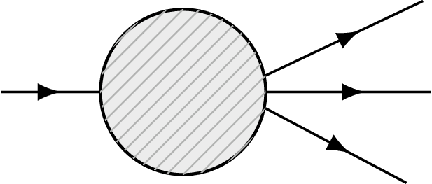
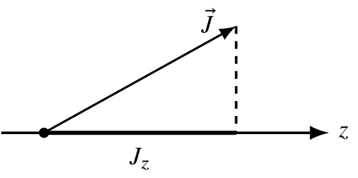

**Presenter**: 

**Note Taker**: 

## Kinematics of Two-to-Two Scattering: Variables and Invariants

### Lecture 5: Angle Distributions and Partial Wave Analysis
#### Recap on Kinematics

Today we are at lecture number five. We will discuss angle distributions and partial wave analysis. But before going there, I would like to start with a recap.

Last lecture we discussed the phase space for particle reactions, and we discussed different experiments and their kinematics. We went through the list of experiments around the world that study hadrons, look at their production mechanisms, and some peculiarities.

We start with a recap on kinematics. The following items are considered:

- **A. Scalar particles:** How many variables are needed to describe a 2‑to‑2 scattering of scalar particles (0⁻ mesons scattering to 0⁻ mesons)? The final state also has two 0⁻ scalar particles.
- **B. Particles with spin:** How many variables are needed when particles carry spin? For example, a 0⁻ scattering from a 0⁻ to a 3⁻ and a 1⁺.
- **C. Example:** Give a combination of variables that fully describe the process.

Here is a cartoon diagram that indicates what we are discussing. This is the scattering process; something described by strong interaction theory happens inside the interaction blob, and the arrows indicate the particles coming into the interaction and then leaving the interaction. These are not Feynman diagrams – sometimes they are called unitarity diagrams. We will touch on unitarity in the following lectures. For now, this is a nice way to indicate what we essentially talked about.

I ask you to calculate the number of variables needed to describe the process entirely – the full kinematics – and we are talking only about kinematics at this point. Whatever happens inside the interaction blob does not impact the answer. The blob is whatever: electromagnetic, strong, gravity, whatever you want. Something happens inside the blob, and how many variables do you need? Then two possibilities: first, particles without spin; second, when particles carry spin, how many variables do you need to describe the pulses? The second is related to the pictures I gave you. But let us do it one by one. Let us take two minutes and then discuss it. I added a third item: give an example of a combination of variables that fully describe the process.

So for parts A and B, you need to count – tell me how many. Then part C gives the example.

### Counting Variables

<b>Q:</b> How many degrees of freedom for a 2‑to‑2 scattering of scalar particles?
<b>A:</b> One calculates like  $2 \times 2 = 4$ , then multiply by 3, giving 12 degrees of freedom. Then subtract 4 constraints from conservation laws, leaving 8 variables. That is correct for the entire kinematics if you ignore the lack of an absolute reference frame in space. But you can rotate the space, so you must subtract another 6: 3 rotations and 3 boosts. So after conservation laws you have 8, but after removing the space‑time reference you have  $8 - 6 = 2$  variables.

  $$(2+2)(4-1)-4=8,\quad 8-6=2$$  

So for part A, you have 2.

<b>Q:</b> What did you get for part B (particles with spin)?
<b>A:</b> You have the 2 variables from part A, and you have the angular distribution of the final‑state particles from the production. I do not have any decay information on these particles. Just 2‑to‑2, then 4. Why 4? The angle between the two production particles, and the angle between the  $3^-$  and  $1^+$  particle. How are these angles different? Why can I not introduce these angles in part A? You can learn they are not necessary. So it is actually 2 as well.

In the first case, my amplitude that describes the interaction blob – the interaction – is a scalar function. It is just a single number. In the case where I have spin for particles, it is not a number; it is a higher‑rank object. So what is the side dimension of my scattering amplitude? Spin‑3 gives 7 dimensions; spin‑1 gives 3 dimensions. Therefore my scattering amplitude is a 21‑dimensional object – I have 21 amplitudes. But all of them are functions of two variables. It is really important to realize that when you have spin for particles, you have more amplitudes, but they all have the same dependencies.

The situation changes when you take into account the decays of the products of the final‑state particles. Usually we do not know any stable  $3^-$  particles, and none of the stable  $1^+$  particles would fly; we would consider them final‑state particles. Therefore both of these particles decay. Often you can take into account the decay products and introduce more variables. But if I restrict the problem to that – full stop – two variables, that is it.

---
#### Mandelstam Variables

<b>Q:</b> What are your favorite two variables to describe a two‑body scattering process?
<b>A:</b> Several choices exist:

| Variable Choice | Definition | Comments |
|-----------------|------------|----------|
| Mass sum |  $M_1+M_2$  and  $M_1+M_3$  | Valid but mixes  $s$  and  $t$  |
| **Mandelstam variables** |  $s = (p_1+p_2)^2$ ,  $t = (p_1-p_3)^2$  | Lorentz invariant; most common |
|  $u$  variable |  $u = (p_2-p_4)^2$  | Not independent; linear combination of  $s$  and  $t$  |
| Energy‑angle |  $\sqrt{s}$  (centre‑of‑mass energy) and  $\cos\theta$  (angle between  $\vec{p}_1$  and  $\vec{p}_3$ ) | Centre‑of‑mass frame |
| Lab energies |  $E_1^{\text{lab}}$  and  $E_3^{\text{lab}}$  | May cause non‑bijective phase‑space mapping |

These variables  $s$  and  $t$  are called invariants; they are Lorentz invariant. They do not describe a specific rest frame, so they do not describe a specific setup of the reactions. They are just something that characterizes the whole process. It does not matter in which frame you consider –  $s$  and  $t$  are understood. When I say “invariant”, I mean Lorentz‑invariant variables.

<b>Q:</b> Why talk about a third variable?
<b>A:</b> Because  $u$  is a linear combination of  $s$  and  $t$ . If you pass the algebra, you find that there are only two independent variables, so your favorite set  $s$  and  $u$  is equivalent;  $u$  is a linear combination of  $s$  and  $t$ . You take  $t$  and  $u$ .

<b>Q:</b> Another favorite set from a center‑of‑mass perspective?
<b>A:</b> Energy and angle. That is probably my favorite – indeed,  $\sqrt{s}$ , the center‑of‑mass energy, and then the angle. How do you define the angle? You go to the center‑of‑mass frame (often called center‑of‑momentum), and then you take the angle between  $\vec{p}_1$  and  $\vec{p}_3$ . One has to be careful because the lengths of the vectors indicate their momenta. In the center‑of‑momentum frame, the momentum of the initial and final particles are equal. That choice is fine.

<b>Q:</b> Any other common choices?
<b>A:</b> You could choose  $E_1$  in the lab frame and  $E_3$  in the lab frame – that is also fine. One has to be careful: sometimes folding the phase space with a set of variables maps the phase space to a domain that is smaller or has folded coverage – the transformation is not bijective. But that is advanced; I will ask you for an example later.

Here I have a scalar amplitude  $A(s,t)$  that describes the amplitude as a function of  $s$  and  $t$ :

  $$A(s,t)$$  

Now I made my cartoon a bit more rich. I indicate the channels or the variables in **Mandelstam invariants** that describe the process. The energy of the system is given by the variable  $s$ , which is the sum of four‑vectors squared. The transferred momentum in the  $t$  channel describes how energy is transferred analogous to this variable, but in the vertical direction. So I described it as  $p_1 - p_3$ . Here  $p_1$  is this one.

In my cartoon I also added the four‑vectors, which have an energy component and a three‑dimensional component, as well as the spin orientation for particles with spin and their **helicity** values  $\lambda_3$  and  $\lambda_4$ .

::: callout-note
Blue: The variable  $s$  is  $(p_1+p_2)^2$  for initial state (plus sign), and  $t$  is  $(p_1-p_3)^2$  for final state (minus sign). In the three‑body decay section we use a different sign convention:  $s=(p_1-p_2)^2=m_{34}^2$ ,  $t=(p_1-p_3)^2=m_{14}^2$  (with  $p_1$  the decaying particle). This will be updated in later notation.
:::

We discussed two‑body kinematics. We will continue discussing the angular dependence after the **Dalitz plot**. But let us first quickly look… Any questions on the variables that characterize kinematics? Cool.

---
#### Three‑Body Decay and the Dalitz Plot 

![The Dalitz plot, a representation of the phase-space for the three-body decay. It appears as an ellipse-shaped area where the internal region corresponds to allowed kinematics and the outside region is forbidden. On the x-axis lies the squared mass of two final-state particles, while the y-axis corresponds to the other subsystem. A horizontal line represents a slice of the phase-space with one mass fixed. The borders of the area correspond to configurations where all three momenta are aligned in the rest frame of the decaying particle, or equivalently, where the scattering angle in the relevant rest frame is either 0 or π.](2024-Lecture-05-images/fig3.png){#fig-fg3}

The homework had an exercise on the **Dalitz plot**. That problem now enters our lectures – part of the course that is specific to hadrons. Up to now we overlapped a lot with particle physics, but from this lecture onward the next couple of lectures will cover material specific to hadron spectroscopy and the approach we use to discuss hadrons. One of the subjects we want to go deeper into is particle representation, essentially three‑body decay. 

{#fig-fg1}

 The **Dalitz plot** is the common technique to indicate the dynamics of the particles – the dynamics of the interactions.

In the case of three‑body decay we have a similar diagram as before, but now one leg comes in and three legs go out. Inside the interaction blob is the interaction. We can pose all questions as before: what are the number of variables? The answer will not differ – it is the same number of legs. That number tells you that there are two variables that describe the process completely. Once you give me these two variables –  $s$  and  $t$ , or angles, or any other – I should be able to draw the entire kinematics.

Remember my analogy of the rigid body: you come and print on a 3D printer a blob out of which the vectors are sticking. This is a rigid body that describes a kinematic point. Angles between all vectors are fixed; lengths of the vectors are fixed. So you have the entire setup of the kinematics at a single point in phase space. The same for three‑body decay: give me two variables and I should be able to draw how the decay looks in the center‑of‑mass frame. In that case I have to draw three vectors leaving. This is the support out of which the vectors stick. Vectors determine angles and lengths – that is it.

Now  $s$  and  $t$  are defined in a similar way, but now we have different particles in the final state. The step from two‑body to three‑body kinematics is essentially taking one leg and swapping it to the other side, done by changing the sign in the formula. For three‑body decay, let me define it here:

  $$s = (p_1 - p_2)^2 = m_{34}^2, \qquad t = (p_1 - p_3)^2 = m_{14}^2$$  

I noticed a typo:  $p_1$  is the particle that decays. I will update my notation later. Let me for now stick to notations that relate to kinematics.

::: callout-important
Violet: The phase space for three‑body decay is constant on the variables  $m_{34}^2$  and  $m_{24}^2$ . In terms of  $s$  and  $t$  we write the recursive phase‑space formula as:
:::

  $$d\Phi_3 = \int \frac{dm_{23}^2}{2\pi} \, d\Phi_2 = \frac{1}{(8\pi)^2 \; 2s} \int dm_{23}^2 \, dm_{24}^2$$  

This is the recursive formula we discussed last lecture. It is easy to use this equation to demonstrate that once you substitute the two phase‑space factors and then put the proper mass transformation, you end up with a factor  $\frac{1}{8\pi^2}$ . This comes from the two phase‑space factors. From the first two‑body phase‑space you get a factor  $\frac{1}{8\pi} \frac{2p}{\sqrt{s}}$ ; from the second you get the same form. Every phase‑space factor has a  $\frac{1}{2\pi}$ , so overall  $\frac{1}{(8\pi)^2}\frac{2p}{\sqrt{s}} \frac{3d\Omega}{4\pi}$ . That is easy to remember because it is  $\frac{1}{8\pi}$  asymptotically – these things approach 1 at high energy and that is a unit integral. 

{#fig-fg2}

For both phase‑space factors you put this expression. For one of them, the cosine  $\theta$  describes the variable  $m_{34}$  in terms of the cosine of the scattering angle. So the  $2p$  appears, and you have to replace  $E'$  by  $p$ . This appears as a Jacobian. I think I may be incorrect; we arrived at these couple of lines without details. I hope we have another chance to fill in the details – it comes through the exercises and several times during the course that we evaluate phase space.

What we find for the three‑body case is that by using the recursive formula we obtain the fact that the Jacobian for the transformation is constant. The Jacobian for the transformation of the three‑body phase space into the variables of paired masses is constant – there is no extra dependence. It means that when we look at the differential width or differential cross section against these two variables, there will be no extra stretching or extra density increase due to the choice of variables.

We have several choices, and only one of them – or only the **Mandelstam invariants** – gives the undistorted representation of the density. So if you plot differential widths against two variables,  $m_{34}^2$  and  $m_{24}^2$ , the quantity

  $$\frac{d\Gamma}{dm_{34}^2\,dm_{24}^2} = c \, |\mathcal{M}|^2 = \text{const.}$$  

is a constant numerical number and is not rescaled. That is why representation of three‑body processes in terms of **Mandelstam invariants** (or other linearly related variables) is so powerful: you see directly the content of the interaction blob – what happens with the interaction. That is essentially what the **Dalitz plot** is.

## Kinematic Variables and the Dalitz Plot in Three-Body Decays

You can see an example of the three‑body decay of the  $\Lambda_c^+$  baryon to a proton, a kaon, and a pion.
We measure  $\Lambda_c^+$  produced in proton–proton collisions or any other collisions. In the BES and Belle experiments they see  $\Lambda_c^+$ . This is one of the particles that has a long lifetime and is produced abundantly. Particles with charm ground states are produced abundantly and they live a sufficient distance to fly from the primary vertex. We reconstruct them. That is why we have a good sample and a good understanding of their decay kinematics – not only kinematics, but dynamics as well.

In that decay there is a charm quark in the initial state and no charm quark in the final state, indicating that it proceeds via the weak interaction. The charm quark disappears between initial and final. The charm quark decays, transitioning into the  $s$  quark that ends up in the kaon. The  $c \to s$  transition is within one generation. This is an allowed process and not suppressed. This decay is a golden channel for registration because in the final state you have three charged particles. There are no neutrals. The proton is a nice charged particle – it travels and is stable. The kaon is stable in our accelerators, and the pion is also stable. So they fly away from the decay without distraction, and we see their tracks nicely through all detectors. We look at them and see they point out of the primary interaction.

At LHCb energies there is a shift of about 10 mm (roughly 1 cm) between the primary and secondary vertices. That is due to the boost and the fact that the  $\Lambda_c^+$  in the laboratory frame lives longer than in its rest frame. It has a few hundred GeV produced in proton–proton collisions at the LHC. This is a super nice decay and we have studied it a lot.

---

Here is the experimental result of the analysis, which resembles experimental data. If I showed you experimental data, you would not distinguish it from that plot because the statistics are so high that everything is very smooth in this distribution. On the  $x$ ‑axis I have the invariant mass of the proton–kaon system; on the  $y$ ‑axis I have the invariant mass of the kaon–pion system. In terms of Mandelstam variables, these are  $s_{pK} = (p_p + p_K)^2$  and  $s_{K\pi} = (p_K + p_\pi)^2$ , respectively. The allowed values for the decay are shown in color. The white area around corresponds to kinematics for which no setup exists. If I select a point inside the plot, I can compute the angles between the particles and, in a 3D‑printer analogy, make a rigid body of that kinematic point. But if you ask about the kinematics corresponding to the white region, you quickly find that energy is not conserved at that point – the constraints cannot be satisfied. That is why the range of possible values for the invariants is limited, and the surface is called a Dalitz plot. This is how we explore the kinematics.

In this plot, different colors indicate different probabilities for the reaction. What we measure is the decay. We reconstruct the tracks of the particles and then determine from which kinematic point the decay occurred, because there is an unambiguous relation between the four‑vectors and the kinematic point. It turns out that certain kinematics are more probable than others – particles prefer to go in different directions. For this decay, for example, one configuration is longer, another is shorter. It turns out that one possibility is rarer than the other, and you can see this looping in the plot.

::: callout-tip
The Dalitz plot is a powerful tool: if the matrix element  $\mathcal{M}$  is constant, the distribution over the Dalitz plot is flat. The phase space factor for a three‑body decay can be written as
  $$d\Gamma = \frac{|\mathcal{M}|^2}{2m} d\Phi_3, \quad d\Phi_3 = \frac{1}{(8\pi)^2 2s} \int dm_{23}^2 \, dm_{24}^2,$$  
so that for constant  $\mathcal{M}^2$  we have  $\frac{d\Gamma}{dm_{34}^2 \, dm_{24}^2} = \text{constant}$ . Any enhancement indicates dynamics, such as intermediate resonances.
:::

---

Shall we spend two minutes to find where the points of extreme mass lie? The hint is that on the border of the plot the particles are aligned in one line; inside the surface they always have an angle between them. Once you go to the border, they are somewhat in a line. Think about how to maximize the mass and where on the border that point lies.

<b>Q:</b> Any thoughts? I think you should be at the bottom right, because we want to maximize the mass of the  $pK$  system. There are three momenta going out. The three momenta are in opposite directions, so the three‑momentum of the sum should be as small as possible. The sum of the squares of the momenta should be as large as possible, so we should be on the right of the diagram. And if we add the  $K$  and  $\pi$ , same direction should give the lowest mass.

<b>A:</b> So you argue that this mass on the  $y$ ‑axis should be as large as possible or as small as possible?

<b>Q:</b> As small as possible.

<b>A:</b> Why?

<b>Q:</b> Because the three momenta are in line – we subtract them. In their rest frame, if we boost so that the  $K$  and  $\pi$  fly next to each other, their relative momentum is small. If we boost to their rest frame, they might even both be at rest. So their mass would be just the sum of the masses; that is a minimum.

<b>A:</b> So what you say is correct. We are looking for the minimal mass of the  $K\pi$  system. Therefore, let us figure out what that point corresponds to. That kinematics has two particles with maximal momentum and the third at rest. They go in opposite directions. That corresponds to this point. I think this plot is from experimental data. Yes. How in experiment will we reconstruct such a case? We do not detect the proton. This is the lab frame; this is the center‑of‑momentum frame. Everything we measure is in the lab frame, which is already boosted. So this point is the maximum mass – they go back‑to‑back, so that is the maximum mass. And this point minimizes the mass. Good.

For the three‑body decay there is a similar way. The standard way to define the angle: I will show the setup using proton, kaon, and pion. I fix the invariant mass of one pair, say the  $K\pi$  system, and then vary the angle between the other particle and that pair. The way to think is to take the setup in the center‑of‑momentum frame and boost to the  $K\pi$  rest frame. Once in that rest frame, the  $K$  and  $\pi$  go back‑to‑back in the center‑of‑momentum frame. I have three particles arranged such that the sum of the three momenta is zero. Then I boost to the  $\Lambda_c^+$  system – it has non‑zero momentum – the  $K$  and  $\pi$  each have non‑zero momentum, but in their rest frame they add to zero. If I fix the mass of the  $K\pi$  system and want to explore the phase space along the line where this mass is fixed, the length of the vectors is fixed. What changes is only the angle  $\theta$  between the proton and the  $K\pi$  system. So I have an angle  $\theta$  that I vary from  $0$  to  $\pi$ . One corner corresponds to  $\theta=0$ , the other to  $\theta=\pi$ .

<b>Q:</b> I thought because we fixed the mass of the  $K\pi$  system, what we found is that in this setup the proton and kaon go opposite directions, which gives the maximum mass of the  $K\pi$  system. So for our new setup we only generate one angle. Since the length of all vectors is fixed, we can only rotate. The dependence of the mass of two particles on the angle: the wider the angle, the larger the mass. For the proton–kaon mass, if the angle is zero you have a very high mass; if they go almost in the same direction you have a small mass. You can do the same with the other pair.

<b>A:</b> Let me fix the mass of the proton–kaon system again. The most straightforward way is to go to the rest frame of the  $\Lambda_c^+$ , where everything is fixed, and then scan along a line by changing the angle of the  $K\pi$  pair with respect to the rest. Therefore the lines in the Dalitz plot describe the setup where you change the angle in one frame or another. Another thing: in 2‑to‑2 scattering you have a third variable called  $U$ , which is even more symmetric. For the three‑particle decay there is also an invariant mass of the pion–proton system,  $m_{p\pi}^2$ . It is not evident what that mass is, but if you want to fix that mass and scan along a line, it is easy to understand from the relation that  $U$  is a linear combination of the two Mandelstam variables. Actually it is a linear combination with coefficients of one, so it appears as a diagonal in the Dalitz plot. If you fix the mass of the pion–proton system, you move from one corner to another along a diagonal line.

In experimental analysis we usually plot on the  $x$ ‑axis the invariant mass of one pair and on the  $y$ ‑axis the invariant mass of another pair – that is what you see here. In the homework you have an exercise of a more symmetric Dalitz plot where all variables enter symmetrically. This uses the property of an equilateral triangle: for any point inside, the sum of the distances to the three sides is constant. That allows us to introduce variables that are the distances to the sides, so the masses of the pairs are represented by these distances. It is a symmetric representation. It is essentially the same as the rectangular plot but skewed – it is a linear transformation. To relate them you use a transformation that involves  $\sqrt{3}/2$  because of the 60° angles. Both representations show the same kinematics. The objective of this kinematic representation is to understand the dynamics – what processes guide the interaction.

---

Looking ahead to future lectures, we realize that this process is not just  $\Lambda_c^+$  decaying to three particles; it proceeds via intermediate resonances. For a short moment, two of the particles form an intermediate state that then dissociates. This increases the probability of the decay. If the energy is adjusted into a certain range, the probability is higher because these particles interact more strongly at that energy. You might have seen cross sections for two‑particle resonances, which have a bump known as a hadronic resonance. The physics is that you have a system of two particles whose quantum numbers match those of a known resonance. By adjusting the energy you explore how likely the particles are to interact. If there is an intermediate resonance, the system can resonate at that energy, increasing the probability. This leads to bent structures in the Dalitz plot distribution. If you project onto one axis, you see a nice resonance‑like shape. These bent structures can be identified. I like this example because there are resonances in all three pairs.

<b>Q:</b> Why is there a larger probability increase when the kaon and pion are near resonance, and also for  $pK$  on the right side, but not only two lines on the left side?

<b>A:</b> Let us quickly identify the different lines. Horizontal lines correspond to a fixed mass of the  $K\pi$  system. They peak at a certain value, indicating resonances in the  $K\pi$  system – these are  $K^*$  resonances. Vertical lines correspond to a fixed mass of the  $pK$  system. Scanning along the vertical axis you see  $pK$  resonances (e.g.,  $\Lambda$  and  $\Sigma$  states). The third combination is  $p\pi$ , which gives  $\Delta$  resonances. In the symmetric Dalitz plot these lines are parallel to the sides of the equilateral triangle. For example,  $\Lambda$  resonances are parallel to one side,  $\Delta$  resonances parallel to another. It is easier to see in that representation, though it is a bit trickier here.

| Subsystem | Resonance type | Observed as |
|-----------|----------------|-------------|
|  $K\pi$     |  $K^*$           | Horizontal bands |
|  $pK$       |  $\Lambda, \Sigma$  | Vertical bands |
|  $p\pi$     |  $\Delta$        | Diagonal bands |

## The Dalitz Plot of Λc⁺ Triple-Body Decay

One thing to finish and to move past **the previous topic** and to move to the topic of today is the **angular distribution**.

I'm going to discuss now the angular distribution for a decay within one band. Let me look at the phase space resonance here. (see @fig-fg3) As we discussed before, when I traverse the Dalitz plot and the phase space from one end to the other, while keeping the mass of the ** $K\pi$  combination** fixed, I am changing the angle. So I am exploring the different angles. This is precisely the kinematics.

Let me sit in the rest frame of the  $K\pi$  where this band is happening and traverse the phase space by changing this angle. Within the band I can have an inhomogeneity. Sometimes even if I am within the band, one edge of the band has a different probability than the other. It is common that particles like to be aligned and do not like to be perpendicular. So **the perpendicular kinematics** is less probable than **the aligned kinematics**. This preference for alignment might happen.

---

This happens because particles have **spin**. This preference appears only because the intermediate resonance in that case — the  $K$  — is not a scalar particle; it has spin. The spin of particles causes the inhomogeneity in angular distributions and causes inhomogeneity on the Dalitz plot.

Fifteen minutes before the end, we start with the lecture of today.

The **angular distribution** is a very powerful tool to understand properties of particles. As we already discussed, that is our way to measure spin, parity, and other quantum numbers in particle interactions.

Particles with higher spin produce more bumpy, more spiky angular distributions; particles with lower spin, if everything is scalar, produce no asymmetries at all — no structure in angular distributions.

| Higher spin | Scalar lower spin |
|-------------|------------------|
| Produce more bumpy, more spiky angular distributions | Produce no asymmetries at all — no structure in angular distributions |

By looking at the angular distribution, especially in the rest frame of the particle decay, one examines the ratio of aligned kinematics to other types of kinematics. From this one can infer information about the spin.

---

For most of the particles that we have discovered up to now, the quantum numbers are not known. We discover particles that appear as bumps in the spectrum, and the next step to understand their properties is to determine their quantum numbers. This is done by looking at angular distributions.

Most of the time it is as simple as looking at the Dalitz plot and seeing if there is a minimum in the angular distribution, if **the angular distribution curve** has several structures, several nodes. For scalar final-state particles, the nodes directly tell you the spin:

| Spin | Number of nodes |
|------|-----------------|
| 1    | one node |
| 2    | two nodes |
| 3    | three nodes |

The intensity vanishes at certain points in the dark spot.

::: callout-note
For scalar final-state particles, the nodes in the angular distribution directly tell you the spin: one node means spin one, two nodes mean spin two, three nodes mean spin three.
:::

---

If the particles are not scalar — and most of the time they are not — the situation is a little more complicated. I will give an example of scalar resonances. But here let us quickly check what spins are involved.

The spin of the proton is  $1/2$ . The kaon and pion have spin zero. The spin of the  $\Lambda$  is the same as the proton, but the averaging over spin projections smears the distribution.

If you consider a definite spin projection of the  $\Lambda$  and the proton, you again get nodes and zeros in the angular distribution. But since we do not polarize the initial-state  $\Lambda$  and we do not measure the spin of the final state, everything is averaged.

| Definite spin projection of  $\Lambda$  and proton | Averaged over spin projections (unpolarized initial and final) |
|-------------------------------------------------|---------------------------------------------------------------|
| Again get nodes and zeros in the angular distribution | No minima, nodes, or zeros; things get smeared out |

Therefore you no longer have minima, nodes, or zeros; things get smeared out.

## Dalitz Plot and Phase Space in Three-Body Decays

**A particle with spin  $J$  has  $2J+1$  possible projections onto a chosen quantization axis.** We choose a  $z$  axis to quantize the spin, and the operator  $\hat{J}_z$  gives the eigenvalue  $m$  for the state  $|J,m\rangle$ :
  $$\hat{J}_z |J,m\rangle = m |J,m\rangle.$$   

{#fig-fg4}

One can think of the ket  $|J,m\rangle$  as a vector with  $2J+1$  components. For example, for spin‑ $1/2$  we have
  $$\left| \frac{1}{2}, \frac{1}{2} \right\rangle = \begin{pmatrix}1\\0\end{pmatrix},\quad \left| \frac{1}{2}, -\frac{1}{2} \right\rangle = \begin{pmatrix}0\\1\end{pmatrix}.$$  
Operators in this space are matrices that act on these vectors, producing either the same state with a certain eigenvalue or a mixture of states.

---

When a rotation acts on a state, it generally produces a mixture of different  $m$  states, not a single definite projection. In classical vector space one could arrange the rotation to align with a particular axis, but in quantum mechanics that is not possible. A rotation usually yields a superposition of all allowed  $m$  states. The coefficients of this superposition are tabulated known functions, called **Wigner functions**.

---

Let me be more concrete. I will rotate about the  $y$  axis. So we have  $x$ ,  $y$ ,  $z$  axes forming a right-handed triple. To rotate  $|J,m\rangle$  about the  $y$  axis, we use the operator
  $$R_y(\theta) = e^{-i\hat{J}_y\theta},$$  
with  $\hat{J}_y = (\hat{J}_+ - \hat{J}_-)/(2i)$ . The raising and lowering operators  $\hat{J}_+$  and  $\hat{J}_-$  have zeros on the diagonal and off‑diagonal elements. The matrix exponential of  $\hat{J}_y$  produces the rotation matrix.

The result is known: the rotated state is a linear combination
  $$R_y(\theta) |J,m\rangle = \sum_{m'} d^{J}_{m'm}(\theta) |J,m'\rangle,$$  
where the  $d^{J}_{m'm}(\theta)$  are **Wigner  $d$ ‑functions**. These coefficients depend on the initial  $m$  as well, which is why the  $J$  and  $m$  indices appear in the notation.

---

More generally, any orientation in space can be described by three Euler angles. In the convention used in particle physics, we

1. first rotate by  $\alpha$  about the  $z$  axis,
2. then by  $\theta$  about the  $y$  axis,
3. and finally by  $\phi$  about the  $z$  axis.

The full rotation operator is  $R = R_z(\phi)R_y(\theta)R_z(\alpha)$ , and the corresponding **Wigner  $D$ ‑matrix** is
  $$D^{J}_{M'M}(\alpha,\theta,\phi) = e^{-iM'\alpha}\, d^{J}_{M'M}(\theta)\, e^{-iM\phi}.$$  
The  $z$  rotations give simple phases; the non‑trivial part is the  $d$ ‑function for the  $\theta$  rotation.

---

Let me give a small example with spin‑ $1/2$ . I will rotate the state  $|1/2,\,1/2\rangle$  by  $30^\circ$  about the  $y$  axis. The result is a combination of  $|1/2,\,1/2\rangle$  and  $|1/2,\,-1/2\rangle$ . What are the coefficients? These  $d$ ‑functions are closely related to **Clebsch‑Gordan coefficients** because both come from the  $SU(2)$  group. For  $J=1/2$ , the  $d$ ‑matrix (for  $m',m$ ) is
  $$d^{1/2}(\theta) =
\begin{pmatrix}
\cos(\theta/2) & -\sin(\theta/2) \\[2pt]
\sin(\theta/2) &  \cos(\theta/2)
\end{pmatrix}.$$  
Since the rotation angle is  $30^\circ$ , the half‑angle is  $15^\circ$ . Therefore
  $$R_y(30^\circ)\,|1/2,1/2\rangle = \cos 15^\circ\,|1/2,1/2\rangle + \sin 15^\circ\,|1/2,-1/2\rangle.$$  

I should have picked  $60^\circ$  to get nicer numbers, but  $15^\circ$  is still easy to look up. In the seminar we will explore more details, but the  $d^{1/2}(\theta)$  matrix is super simple to remember.

## Dalitz Plot Resonances and Angular Distributions

#### Questions Concerning Wigner D Functions

Would you be able to calculate any rotations of the spin projection?
The rotation operator for a rotation about the  $y$ -axis is

  $$R_y(\theta) = e^{-i\hat{J}_y\theta},$$  

and its action on a state  $|J m\rangle$  is

  $$R_y(\theta) |J m\rangle = \sum_{m'} d^J_{m'm}(\theta) |J m'\rangle.$$  

The general Wigner  $D$ -function for an arbitrary rotation  $R = R_z(\phi)R_y(\theta)R_z(\alpha)$  is

  $$D^J_{m'm}(\alpha,\theta,\phi) = e^{-im'\alpha}\, d^J_{m'm}(\theta)\, e^{-im\phi}.$$  

This explicit form makes the minus‑sign convention clear.

---

### Computing the Matrix Exponent

If you want to compute the matrix exponent yourself, in previous exercises we computed these matrices. In principle, one can do that using Python or Julia. Just call the matrix exponent function with a matrix and you obtain the Wigner D functions.

For example, a rotation by  $30^\circ$  about the  $y$ -axis acting on a spin‑ $\frac12$  state  $| \frac12, \frac12 \rangle$  gives

  $$R_y(30^\circ) \left| \frac{1}{2}, \frac{1}{2} \right\rangle = \cos 15^\circ \left| \frac{1}{2}, \frac{1}{2} \right\rangle + \sin 15^\circ \left| \frac{1}{2}, -\frac{1}{2} \right\rangle,$$  

where the basis states can be represented as column vectors:

  $$\left| \frac{1}{2}, m \right\rangle = \begin{pmatrix} 1 \\ 0 \end{pmatrix} \text{ or } \begin{pmatrix} 0 \\ 1 \end{pmatrix}.$$  

---

### Conventions and Warnings

However, the Wigner D functions are also tabulated.

::: callout-caution
<b>Mathematica:</b> Be especially careful with Mathematica. Mathematica has an opposite convention to what we use: it has a plus sign in the exponent and some indices swapped. Beware of this difference.
:::

- Wikipedia is the most reliable source in that respect.
If you search for "Wigner D functions", it provides a table and explains the conventions. This is my go‑to page for checking Wigner D functions.

- They are coded correctly in the **sympy** library (Python) and in **ROOT**.
There is a word of warning: be careful with the sign conventions.

---

### Importance of Rotational Group

Let me stress that what we discussed so far does not involve weak interactions; it is about rotations and the rotational group. That is a fun part, and it still impresses me: to understand how particles behave and what the angular distributions are, you need very little from the strong interaction. You need the general properties of the rotational group.

Angular distributions are determined by how space is rotated, plus the little bit we need from strong interactions regarding which spin particles are produced. Strong interactions tell us which spin particles are produced.
But how they decay and what asymmetry appears in the kinematics is determined by the quantum group. That is amazing.

Therefore we can now move on and have a general recipe to construct any particle decay chain and determine the angular distribution.

## Angular Distributions and Wigner D Functions for Spin Determination

Let’s now explore the blob from the previous slide and consider one of the possible decay kinematics and dynamics. (see @fig-fg1) (see @fig-fg3)

Now we will construct a model for what is inside the blob.

It is not kinematics; it comes from modeling assumptions. I assume that the three final‑state particles are produced via a cascade: the initial particle decays to an intermediate particle  $X$  with **spin**  $J$ , and then  $X$  decays to particles  $1$  and  $2$ . 

{#fig-fg5}

 

{#fig-fg6}

 

{#fig-fg7}

A three‑body decay with two variables; **spins** give the dimension of the matrix (discrete dimensions).

Since all particles have **spin**, the dimensions are

  $$(2j_0+1) \times (2j_1+1) \times (2j_2+1) \times (2j_3+1).$$  

If a particle has **spin**  $0$ , the dimension of the corresponding **spin** is  $1$ . That is straightforward.

---

In general, you have many two‑variable functions, and the way to write the amplitude is to sum over the intermediate **spin**.

For simplicity, we are going to align the kinematics. We consider particle  $X$  and particle  $3$ ; they are in different rest frames.

| Particle(s) | Rest frame |
|-------------|------------|
| 1 and 2     | are in the rest frame of  $X$  |
| 3           | is in the center‑of‑momentum frame of the initial state |

This is a general expression; it is extendable to any cascade decay.

---

I will give you a general formula; we will only have time to understand it, not derive it.

It has two components: model‑independent angle dependence driven by the Poincaré group, and the particle interactions that you have to insert.

The  $H$ 's are the remaining dark blobs that hide the dynamics of the particles. They come from the weak, strong, or electromagnetic interaction — whatever you have. This physics is contained in  $H$ , and the rest is the rotational properties of the system. So  $H$  encodes the physics of the hard interactions, which is unknown because we have no parameterization.

The amplitude is a sum over intermediate **helicities** of products of  $H$  couplings and **Wigner  $D$ -matrices**:

  $$A_{\lambda_0,\lambda_1,\lambda_2,\lambda_3}(s,\theta) = \sum_{\lambda'_X} H^X_{\lambda_0\lambda'_X}\, D^{\,j_X}_{\lambda'_X\lambda_X}(\theta_X,\phi_X)\, H^Y_{\lambda_X\lambda_Y}\, D^{\,j_Y}_{\lambda_Y\lambda_3}(\theta_Y,\phi_Y).$$  

The  $D$  functions represent the rotation orientation of the decay. The first index tells you which particle decays; the second index gives where it decays. The particles then have their **spin** quantized in the frame where the particle moves.

The most natural quantization axis is the direction of motion; then the **spin** projections are **helicities**  $\lambda$ , the projection of **spin** onto the momentum direction.

---

Now look at particle  $X$ . It carries **spin** projection  $\lambda_X$ .

It decays to particles  $1$  and  $2$  at an angle relative to the direction of motion of  $X$ . To compensate for this angle, one must rotate the quantization axis; this is done by rotating the **spin** of  $X$  to align with the decay direction.

A Wigner rotation is performed:

  $$R_y(\theta)\,|J m\rangle = \sum_{m'} d^{\,J}_{m'm}(\theta)\,|J m'\rangle,
\qquad
D^{\,J}_{m'm}(\alpha,\theta,\phi) = e^{-im'\alpha}\, d^{\,J}_{m'm}(\theta)\, e^{-im\phi}.$$  

---

I will evaluate this expression in the aligned kinematics:  $\phi=0,\ \theta=0$ .

Here is the center‑of‑mass frame.

If we evaluate the amplitude when the angles are zero, we do not need to rotate the system. Particle  $X$  moves along the  $z$ -axis, so no rotation is needed.

Therefore the sum over  $\lambda_X$  reduces because the **Wigner  $D$ -matrix** at zero angles becomes a **Kronecker delta**:

  $$D^{\,j_X}_{\lambda'_X\lambda_X}(0) = \delta_{\lambda'_X\lambda_X}.$$  

The product then gives

  $$\sum_{\lambda'_X} H^X_{\lambda_0\lambda'_X}\,\delta_{\lambda'_X\lambda_X}\, H^Y_{\lambda_X\lambda_3}
= H^X_{\lambda_0\lambda_X}\, H^Y_{\lambda_X\lambda_3}.$$  

Conservation of angular momentum along the  $z$ -axis forces  $\lambda_X = \lambda_0 + \lambda_3$ .

The second decay angle  $\theta$  (the angle between particle  $1$  and the direction of  $X$  in the  $X$  rest frame) is non‑zero, so we keep the corresponding Wigner  $d$ -matrix.

The final expression simplifies to

  $$H^X_{\lambda_0,\,\lambda_0+\lambda_3}\; d^{\,j_X}_{\lambda_0+\lambda_3,\ \lambda_1-\lambda_2}(\theta).$$  

That is it — as simple as that.

## Cascade Decay Kinematics and Helicity Amplitudes

<b>Q:</b> How many numbers do I need from you to compute?
<b>A:</b> I want to think now about electromagnetic interactions, or let me do gravity. How many numbers as input do I need from you to predict the angular distribution? It is essentially here, but it misses fundamental components. What is inside the amplitudes? What is inside this amplitude, this amplitude, or this amplitude and that amplitude?

In order to predict all of my values, I just need the amplitudes for the initial and final spin projections. So I have  $(2j_1+1)(2j_2+1)$  values here, which might be functions of particle masses as well — could be masses of particle  $X$ . Then I need a similar number of these amplitudes, but there is a reasonable way to approximate them.

Often in the experiment, in the analysis at the first try, we assume that these are actually constant. One amplitude is constant ( $c$ ) and the other contains only the particle property. I am going to say that one amplitude is constant ( $c$ ) and the other contains only the particle property. Once I do that, I should be able to compute what the angular distribution is.

---

In that case I am going to fix the mass of the particle and the intensity distribution that I see along the line. What we have up to now is the differential decay rate  $\frac{d\Gamma}{d\cos\theta}$ . Cosine is just better because it has a better Jacobian — we do not need the sine Jacobian. That is why often what is looked at is  $\cos\theta$ , and the matrix element is proportional to the decay rate:

  $$\frac{d\Gamma}{d\cos\theta} \propto |\mathcal{M}|^2.$$  

This  $|\mathcal{M}|^2$  is fixed. The distribution changes from  $-1$  to  $1$ . So  $\theta$  gives  $\cos\theta = -1$  at one endpoint, and we scan from  $-1$  to  $1$ . (see @fig-fg4) If it is flat, that is one possibility. What you often see, especially when dealing with particles with spin, is a parabola, a second‑order polynomial in  $\cos\theta$ . Or what you also often see is this.
---

::: callout-note
The amplitude  $\mathcal{A}$  appears squared, and in experiments we only see the squared magnitude.
:::

Notice the difference. It is important to acknowledge that what we wrote here — the amplitude  $\mathcal{A}$  — is from the quantum transition approach. It is a probability amplitude; it is going to be squared to give the observed probability. This amplitude  $G$  appears squared. In experiment we only see the squared value of the amplitude. Moreover, often we deal with unpolarized decays, so the distributions are also averaged. Therefore we have to square this thing and sum over the initial and final spin projections:

  $$\frac{d\Gamma}{d\Omega} = \frac{1}{2j_1+1}\frac{1}{2j_2+1} \sum_{\lambda_i,\lambda_f} |\mathcal{A}_{\lambda_f\lambda_i}|^2 \times \text{(phase space)}.$$  

In experiment you see this and you wonder: what does it tell me? The first way to analyze that is not to guess the amplitude, but rather to acknowledge these angular distributions by projecting onto Legendre polynomials, because that gives a nice basis. And this basis corresponds to the maximum spin value that appears.

You see some functions from  $-1$  to  $1$  and you can expand any such function as a series of Legendre polynomials:

  $$f(\cos\theta) = \sum_{l=0}^{\infty} a_l\,P_l(\cos\theta).$$  

These Legendre polynomials are related to the spin of the particle that is produced. This is what is called **partial wave analysis**. If you project the differential cross section, this is called **moment analysis**. So partial wave analysis is a way to guess the  $H$  functions (the helicity amplitudes) to model your cross section, and let these coefficients be free parameters. Then you try to learn what is inside the amplitudes by adjusting them on the data.

But as a first step, often what is done is to project angular distributions onto the polynomials, which will not give you inside of the amplitudes directly, but some combination of the helicity amplitude parameters. This is not straightforward, I believe, and we will have more chance to discuss that.

## Identifying Dalitz Plots from Unlabeled Decays

I didn't tell you much about differences between the **canonical state** we introduced at the beginning and the **helicity state** we introduced later.
We only touched a little bit on how the state is defined in the rest frame, and hopefully we will explore more.

---

I would like to tell you that this book has the best coverage of this subject: Martin Spearman's *Elementary Particle Theory*.
**Chapter four** is fundamental.
It is really fun reading because it starts from the Lorentz group, tells you how to introduce the vectors, how to do a little bit of group theory, but in a nice way without heavy details, without having mass.
It is a really good book.

Chapter four of Martin Spearman's *Elementary Particle Physics* would give you some insights on particle definitions.

---
I am going to hand out an exercise. There are some **Dalitz plots** from **CLEO** and **BaBar**, and I have removed the labels. I do not tell you which particles are in the final state. I only tell you that one is a  $D$  decay and another is a  $D_s$  decay. (see @fig-fg6) (see @fig-fg7)

You already know a lot about kinematics.
The exercise is to figure out what decay each plot represents.
The axis labels are still there, but you do not know what each mass is.
From the kinematics you can figure out the masses and perhaps guess the case.

