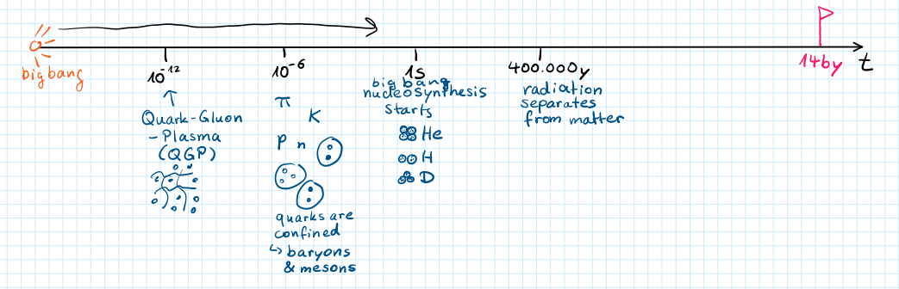
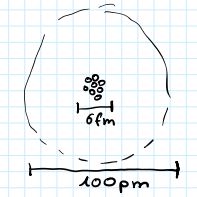
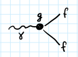
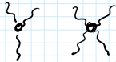
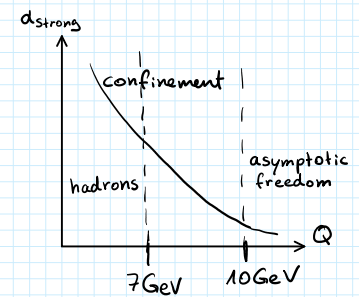

**Presenter**: 

**Note Taker**: 

### Foundations of Hadron Physics

Lecture one will be dedicated to the introduction of hadron physics.
I would like to start by explaining the origin of hadron physics and how it appeared at the earlier stages of the universe, where it matters in the course of evolution of our universe.
Then we'll discuss the matter composition and how quark physics plays its own role.
We'll discuss the standard model and then equations that describe the motion of fields.
We will talk about the gauge groups and mention the important property of the strong interaction that is the key to matter formation, known as confinement.
I will write the basic equations that will help you to solve exercises.

Today is the 8th.
The course is for the second time.
I will be reusing material from the last lecture from last year as well.
Last year we made an experiment of recording the lectures and transforming them into text.
There is a project we are working on to have this more automatic way.
We experiment to gain more material to play with.
I would like to ask if no one minds me recording myself.
This iPhone is the recording device.
There are no voices usually on that.
But if you mind, I don't have to.
I have recordings from last year.
That will benefit you as well, because the idea is that I provide you with the text of the lecture.
Another thing is that if someone makes the pictures, wants to fill the board, it will also get included.
It will throw this to the language model as well and have it formally typed.
So probably I will ask you to make a picture once we fill the board.

It's good to start the lecture course by establishing the timeline for the universe and the numbers for different epochs and stages.
They are really hard to imagine - either very small or very large.
That's why we need this on human scale first.
The number that is where we are now is 14 billion years, which is what we believe is the age of the universe.
Starting from the Big Bang there will be many points, but to have a human scale, I would like to make one exercise.
A clap represents the Big Bang, and then the sound travels.
The speed of sound is like 300 meters per second, so for one meter it's 0.003 seconds.
If the clap was a Big Bang from that moment, the universe started evolving, and by the time when the sound came, most of the stages had passed.
Hadron physics is actually around this time.
So we need $10^{-6}$, $10^{-12}$.
At like one second at the beginning, matter is produced.
We don't know what kind of matter is there, but we assume that the structures started forming already.
The seeds of the structure were already produced during inflation, inflation of the space and time.
We have little idea about what's going on here, so we'll move to $10^{-12}$, where already electroweak scale is passed, Planck scale is passed.
Higgs potential developed its minimum, universe collapsed to the lower, to the second minimum of the Higgs potential, and we arrive at $10^{-12}$, where the matter itself is the equivalent plasma.
The dots here are quarks - they are constituents of the matter.
The fields that operate in this space are gluons.
With the abbreviation QGP, we refer to quark gluon plasma.
There is no matter as we know it - it's just a soup in which fields are acting.
The equation of motion at high temperature in place around $10^{-6}$, this soup starts evolving into structure.
In the interval somewhere here you've got hadronization process.
When the sound came, what happened with our universe is that it already has elementary matter blocks, which are mesons and baryons.
Quarks are now confined and gluon fields are almost entirely sitting inside of these objects.
Essentially that's all we need from this picture.
What happens further is another 14 billion years of evolution.
Somewhere here I mark one second, which is a good mark, where the nuclear synthesis starts.
Another visually pleasant indication is when radiation separates from the matter.
Big Bang nuclear synthesis and then radiation separates from the matter is around - doesn't have a scale.

{#fig-fg1}

That happens for 400,000 years after the Big Bang.
We've got pions and baryons.
For the rest of the semester, what will happen with our universe, which we just created? There will be some nuclear synthesis starting.
We won't get to the forming of the atoms as we know them with electron shells until 400,000 years after.

So what I have here is the electron, right? So atom is what? Let's now go to the second item.
What is the matter? What's the most abundant element in the crust of the earth? By mass, the most abundant element is iron, and the most abundant in the crust it seems is oxygen, so oxygen.
Oxygen is an element with eight protons and eight neutrons, and they form a rather compact object in the center of the atom which is the nucleus, and they are actually packed to each other very, very tightly.

{#fig-fg3}

What's the size of a single nuclear proton or neutron? It's roughly one fermi.
And yet you have 16 balls of one fermi packed together.
If you think of this setup, you get roughly the size of the nucleus, and this is 6 fermi in diameter.
So we do measure that a radius of 3 fermi is what naive calculation tells you.
That's why I multiply by two and I get the diameter of six fermi.

Then electrons are another part of the atom and how many of them do we expect? They occupy shells of the atom which is 1s 2 2s 2 2p 4, where s stands for s orbital circular P stands for the p orbital which are what is the shape of it? It's not banana shape, it's what exactly like a dumbbell shape.
If you remember that there was the energy of electrons versus the angular momentum in the lower one was 1s was 2 1s and here.

{#fig-fg2}

Right, something like that.
Then the wave function of the electron of 1s orbital is something like $ e^{-r/a_0} $ where $ a_0 $ is the Bohr radius and you already get the scale.
So the size of the atom is given by the Bohr radius.
This you find by solving Schrödinger equation of moving of electron bound in the electromagnetic field of the core.

::: callout-note
The **Schrödinger equation** for hydrogen-like atoms is:
$$ \hat{H}\psi = E\psi $$
where the Hamiltonian is:
$$ \hat{H} = -\frac{\hbar^2}{2m}\nabla^2 - \frac{Ze^2}{4\pi\epsilon_0 r} $$
The **1s orbital wavefunction** is:
$$ \psi_{1s}(r) = \frac{1}{\sqrt{\pi a_0^3}} e^{-r/a_0} $$
where $a_0 \approx 0.529 \times 10^{-10}$ m is the **Bohr radius**.
:::
For the scale $ a_0 $ is equal to 50 picometers I think 59, 59,000 femtometers.
This is 60 picometers and this thing would be of order 50,000.

Wait a second, doesn't the charge of the nucleus affect the radius? Of course it does.
In fact it just scales.
If you have a Z equal to 8 here, then you are going to find 8 times smaller numbers.
However, further electrons from the orbital they get screened by the internal electrons, they feel less charge and that's why you have outer shells, I mean of roughly several hundred picometers.
So I have a clear estimation of 100.

To imagine that, comparing this to our solar system and sketching it here.
Here is Earth.
Comparing the radius of the nucleus to the orbital shells and comparing to the radius of the sun versus the orbit of the Earth, scaling the sun by a factor of 150 makes them smaller and then it matches the distances in the atom roughly.
This is so that you have scales in mind, scaled some sizes.

I think I will add here that the average radius for 1s is equal to $ \frac{3}{2} a_0 $.
The average radius for the 2s is for the figure is equal to $ 6a_0 $ and then the average radius for the 2p.
When I got this number is roughly I took this and I divided by effective charge.
2s is $ 6a_0 $ and then divide by effective charge of roughly probably it's to be started with eight.
We get some screening.
So it's probably four, I don't know minus two six.
So we get roughly $ a_0 $.
That's why $ a_0 $ is taken is giving us the radius and then roughly where the hundred picometers come from.

::: callout-tip
For hydrogen-like atoms, the **average radii** scale with nuclear charge:

- $\langle r \rangle_{1s} = \frac{3}{2}\frac{a_0}{Z}$
- $\langle r \rangle_{2s} = 6\frac{a_0}{Z_{\text{eff}}}$
where $Z_{\text{eff}}$ accounts for electron screening effects.
:::
Standard Model then questions here.
Particle physics has the most accurate and precise theory that describes unfortunately everything that we have observed so far which is the Standard Model.
It's so accurate that for 10 years now we have been trying to find any single deviation by colliding particles at CERN and elsewhere from predictions of the Standard Model.
So far we don't find it, it's very nice and accurate.
There are some problems with the Standard Model which we will probably touch on at the large scale.
When we think of the evolution of the universe, there are also questions of the naturalness of the certain couplings, that is certain parameters have been measured and we know accurately in the Standard Model.
But it's unclear where they come from, why they are like this.
Roughly the Standard Model you can think of is electroweak sector times QCD.
The fact that Standard Model is such a good theory and that it works so well doesn't mean that we understand it fully.
That particularly refers to the quantum chromodynamics.
The interaction that describes strong interaction.
Everything that we talk about in hadron physics course is governed by strong interaction.
Quantum chromodynamics is the theory of the strong interaction, theory of the color charge.
This is the theory that works very well, for phenomena physics, but it's such a complicated theory that until recently direct predictions from the sort of basic equations of quantum chromodynamics to the real world observables were not possible.
The reason that we will discuss later in the lecture is the fact that fundamental interaction describes interactions between the fundamental building blocks, quarks and gluons.
After that the theory turns into something different, where there are particles with the non-trivial structure and not fundamental particles of the theory starts interacting.
Essentially hadron physics is not so much about level of the quark in drawings, but what this fundamental theory implies.
For the form in which the theory manifests itself, the hadrons manifest themselves as color neutral objects, in the objects where the charge that is carried by the theory is confined.
We will in this course, in the scope of this course, we will try to understand the relation of the fundamental part to sort of effective interaction that appears between hadrons.

To match to what you prefer already to manage this picture of the standard model being two parts, I think it's worth expanding still.
The electroweak sector and the leptonic sector contains only three parts: electromagnetic interaction, weak interaction and mass energy sector.
Let's quickly probably have a repetition of that.
Quickly write down the particles.
Write down the particle symbol and tell me to which it belongs.
So first, start? Higgs.
Where it belongs? The Higgs.
What's that? W boson.
This is also from the weak sector.
What's that? Z boson.
Belongs to weak.
These are the two are light or F of the weak sector.
So they are carriers of the charge in the weak sector.
What is there? Photon.
That belongs to electromagnetic.
To which sector would it belong? Weak interaction plus electromagnetic.
Electroweak.
Essentially, it's correct to say that.
Then maybe switch finally some particles.
Top.
Charm.
Which theory is.
It's strong one.
What is it about? Yes, it's a QCD strong interaction.
These are called quarks.
These are elementary particles that make strong interactions so this classification is a little bit vague because we will mostly talk about quarks.
Electroweak talks about leptons, electromagnetic has photons and weak interaction has WZ bosons and Higgs as a separate field however, as soon as the particle has a charge of certain type it can interact with the carriers of the it can interact in a certain way so things worth describing what charge? Write them all down in four X.
Think that's most important if you forgot the charge of particle.
This classification should we mention a severance? Yes, it's actually and well would have been better to put it first but I think we will get to the discussion of that if you forgot the charge just draw that up down, charm strange, top bottom this diagram and then tells you already a lot so the quarks are organized in generations first generation, second generation, third generation and they are organized in the two rows of top quarks and bottom quarks and depending on the location of this actually the only thing that matters for the charges is the either top row or bottom row so the top row so I can say electric charge of $ +\frac{2}{3} $ plus electric charge of $ -\frac{1}{3} $ plus $ \frac{2}{3} $ minus $ \frac{1}{3} $ and then the weak charge for the upper one will be $ +\frac{1}{2} $ weak charge for the lower one will be $ -\frac{1}{2} $.
That's it? So let's look at the chart Quark it has a charge of $ +\frac{2}{3} $ and then has the weak charge $ +\frac{1}{2} $ as soon as a particle has a charge of certain type it can couple to the carrier of the charge it actually has to be other sector that is relevant for this charge has to be considered so the quarks are the most sort of diverse particles in the standard model because they couple to all charges they couple to the electromagnetic charge they couple to the weak charge and then also have.
So I can say they have a strong charge and have a strong charge.
Let's take up quark can it interact with the light that comes out of the window? Yes it can because it has an electric charge can it actually interact with the Z boson and W? Yes it can because it has a weak charge and can it interact with the gluons carriers of the strong interaction? Yes, because it has a strong charge which in fact we called color that's because it's colored.

I don't know if color charge and strong charge are the same thing.
Like electrons could be positive or negative, the color charge could be positive or negative but also we use letters red, green and blue for the color charge.
In the same way anti-red, anti-green and anti-blue are the three charges that the antiparticle can have.
You will quickly get used to this language: strong charge as color charge.
In the course of the physics consideration we'll be talking about the strong interaction, which is also color interaction.

Then perhaps worse, squaring the carriers of the...
When we say interaction, it's interaction of the object with the field.
The fields are represented by these carriers of the force which are W and Z for the weak interaction, photons for electromagnetic interaction and gluons for the strong interaction.
We are reaching...
So we discussed standard model composition and we're reaching unification.
The standard framework in the field theory to describe the fields and the interaction between particles and carriers is the field theory, which starts with the Lagrangian, an expression that describes interaction in a very condensed line.
Here I have an example.
You might remember the Lagrangian mechanics from your first or second semester where the entire motion of the system was condensed down to a single equation.

{#fig-fg4}

This was Lagrange equation.
There is the kinetic term, there is a potential term, and once you subtract them you get a certain expression.
This expression represents the energy of the system.
So kinetic minus potential in that case, and this is an equation of motion.
What happens with the system in the next moment, starting from the initial state, is described by an equation that can be derived from the Lagrangian.
So what you do, you differentiate the Lagrangian by the dot by the velocity.
Then you subtract the term that differentiates Lagrangian by the coordinate.
In that case one that is a system where the point can move here and it creates slides without friction.
Then also we have a pendulum and there is another mass here.
The equation of motion is a differential equation.
You find this equation by applying a classical equivalent of this equation.

::: callout-important
The **Euler-Lagrange equation** is fundamental in classical and quantum field theory:
$$ \frac{d}{dt}\left(\frac{\partial L}{\partial \dot{q}}\right) - \frac{\partial L}{\partial q} = 0 $$
where $L = T - U$ is the Lagrangian (kinetic minus potential energy).
The **Standard Model Lagrangian** has the general structure:
$$ \mathcal{L}_{\text{SM}} = \mathcal{L}_{\text{electroweak}} + \mathcal{L}_{\text{QCD}} = (EM \otimes \text{weak} \otimes \text{Higgs}) \otimes QCD $$
:::

### Lagrangian Structure and Gauge Symmetry

I will now clarify this equation, because this is the one we will use for the fields.

Let me refresh your memory on this.

## Starting with QED

I start with **QED** — quantum electrodynamics — which describes how light interacts with anything that has a charge.

It's relevant for us for only two reasons:

1. Our quarks have charge, so they interact with photons.
2. The Lagrangian for QED is much simpler than for QCD. (see Figure~4)

Let's use this chance to understand all symbols, and we'll proceed to QCD later.

The equation is complicated, but once you understand the general structure, you don't need to look it up to write it down.

The Lagrangian is a function of two fundamental fields:

- $\psi$ — the field of an electron, muon, or quark (something with charge)
- $A$ — the photon field

So, $\psi$ is a fermion field, and $A$ is the photon field.

## Lagrangian Structure and Notation

The Lagrangian is a **scalar quantity** — not a vector or matrix, but a number once evaluated at any point.

Scalar quantities are achieved by contracting indices: every index introduces a dimension, and you only get a scalar when all indices match.

We use **Einstein notation**: when you see the same index twice, it means we sum over it — same as in quantum mechanics.

Here, $\mu$ and $\nu$ are Lorentz indices living in 4 dimensions: 3 spatial ($x$, $y$, $z$) and 1 time dimension.

The $\mu$ here and $\mu$ there must be contracted. I'm skipping the explicit summation over $\mu$ from 1 to 4, and also over $\nu$, which also appears twice.

Now, $F_{\mu\nu}$ is actually a matrix: $\mu$ is 4-dimensional and $\nu$ is 4-dimensional, so $F_{\mu\nu}$ is a $4 \times 4$ matrix.

You don't multiply matrices as usual; you multiply them component-wise. Every component is multiplied by itself, and then you take the trace or sum all elements.

Each coordinate in this matrix is computed as:

$$F_{\mu\nu} = \partial_\mu A_\nu - \partial_\nu A_\mu$$

where $\partial_\nu$ is the derivative in time and space — essentially $\frac{\partial}{\partial x^\nu}$.

## Indices and Spinor Structure

If it were just $\mu$ contracted with $\mu$, it would be simple. But here, we also have spinor indices.

There is another set of indices that I suppressed — $\tau$ and $\rho$ — which come from the **spin** of the particles.

Particles are not scalar; they have spin. That's why the fermion field $\psi$ has **four components**.

$\tau$ and $\rho$ are **spin indices**, not Lorentz indices. For Lorentz indices, we distinguish covariant and contravariant, but for spin indices, we just sum.

Something is still fishy in this Lagrangian because I'm adding a map.

We agree that these are four matrices, and this is a vector, so we can contract them. We get a matrix here, and then somehow from a matrix I'm subtracting a scalar — that's not good.

What's missing is the **diagonal matrix**.

$\psi$ is a four-component spinor, and $\bar{\psi}$ is not a four-component spinor in the same way — it's a row vector.

What we do is take the conjugate transpose (dagger), then multiply by the $\gamma$ matrix from the left so it remains a row of numbers. Then you're ready to contract with whatever matrix is here.

::: callout-important
The full QED Lagrangian is:
$$\mathcal{L}_{\text{QED}} = -\frac{1}{4}F_{\mu\nu}F^{\mu\nu} + \bar{\psi}(i\gamma^\mu D_\mu - m)\psi$$
This describes interactions between charged fermions and photons, with the first term representing electromagnetic field energy and the second describing fermions with mass and interactions.
:::

{#fig-fg5}

## Moving to QCD

One exercise is to see the same structure for the QCD Lagrangian, which I'll write next. Once you do it once, it becomes super clear.

Let's do QCD now — it's not too bad.

The exercise says: recover the indices, the range, the number of terms. You introduce the blue one because every index is $N$.

So: $F_{G\mu\nu}$, then $U_{G\nu}$ minus $D_G$, $A$ is contracted besides gluon. That's a really good exercise to write down — it's super logical.

It's actually the same equation as here with more indices because there are more dimensions.

Let me check if I forgot $G$ in front of the term $g_s$ — exactly, here there is another $G$.

## Dimensionality in QCD

Now let's figure out the dimensionality of the objects quickly.

There's a new object $\lambda$ here. These are three-dimensional — that's a good starting point.

So $IJ$ is here. These are $2 \times 2$ matrices. $IJ$ must be here, must be here this one. Then they come, you contract over $A$.

This has a $\mu$ and also $ij$. These are still...

Now we go here: $IJ$ stays $I$, $J$, $I$, $J$. Here is the trace in these $IJ$ dimensions.

When you commute two matrices, you get a matrix — it's multiplication minus subtitled multiplication.

Overall, this is a matrix in $\mu$ and $\nu$ ($2 \times 2$), but also in $ij$ where $I$ is an index of 3 and $j$ is an index of 3.

I'll try to make more sense of this equation in a moment. As soon as I think all indices have to be introduced.

I really care that you understand what equations are right, at least in terms of mathematical structure. Definitely everyone is capable of tracing this.

## Flavor and Color Indices

The $F$ traces the flavors — $F$ numbers: quarks $U$, $D$, $S$, $C$, $T$, $B$. We have **six flavors**, so the index $F$ goes over all six possibilities.

What else? Spinors in that case had four dimensions, and now there's an extra three for **color**.

The index $I$ here traces the **color charge**.

The only thing I don't track is the spinor indices. For the QED Lagrangian, we agreed there's something related to the spin projection of the particle — that's another $\tau\rho$ indices. We don't put it here; otherwise it's too complicated.

If you think of this field, it has:

- A flavor (let's fix to up quark)
- A color (let's fix to red)
- Another four which are spinors (spin projections)

::: callout-note
The QCD Lagrangian is:
$$\mathcal{L}_{\text{QCD}} = -\frac{1}{2}\mathrm{Tr}(G_{\mu\nu}G^{\mu\nu}) + \sum_f \bar{\psi}_f(i\gamma^\mu D_\mu - m_f)\psi_f$$
where $f$ runs over the 6 quark flavors, and the field strength tensor includes non-Abelian terms due to gluons carrying color charge.
:::
## Equations of Motion

Last thing about this expression: once you know the Lagrangian, you can get the equations of motion by applying $\frac{\partial\mathcal{L}}{\partial(\partial_\mu \text{field})}$.

I think it's easier to look at this expression where such a partial derivative would be nonzero.

For $\psi$, we can do the same for $A_\mu$ (the gauge field). $\psi$ is only sitting in this term.

The first derivative for the first term actually equals zero. The only place where this is nonzero is when you have $\partial_\mu \psi$.

The $D$ has the inside of it — that's the derivative. If you expand this, you'll have $\bar{\psi}\gamma^\mu D_\mu\psi$.

When you differentiate, $\bar{\psi}$ will remain, and then $\frac{\partial\mathcal{L}}{\partial\psi}$ would be nonzero from the other term here.

The mass term will also produce something for the second term.

That way, you get equations of motion — differential equations describing how the field evolves in time and space.

If we apply this to QED, do you know what the equation is called that describes the motion of a fermion?

Perfect. Remember, what's the equation? It says it changes, but it doesn't have a $\bar{\psi}$ side; it just has $\psi$.

Note: $G$ plus or minus is the same term as here. I think the $D_\mu$ here instead of the short — yes.

That would be for the next portion.

## Gauge Transformations

Go to the next portion — the Rancho Kinemic picture.

While I'm cleaning the board, let me ask questions about this point.

We discussed the Lagrangian and equations of motion. Let's discuss **gauge transformation** and **gauge symmetry** — an extremely important concept in field theory.

We'll only touch on this briefly since we're not doing field theory, but it's really important you know where legs grow from it.

Something very familiar from quantum mechanics is the **phase ambiguity** of the wave function. We can update the phase, and the absolute square of the wave function won't change because you multiply $\psi$ to $\psi^*$ and the phase drops out.

This is fine. First is to acknowledge that this should be a symmetry of our theory — we should be allowed to make this phase transformation.

It's kind of by definition, so this overall phase you don't even have to think about.

The problem appears when you demand your theory to be invariant under changes of phase at **all possible space-time points** simultaneously with **different phases**.

What if I want to adjust my wave function at every space point?

Why is this a problem? Because in our equation of motion, in our Lagrangian — let me just write the Dirac part: $\bar{\psi}D_\mu\gamma^\mu\psi$.

Here I have a term $\partial_\mu\psi$, and this term becomes $\partial_\mu\psi'$ which is $\partial_\mu(e^{i\alpha(x)}\psi)$.

Let me take the derivative. This equals applying the derivative to the first term and then to the second term.

When I apply it to the second term, I just have $\partial_\mu\psi$. When I apply it to the first term, I get $\partial_\mu$ acting on this — the exponent stays, but I have to take the derivative of the exponent.

So there's an **extra term**. Indeed, the same equation won't hold for $\psi'$. It doesn't transform to the same equation because the derivative yields another term with $\partial_\mu\alpha$.

This means that **local gauge transformation** is not a symmetry of the free Lagrangian of the free moving Dirac particle.

You cannot adjust phase independently at different points for a free particle.

In simple words, this means the theory is **incomplete**. It only becomes complete if you consider radiation, photons, and charged particles together.

Once you look at the full Lagrangian (I think I get a minus here — that's an exercise in field theory), you update simultaneously the phase of the field $\psi$ and the electromagnetic field $A$.

Then you see that the additional term appearing in the covariant derivative $D_\mu$ will **cancel exactly** the one you get from the phase.

Then the Lagrangian stays the same with the updated fields $\psi$ and $A$.

This fact led us to the $D_\mu$ term. Actually, writing $D_\mu$ minus or plus — was it plus before or minus? That's correct.

::: callout-tip
The covariant derivative in QED is:
$$D_\mu = \partial_\mu - ieA_\mu$$
This ensures local U(1) gauge invariance by canceling the extra terms from phase transformations, with $e$ being the electromagnetic coupling constant.
:::
## Physical Implications

From equations of motion, you can see how different fields are coupled to each other.

In our pendulum example, we would see how the pendulum affects the movement of the upper marble.

Similarly, from equations of motion, we can see that motion of fermion fields is affected by motion of photons, and photons are affected by fermions.

The way we introduce **gauge symmetry** tells us exactly how they affect each other — how they interact.

Gauge symmetry enforces a certain way photons and fermions interact with each other. They have to interact with strength $g$.

The structure is very simple. Again, this is a scalar quantity.

You can figure out and convince yourself that the same integral is a scalar quantity. I guess it comes from this $G$ matrix — $\gamma$ being $4 \times 4$ and then contracting the stuff.

These are contracted. We'll find — that's important.

I think it's worth writing down: **gauge symmetry tells us how objects interact with each other**. That's very important.

## Extending to Other Theories

Now we'll take this idea and move from QED to QCD.

Before jumping to QCD, where we deal with wave functions in three dimensions, let's consider wave functions in the space of two coordinates — the case for weak interaction.

For weak interaction, you have up components and down components. Remember how the weak charge for quarks was $+1/2$ or $-1/2$ — the same range.

Here you have an up field and down field. Remember, it's still a fermion, so they have hidden four spinor components (we don't talk about that).

In that case, the transformation that updates the phase is more general.

What we want is that the update happening here doesn't change the observable. Our observable will be $\psi^\dagger\psi$.

$G$ or the matrix that updates the field — $\psi$ is the $2 \times 2$ matrix, and it's **unitary** because observables should not change.

In this case, we're dealing with transformations that are unitary, described by unitary matrices spanning the class called the **$U(2)$ group**.

We'll also fix the determinant of this matrix to be 1, and then this $S$ comes from — for all matrices with determinant equal to 1 and unitary, they can be represented as an exponent.

Who has seen the exponent of a matrix before? If you saw, what is this? Can you tell me what I should write here and then $V$?

This is more complicated. As soon as I put here one, it gets a little bit...

We solved it last year, right? I think it's either 1 or $1 - e$ something. So $e$ to 1, 1, 10 gets more complicated.

### Matrix Exponentiation and Generators in SU(N) Groups

Exactly right.
So the approach is to take the expansion and perform multiple matrix multiplications.

I recall it's either $e^{1}$ or $1 - e$, but here, this is certainly not zero — and in fact, I'm not entirely sure about that anyway — so you understand what I'm referring to.

This is **matrix exponentiation**, and you can represent any element of the **SU(2) group** using matrix exponentiation.
Here, we have a $2 \times 2$ matrix with **zero trace**.
That condition comes from the determinant:
$$
\det(U) = e^{\mathrm{Tr}(\alpha)} = 1
$$
which implies the trace of $\alpha$ must be zero.

In fact, there are only **three matrices** that span the entire basis of such traceless matrices: the **Pauli matrices**.
These are called the **generators of the group** because they generate any group element.

Once we identify these three generators, we can take any three real numbers $\alpha_1, \alpha_2, \alpha_3$, compute the combination $-i\alpha_j \sigma_j$, exponentiate it, and obtain an element of SU(2) — and in fact, this spans the entire group.
You need to know the generator matrices — they're fixed — then provide three numbers, and I can plug them into a Python routine.

::: callout-important
Any element of SU(2) can be written as:
$$
U = e^{-i \alpha_j \sigma_j}
$$
where $\sigma_j$ are the Pauli matrices and $\alpha_j$ are real parameters.
:::
Is there a reason we fix the determinant to 1?
Yes — because we're working with **SU(2)**.
In general,
$$
U(N) = U(1) \times SU(N)
$$
So U(2) is U(1) × SU(2).
The U(1) part is just a simple scalar phase, while SU(2) contains the non-trivial matrix structure.
The scalar phase behaves exactly as in the 2D case, but the SU(2) matrix gives something interesting.

So I see the relationship, but why do we fix the determinant?
Because **SU(2)** is one of the standard groups — we know a lot about it.
If we considered U(2) instead, we'd have more generators and greater complexity.
SU(2) is one of the primary elementary groups — that's the main reason.
We know everything about SU(2): how many generators it has, its matrix structure — it's a nice object to work with.

This factorization helps us proceed similarly for higher groups:
$$
U(3) = U(1) \times SU(3)
$$
We factor out the phase, and what remains is the standard group **SU(3)**, which we use to describe the global update of the wave function with the same components.
This is exactly what we deal with in **quantum chromodynamics (QCD)**.

When dealing with **color charge**, we don't have two components — we have **three**: red, blue, and green.
The transformation is then a $3 \times 3$ matrix with an overall phase — that's not too complicated.
We've discussed this before.

But then there's a non-trivial contribution where you update your fields significantly.
These are $3 \times 3$ matrices with determinant equal to 1.
Again, you can relate this to the matrix exponential, and the exponent must be **traceless**.

The basis of traceless matrices in three dimensions that satisfy the anti-commutation properties — should I say the output must be anti-Hermitian? Does it hold for our condition?
We insert it, multiply by two, and get $-i\alpha$, then move to the other part.

If you look at the basis in two dimensions for traceless matrices, you get **three** generators; in three dimensions, you get **eight**.
The number of generators is related to the number of **charge carriers** in the field.

In fact, we identify each generator matrix with the action of the field because they appear in the **interaction term**.
The interaction term includes this matrix:
every time you attach the field $\psi$ and the interaction field $A$, it comes together with this generator matrix.

To connect this back: remember where this chunk came from?
We were computing derivatives and found an extra derivative for the phase.
This extra derivative led us to introduce an **extended derivative** of the field — an interaction term that appears in Feynman diagrams.

As soon as we deal with higher dimensions, the same derivative we compute will come together with the appropriate matrix.
So $\alpha$ is now $2 \times 2$, and it will appear here as another matrix.
These generator matrices — $\sigma$ for SU(2), or $\lambda$ for SU(3) — will appear in the **interaction vertex**.

We find that:

- For **SU(2)**: 3 generators → 3 charge carriers: $Z$, $W^+$, $W^-$
- For **SU(3)**: 8 generators → 8 gluons

Unfortunately, we lack the imagination to name all eight gluons properly, but they are identified by their matrices.

In the case of weak interaction, one matrix is diagonal in the space — roughly corresponding to the **Z boson**.
The W and Z are charged similarly to the gluon field; some will be diagonal, and we identify certain extra hypercharges for the states.
Some will behave like $W_2$, $W^+$, depending on the matrix.

You'll see the same matrices in homework exercises.
Think of them as the eight different gluons — you can name them, and they act differently on the field.
They appear in the interaction vertex depending on the **flavor of the gluon** interacting with the quark.
Each vertex behaves differently, driven by the structure of the Pauli matrices or their generalizations.

That's why it's a good exercise to think about this interaction term:
How does this become a skewer? How do we contract the color charge? It's a big, old puzzle.

Now, the last part: I have two more topics.
**Confinement** is important to discuss, so let me say a few words about it, and then we'll go through the basic equations quickly.

**Confinement** is the property of the theory where the **strong interaction grows** with distance.
Unlike electromagnetic interactions, which decrease with distance, the strong interaction governing color charge **increases** when you pull quarks apart.
This confines quarks to small scales.

The only way to feel the strong interaction is to zoom in to the smallest objects: **mesons** and **baryons**.
Let's draw them again:

- This is a **meson**
- This is a **baryon**

The word "confined" means that the strong interaction exists only **inside** the bubble of the meson or baryon.
There is **no strong interaction outside**.
If you try to pull them apart with huge force, at some point they divide — but then the resulting objects are again **color-neutral**, confined, and travel as stable particles.

**Color neutral** means having **zero charge** with respect to the strong interaction.
Remember: as soon as a particle has color charge, gluons can interact with it — meaning it's **not confined**.
Therefore, matter forms into these little bubbles where strong interactions are active inside, but outside they don't feel the strong field — they are color neutral.

I'm not deriving this — I'm stating it as a fact of the theory, proven by the existence of life as we know it.
Confinement plays a vital role in binding and making life possible.

However, if you look at the **Lagrangian** — where did our Lagrangian go? — you can't directly see that it's a confined theory.
There are **indications** of confinement in the Lagrangian, and one of them is the **gluon self-interaction**.

{#fig-fg6}

In QED, we had photon terms; in QCD, we have $G_\mu$ terms like:
$$
G_\mu G_\nu - G_\nu G_\mu + f^{abc} G_\nu G_\nu
$$
and then $G_\mu G_\mu$ with 3-gluon and 4-gluon terms.
These manifest in interaction vertices like this and this — called **gluon self-interactions**.

Gluon self-interaction is one indication of confinement — not a proof, but a clue.
People study all possible field theories; some have confinement, some don't.
Confinement remains one of the great unsolved problems — there's even a prize waiting for whoever can explain it.

::: callout-note
The **running coupling** $\alpha_s(Q)$ depends on the momentum transfer $Q$:

- **Asymptotic freedom**: $\alpha_s(Q) \to 0$ as $Q \to \infty$
- **Confinement**: $\alpha_s(Q)$ grows large at low $Q$ (around 1 GeV)
:::

{#fig-fg7}

We define $Q$ as the momentum with which we probe the hadron.
What we experience is the **effective strong coupling** $\alpha_s^{\text{eff}}$.
You can think of a gluon coming in, interacting with a quark, and a lot happening — effectively, one quantum bubble with an effective interaction strength that depends on the gluon's momentum.

This gluon, depending on its energy, will experience different interaction strengths.
In electromagnetic interactions, we discuss screening effects; here, the effective interaction depends on $Q$ as follows:

- If $Q$ is very high, we're in the regime of **asymptotic freedom**
- If $Q$ is low, we're in the regime of **confinement**

The transition happens around 1 GeV.
Hadrons live in the low-$Q$ region.

If you think about it: these particles talk to each other, exchange gluons, and the gluon couples to the fermion.
When they're close together, the gluon momentum is small — below 1 GeV — and that's where the interaction is super strong.
Meanwhile, at very high momentum transfer, the coupling becomes small — that's **asymptotic freedom**, which we'll discuss more later.

### Nuclear Binding and Decay Fundamentals

I notice you've provided detailed instructions and examples for editing lecture transcripts, but you haven't included the actual nuclear physics lecture transcription that needs to be polished.

The helping material contains several relevant nuclear physics formulas that could be integrated if they appear in your transcript:

**Key Nuclear Physics Formulas:**

* **Nuclear Binding Energy**: Calculates the energy equivalent of the mass defect:
$$B(Z,A) = [Zm_p + (A-Z)m_n - m_{\text{nucleus}}]c^2$$

* **Semi-Empirical Mass Formula**: Approximates binding energy based on the liquid drop model:
$$B(Z,A) = a_V A - a_S A^{2/3} - a_C \frac{Z(Z-1)}{A^{1/3}} - a_A \frac{(A-2Z)^2}{A} + \delta(A,Z)$$

* **Radioactive Decay Law**: Follows exponential decay:
$$N(t) = N_0e^{-\lambda t}$$

* **Rutherford Scattering**: Describes angular distribution:
$$\frac{d\sigma}{d\Omega} = \left(\frac{Z_1Z_2e^2}{8\pi\epsilon_0E}\right)^2 \frac{1}{\sin^4(\theta/2)}$$

* **Universe Evolution Timeline**: Includes key phases:
- $t \sim 10^{-12}$ seconds: Quark-Gluon Plasma
- $t \sim 1$ second: Big Bang nucleosynthesis begins

* **Quark Charge Properties**:
- **Up-type quarks** ($u, c, t$): Electric charge $+\frac{2}{3}$
- **Down-type quarks** ($d, s, b$): Electric charge $-\frac{1}{3}$

::: callout-note
These formulas represent **fundamental concepts** in nuclear and particle physics that might appear in your lecture transcript. The binding energy formulas explain nuclear stability, the decay law describes radioactive processes, Rutherford scattering reveals nuclear structure, and the quark properties form the basis of particle physics.
:::
Could you please provide the actual lecture transcription you'd like me to edit? Once you share the text, I'll apply your requested corrections while preserving all technical content, explanations, and analogies.

