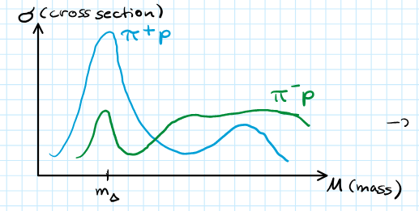
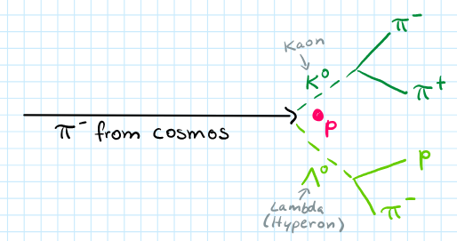
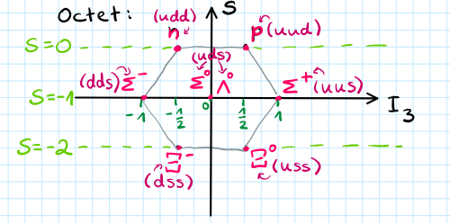
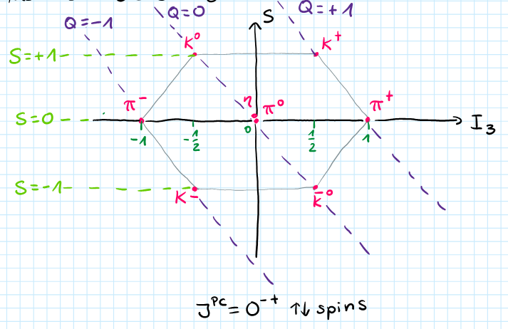
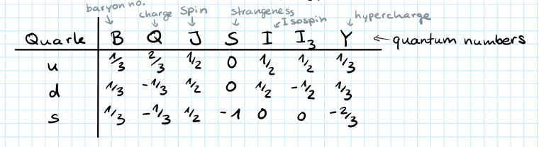
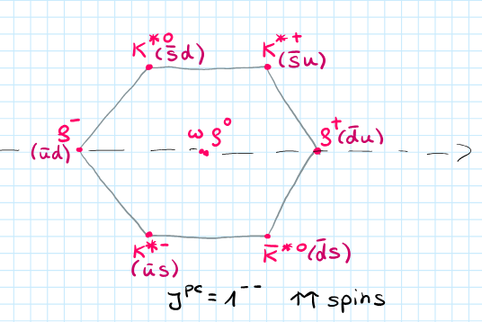

**Presenter**: 

**Note Taker**: 

## Isospin and Hadron Classification

Welcome everyone to today's lecture. It will be mostly about classification of hadrons. I will walk you a little bit through the history of how important discoveries were made and what we learned from there about the hadrons and how we can group them together.

In the 1950s and 1960s, there were a lot of new big accelerators built, like for example the Bevatron. It came into operation in 1954. It was a proton accelerator with energies of up to 13 GeV. These high energy protons were then shot at a fixed target, and a lot of different particles were produced and detected. They found over 100 new particles, which was then called the particle zoo. Physicists of the time had to think about how to organize these particles: is there some pattern? Are these all fundamental particles? This is what we will be talking about today.

If you think about the periodic table, for example, we had all these atoms and we were able to group them together according to their proton and neutron numbers. We knew how many electrons were in the outermost shells, which helped us to group them together in the periodic table. This is kind of what we want to do now with hadrons. In the context of particle physics or hadron physics, the characteristics that we choose to group them together are according to their quantum numbers. We will now discuss different quantum numbers and why they were introduced and how they helped us to group together certain particles.

### Isospin Introduction

Let's start with isospin. In 1932 the neutron was discovered, and different experiments showed that when we look into proton-proton interactions, proton-neutron interactions, or neutron-neutron interactions, they had a very similar interaction strength. If you look at the rate at which these interactions were taking place, then they were basically the same. Experiments showed that all of these had similar interaction strength. If you also look at the mass of the proton and neutron, it's almost the same at 939 MeV. This led to the suggestion that we can consider proton and neutron to be the same particle, but to have two different states that it can occur in, described by the isospin.

This means that the strong interaction does not distinguish between proton and neutron. The only time when we know that there are different particles is in an electromagnetic field. We can describe them as the same particle, the nucleon, and put them into an isospin doublet:

$$N = \begin{pmatrix} p \\ n \end{pmatrix}$$

This is an analog property like the spin: if you look at the electron, we can have either spin up or spin down. This is similar here. At the level of quarks, since protons and neutrons are composed of up and down quarks, this means that the strong interaction does not distinguish between up and down.

The strong interaction is not capable of distinguishing between the different flavors of down and up. We can write that the up quark has an isospin of $I = \frac{1}{2}$ with the third component $I_3(u) = +\frac{1}{2}$, and the down quark with $I_3(d) = -\frac{1}{2}$.

::: callout-important
The isospin quantum numbers for quarks are:

- Up quark: $I_3(u) = +\frac{1}{2}$
- Down quark: $I_3(d) = -\frac{1}{2}$
For antiquarks, the signs are reversed: $I_3(\bar{u}) = -\frac{1}{2}$ and $I_3(\bar{d}) = +\frac{1}{2}$ to maintain consistent SU(2) transformation properties.
:::
### Mathematical Framework of Isospin

Isospin is not exactly a property like the spin, but mathematically we can treat the isospin like the spin. It follows the SU(2) algebra. In the last lecture, you already heard a little bit about the SU(2) algebras. Let me remind you a couple of things. It holds for the matrices, and we can describe this as a rotation matrix. Here, these sigma matrices are just the Pauli matrices. For the isospin operator, it was the same as for the spin where you had $J$ instead of an $I$.

Generally we write these states always with the isospin and then the third component: $|I, I_3 \rangle$. If we apply, for example, the $I_3$ operator to up, then we just get the eigenvalue $+\frac{1}{2}$. We have here the lowering operators. If you have the isospin $I$, then we can have different projections $I_3$ from $I$ down to $-I$, so you have $2I + 1$ projections. With these lowering operators, you can go from one projection to the next. If you apply this to a state, you get out the Clebsch-Gordan coefficients.

This is just to remind you how this SU(2) algebra works.

::: callout-note
The SU(2) isospin algebra follows these key relations:

- Commutation relations: $[I_i, I_j] = i\epsilon_{ijk}I_k$
- Ladder operators: $I_\pm = I_1 \pm iI_2$
- Casimir operator: $I^2|I,I_3\rangle = I(I+1)|I,I_3\rangle$
:::
### Meson Isospin Combinations

Now let's look at a couple of examples. For example, if you want to think about the up and down quarks: last time you heard that we can form mesons taking a quark and an antiquark. Let's think about what kind of particles we can get if you combine up and down quarks with antiquarks for the mesons.

If you look here at the isospin, we have for both up and down quarks isospin $\frac{1}{2}$. We combine $\frac{1}{2}$ with another $\frac{1}{2}$. What can we get if we have two $\frac{1}{2}$ isospin particles? We can have isospin of 0 or 1, just like you're used to in the spin. If you think about the dimensions here, we always have two projections for one half: $+\frac{1}{2}$ or $-\frac{1}{2}$. This is the dimensions here: $2 \times 2$. To indicate that we have here an antiquark, I place this bar here on top.

If you have an isospin of 1, how many projections can we have for $I_3$? You can have $2I + 1$ projections. For $I = 1$, you get three: $+1, 0, -1$. For $I = 0$, just zero. If you take these as dimensions, then you would get $3 + 1$. This is how you would write it down according to group theory:

$$\mathbf{2} \otimes \mathbf{\bar{2}} = \mathbf{3} \oplus \mathbf{1}$$

I will also discuss a little bit later how we can understand this in terms of matrices. Here basically you have a $4 \times 4$ matrix and then you can decompose it into two components: into a $3 \times 3$ and a $1 \times 1$ matrix. 

{#fig-fg1}

 This is a triplet isospin state and this is an isospin singlet. This is how these different states would look like written down in terms of up and down quarks and form mesons.

Now I want to briefly discuss with you where these factors come from. Like in the case of spins, you can use Clebsch-Gordan coefficients if you combine two spins or two isospins to figure out what kind of signs and coefficients you have in front of them. I will just write down a small fraction of the Clebsch-Gordan coefficients. We are combining here either spin $\frac{1}{2}$ with $\frac{1}{2}$. These are the isospins of the two particles that we want to combine, and these are then the projections, the $I_3$ components.

I will write the one now on top. Here you can see the outcome: the new particles that you get out and below it you see the projection $I_3$ of this combination. We said we can have an isospin triplet with isospin 1, so we get here this one three times with the projection $+1, 0, -1$. We have here the singlet with zero and the projection zero. Then here we can see the Clebsch-Gordan coefficients, and you also have to always take the square root. If you now look here, you can then see why these states look the way they do.

::: callout-tip
The explicit wavefunctions for the pion triplet members are:

- $|\pi^+\rangle = -|u\bar{d}\rangle$
- $|\pi^0\rangle = \frac{1}{\sqrt{2}}(|u\bar{u}\rangle - |d\bar{d}\rangle)$
- $|\pi^-\rangle = |d\bar{u}\rangle$
These come from Clebsch-Gordan coefficients for combining isospin-1/2 states.
:::
Just one more thing that I need to mention is that for the antiquarks we get $I_3(\bar{u}) = -\frac{1}{2}$ and $I_3(\bar{d}) = +\frac{1}{2}$. This minus sign is chosen so the quarks and antiquarks behave in the same way when you apply SU(2) transformations. If you look here at the singlet, we get then from the up and anti-up we get this vector: we have these projections $+\frac{1}{2}, -\frac{1}{2}$, so we get this vector with the square root. You do the same for down anti-down: you have $-\frac{1}{2}, +\frac{1}{2}$, you get here this minus sign, but because there's also here this minus sign, it ends up being a plus. Then you do the same with the triplet one states. I just wanted to show you how it's done, because we also practice this a lot more in the exercises.

Now let's take a step forward. I also wanted to mention what kind of particles we have here. This triplet typically pions: this would be a $\pi^+$, this would be a $\pi^0$, and here $\pi^-$. We can also have rho particles: they're basically the same, but there's one thing that distinguishes these two, and that's their spin. Here we have antiparallel spin, spin zero, and here they have parallel spin, but otherwise they're the same. For the singlets we can have here an omega and here eta prime. Choosing this isospin quantum number, we can already group together some particles.

### Meson-Nucleon Systems and Baryons

Let's now go one step further and think about if you take for example a pion beam and shoot it on a proton target. We have a pion with isospin 1 and a nucleon target with isospin $\frac{1}{2}$. What kind of isospin states can you get out of this? If you combine isospin 1 and isospin $\frac{1}{2}$, you add this up. What do you guess? It's either $\frac{3}{2}$ or $\frac{1}{2}$.

Let me write this properly. What are the dimensions here? For $I = 1$, we know it's three: we have three different projections that are possible. For $I = \frac{1}{2}$, we have two projections. Here we get four because we have $\pm\frac{3}{2}$ and $\pm\frac{1}{2}$, and we get two again for $\frac{1}{2}$. This is how you write this theory:

$$\mathbf{3} \otimes \mathbf{2} = \mathbf{4} \oplus \mathbf{2}$$

I also wanted to mention what this actually means, what we're writing down. Basically we have here a $6 \times 6$ matrix and we can decompose it into matrices of the subspaces here: we have here a $2 \times 2$ matrix and here a $4 \times 4$ matrix. These are then called irreducible representations. This is basically what we do. For small numbers it's kind of easy to know and write it down, but if you have larger numbers, there are some methods how you can figure this out. We will not discuss it in more depth, but I just wanted to mention what this actually means.

If you have isospin in SU(2), you get these four projections. This can be actually assigned to particles that were found at the time: these are called delta particles. We have $\Delta^{++}, \Delta^+, \Delta^0, \Delta^-$. They also give you the mass $m_\Delta = 1232\text{ MeV}$.

I want to do one last example. Right now we have looked into meson systems and combining a meson and a nucleon system. What about if you just combine three quarks to get baryons? Then you would have basically $2 \times 2 \times 2$: three quarks, and there are always two projections possible for $\pm\frac{1}{2}$. We can now use what we have already seen here: $2 \times 2$ gives us $3 + 1$. (see @fig-fg1) This is what we had before: $\mathbf{2} \otimes \mathbf{2} \otimes \mathbf{2} = \mathbf{4} \oplus \mathbf{2} \oplus \mathbf{2}$. This gives us four, eight: $\frac{3}{2}$ and we have here two out of spin doublets with isospin $\frac{1}{2}$.
### Experimental Significance and Historical Context

What is this good for in isospin? You will later also see in the exercises that we can actually use this quantum number to see why certain cross sections that were measured are of different sizes. 

{#fig-fg2}

 If we take for example the cross section for $\pi^+ p$ and for $\pi^- p$, if you look here in the delta mass region, you see that there is a factor of three difference: $\frac{\sigma_{\pi^+p}}{\sigma_{\pi^-p}} \approx 3:1$. You can figure out in the exercises and classwork why there are differences in the cross sections between the different reactions.

I introduced this isospin concept for protons and neutrons. How was that in experiment? They also write like up and down quarks—that wasn't there. This concept in the 1950s: how should you imagine this? They saw like, oh, well, you produce pions and rho—was it also there? Yes, they also found rho later on. They introduced this concept to find symmetries or something. They were first just looking for patterns that they could find between different particles. This was like purely mathematical looking: just how can we group these together?

If you take the isospin, then we can already group some of these particles together. Like I said, we can group the pions or the rhos into triplets. We can have the delta in an isospin quadruplet and things like this. Then later bigger patterns were also seen. That's where this lecture is headed towards: we will look later next into the strangeness and then hypercharge and so on.

The reason why I'm asking is because if you look just at protons and neutrons, you might initially think, oh, you have spin and charge and that's all they do. Why would you introduce isospin? But it's only when you do these kinds of reactions: proton-proton, proton-neutron, and neutron-neutron, and if you see that the reaction rates are pretty much the same, then you can come to the conclusion: okay, maybe the strong interaction doesn't care about whether it's a proton or a neutron. That's where the isospin idea came from.

It comes down to once you start to look at cross sections, you start to see that certain reactions are stronger and you need to introduce new concepts in the theory. Here it was actually that they are pretty much similar. If you look at these different experiments and you see that the strong interaction does not seem to care about whether it's a proton or a neutron, on quark level it means then it doesn't care about up or down quark. That's why we also placed not just the proton and neutron into an isospin doublet, but also the up and down quarks.

## The Eightfold Way and Quark Model

So first, physicists had this kind of an isospin doublet. They found all these other particles like the pions and kaons and grouped them together, then looked for bigger patterns with also the strangeness included as the next quantum number.

Around the 1960s, with the Bevatron experiment and large accelerators accessible, they found over 100 particles and didn't know what to do with them. They later found out we can actually decompose them into smaller particles to understand how, and we are still trying to understand.

Some particles detected behaved in a strange manner. For example, in cosmic rays with pions going to a carbon target, they could see in a cloud chamber four tracks which look like a V: $\pi^+$, $\pi^-$, proton, and $\pi^-$. 

{#fig-fg3}

 These particles always appeared in pairs and had a fairly long lifetime.

They concluded by introducing a new quantum number **strangeness** and said that it needs to be conserved. Isospin is also a quantum number conserved in strong interactions.

How do we assign this quantum number? Particles consisting of up and down quarks have strangeness $S = 0$, for example pion, neutron, proton. Particles with strangeness $S = +1$ include lambda, and in general these are called hyperons. There are different types of hyperons like lambda, sigmas, cascades, and kaons.

With this we can form two isospin doublets with $K^+$ and $K^0$, and similarly $K^-$ and $\bar{K^0}$ in an isospin doublet with strangeness $S = -1$. They figured since these two come always in pairs that this quantum number needs to be conserved in strong interaction, but it is not conserved in weak interaction.

Looking at the lambda decay $\Lambda \to p + \pi^-$, both products don't have strangeness but this decay can happen. (see @fig-fg3) From the long lifetime this means weak decay. They are produced in strong interaction because we have $\pi + p \to p + K^+$ and $n \to$ hypercharge.

**Hypercharge** $Y$ is given by baryon number $B$ and strangeness number $S$: $Y = B + S$. For baryon number, if it's a baryon then it gets $B = +1$, if it's an antibaryon then $B = -1$, and if it's a meson then $B = 0$.

We can't have certain reactions. For example, if here we didn't have a lambda but a proton, then this would not happen. Same way here, if you have lambda then we can't have a $\pi$ in here. This always comes in pairs, so the strangeness number is conserved.

Also if you have $\pi^-$ in a proton beam, then you can't have suddenly in the end two mesons only. There needs to be a baryon as well, so the baryon number is conserved.

From isospin, we had the isospin triplet with projections $+1$, $0$, and $-1$ correlating to charge: $-1$ for $\pi^-$, $0$ for $\pi^0$, and $+1$ for $\pi^+$. There seems to be a relationship between isospin and charge.

This is what **Gell-Mann and Nishijima** calculation tells us: the charge can be expressed as the third component of the isospin plus the hypercharge divided by two: $Q = I_3 + \frac{Y}{2}$.

Let's check this formula:

- For proton, $I = \frac{1}{2}$ and $I_3 = +\frac{1}{2}$. Hypercharge: strangeness $S = 0$ for proton, but it's a baryon so $B = 1$, giving $Y = 1$. Using the relation, charge $Q = \frac{1}{2} + \frac{1}{2} = +1$, as expected.
- For neutron, $I_3 = -\frac{1}{2}$, $Y = 1$, giving $Q = -\frac{1}{2} + \frac{1}{2} = 0$.

::: callout-important
**Key Formulas:**

- **Gell-Mann–Nishijima Formula:** $Q = I_3 + \frac{Y}{2}$ relates electric charge to isospin and hypercharge
- **Hypercharge Definition:** $Y = B + S$ combines baryon number and strangeness
- **Conservation Laws:** $\sum B_{\text{initial}} = \sum B_{\text{final}}$ and $\sum S_{\text{initial}} = \sum S_{\text{final}}$ (strong interactions only)
:::
Using strangeness and/or hypercharge in combination with isospin, Gell-Mann and Ne'eman found a much larger pattern for these particles. They can be arranged in bigger multiplets, called the **eightfold way**.

For these larger patterns they looked not just at the up and down quark, but also included the strange quark. Now we are in the **SU(3) flavor symmetry**. At the time they didn't know these different quarks existed, but we are just going to look at it in this way. 

{#fig-fg4}

 

{#fig-fg6}

Plotting the third component of isospin against strangeness for the up, down, and strange quarks, let's write down the quantum numbers:

- For baryon number each gets $\frac{1}{3}$ because up, up, down gives total $1$
- Charge for up is $+\frac{2}{3}$, for down is $-\frac{1}{3}$
- They're all fermions with spin $\frac{1}{2}$
- Strangeness for strange quark is $-1$ 

{#fig-fg7}

Now looking at bigger patterns for baryons. Baryons are composed of three quarks from up, down, or strange: $\mathbf{3} \otimes \mathbf{3} \otimes \mathbf{3} = \mathbf{10} \oplus \mathbf{8} \oplus \mathbf{8} \oplus \mathbf{1}$. This gives a decuplet and octets. We look at ground state variants arranged into an octet and decuplet.

Plotting third component of isospin against strangeness (or hypercharge), we have $S = 0, -1, -2$. 

{#fig-fg8}

 On the horizontal axis are isospin multiplets: isospin doublet for neutron and proton, triplet for sigmas, doublet for cascades.

Pointing out positions: here is $I_3 = +\frac{1}{2}, -\frac{1}{2}$, here $I_3 = 0$, here $S = -1$. 

{#fig-fg5}

 You can see quark content: here all with one strange quark, here with two strange quarks.

Looking at masses:

- Proton and neutron masses are almost the same, difference about 1 MeV
- Similar for isospin partners
- But in vertical direction, mass difference is much larger: sigma mass difference about 250 MeV, here to here about 130 MeV

This tells us that isospin symmetry in SU(2) is a good symmetry, but including strange quark it's pretty much broken. It's only an approximate symmetry because otherwise we would have same masses for all.

Working out the pattern: upper row has data, down here only minus. On this axis highest third component, along this axis strangeness $0, -1, -2$.

All these particles have spin in common. Baryons in octet have spin $\frac{1}{2}$ and parity $+$. For decuplet, spin $\frac{3}{2}$ and parity $+$. Here spins can be aligned or permutations giving $\frac{1}{2}$, here all aligned.

When this pattern was found, the $\Omega^-$ was not yet discovered. This was a big success to predict its existence, found two years later in bubble chamber experiments with $K^- + p \to \Omega^- + K^+ + K^0$. For strangeness conservation, we need two more kaons.

$\Omega^-$ decays into cascade $\Xi^-$, then further to $\Lambda^0 + \pi^0$, $\pi^0 \to 2\gamma$, and $\Lambda \to p + \pi^-$. Not only predicted existence but roughly predicted mass: looking at masses between horizontal lines, $\Delta$ mass 1232 MeV, sigmas, then $\Omega^-$ mass around 1680 MeV, with mass spacing roughly 150 MeV.

All these considerations come from group theory, mathematical descriptions of particles with symmetry considerations. Difference between masses in octet and decuplet is that spin is different, so mass difference accounted to spin-spin or spin-orbit interactions from dynamics.
For mesons, with up, down, strange quarks, $\mathbf{3} \otimes \bar{\mathbf{3}} = \mathbf{8} \oplus \mathbf{1}$. On diagonal you have charge: here all charge $-1$, middle charge $0$, $+1$, $+2$. This octet or nonet including $\eta'$ has quantum numbers $0^-+$. (see @fig-fg8) 

{#fig-fg9}

This means quark-antiquark pair have anti-parallel spins, parity $-$. For spins aligned parallel, spin $1$, parity $-1$, charge conjugation $C$. Parity inverts spatial coordinates, charge conjugation converts particle to antiparticle.

For baryons, if you know orbital angular momentum $L$, parity $P = (-1)^L$. For octet ground states $L = 0$, parity $+$ for $\frac{1}{2}^+$ and $\frac{3}{2}^+$. For mesons, $P = (-1)^{L+1}$, giving $-$ for both. Charge conjugation well-defined for neutral mesons, e.g., $\pi^0$ has $C = +1$. (see @fig-fg3)

For decays, parity and C parity are multiplicative. Combining spins of different particles to get total spin. Example: can $\omega$ meson decay into two pions? For $\pi^0$, $C = +1$, multiplied gives $+1$, but for $\omega$, $C = -1$, so cannot happen.

Lastly, consider quark content for $\Omega^-$ or $\Delta^{++}$. All spins aligned, flavor content same. With Pauli exclusion principle for fermions, they should be distinguishable by one quantum number. Looking at total wave function: spatial, spin, and flavor.

For $L = 0$, spatial wave function symmetric. Spins all aligned up, symmetric. Flavor all same, symmetric. Physicists introduced new quantum number: **color charge**. This part of wave function must be antisymmetric to get total antisymmetric wave function. (see @fig-fg5) Assign each quark different color: red, green, blue. 

::: callout-note
**Parity Formulas:**

- **Baryons:** $P = (-1)^L$ (ground states have $L = 0$, $P = +$)
- **Mesons:** $P = (-1)^{L+1}$ (ground states have $L = 0$, $P = -$)
- **Multiplet Decompositions:**
  - Baryons: $\mathbf{3} \otimes \mathbf{3} \otimes \mathbf{3} = \mathbf{10} \oplus \mathbf{8} \oplus \mathbf{8} \oplus \mathbf{1}$
  - Mesons: $\mathbf{3} \otimes \bar{\mathbf{3}} = \mathbf{8} \oplus \mathbf{1}$
:::
Briefly discuss experiment showing three colors. Looked into $e^+ e^-$ annihilation with virtual photon exchanged, producing different particles: quark-antiquark pairs or leptons like $\mu^+ \mu^-$.

Measured ratio $R = \frac{\sigma(e^+ e^- \to \text{hadrons})}{\sigma(e^+ e^- \to \mu^+ \mu^-)}$. For leptons no color, so dividing gives proportionality to number of colors. Photon vertex proportional to charge squared, different quark types. (see @fig-fg4)

Initially up, down, strange quarks measured as peaks in spectrum (rho, omega, pi mesons). When energy high enough, produce charm-anticharm bound states (J/ψ), then B bar states. Calculated steps show number of colors should be three.

This was historical background on how from detected particles, patterns were seen using eightfold way strangeness, later forming quark model where particles consist of smaller quarks with six flavors and three colors.

## Unraveling Strange Particles and Quantum Numbers

Generally, what I always find difficult with histories like what is known versus what's not known relates back to my previous question about particle identification methods.

I should have perhaps asked this earlier when you introduced strangeness in the context of cosmic rays.

### Particle Identification Through Invariant Mass

The fundamental practical question is: how do you distinguish kaons from other particles using just invariant masses? (see @fig-fg3) (see @fig-fg10)

::: callout-note
**Invariant Mass Formula**:
$$M^2 = \left(\sum E_i\right)^2 - \left(\sum \vec{p}_i\right)^2$$
This relativistic invariant allows identification of particle resonances from decay products. (see @fig-fg2) When analyzing cosmic ray events with protons and pions, peaks in the invariant mass spectrum reveal new particles like kaons.
:::
You can only look at the invariant mass in these cases. You detect the proton and the pions, then examine the spectra to identify what's known versus unknown.

### Historical Discovery Timeline and Strange Particles

These particles were called "strange" because researchers were confused about why they only appeared in pairs and had longer lifetimes than other particles. (see @fig-fg3)

::: callout-important
**Strangeness Conservation**: $\Delta S = 0$
This quantum number explains why strange particles (like kaons) are always produced in pairs and have unexpectedly long lifetimes. Violation occurs only through weak interactions.
:::
The pions were discovered relatively quickly after fundamental particles:

- Protons were known early
- Neutrons discovered in 1932
- Later in the 1950s: antiprotons and many other particles emerged

Since many are charged, you can measure them directly.

### Conservation Laws and Quantum Numbers

You mentioned **C-parity** - how was that introduced? Was it used to say certain decays aren't allowed? (see @fig-fg10)

Actually, I think it worked the other way around: researchers observed that certain decays weren't measured, suggesting some quantum number must be violated.

::: callout-note
**Charge Conjugation (C-parity)**: $C|\psi\rangle = \eta_C|\psi\rangle$
C-parity describes how particles transform into their antiparticles under charge conjugation, providing selection rules for decays.
:::
I don't know exactly when charge conjugation was introduced, but it emerged when people started thinking systematically about particles and antiparticles - directly with the positron in the 1930s, before the antiproton discovery.

This highlights the difficulty: sometimes concepts come from theory, sometimes from experiments. It's interesting how the omega baryon was predicted, but also how quantum numbers were introduced based on cross-section measurements.
### Quark Model Development and Mass Patterns (see @fig-fg11)

Historically, the multiplets were mostly correct - I only added the quark content for clarity. When multiplets were assembled, researchers postulated there might be smaller substructure, initially called "partons" before becoming "quarks." (see @fig-fg2) (see @fig-fg10)

::: callout-important
**Quark Model Mass Relations**:
$$M(\Omega^-) - M(\Xi^*) \approx M(\Xi^*) - M(\Sigma^*) \approx M(\Sigma^*) - M(\Delta) \approx 150\text{ MeV}$$
The regular mass spacing in baryon multiplets provided crucial evidence for the quark model, suggesting these particles differ by replacing one quark with a heavier strange quark.
:::
The mass differences already indicated there should be different quark content in these particles - for the deltas, sigmas, cascades, and so on. Researchers observed these mass differences and reasoned that the last undetected particle would also have approximately 150 MeV more mass than the others, which turned out to be correct.

The original quark paper is remarkably brief - just two pages - so you can easily look up how they introduced the concept.

It was an exciting time: they predicted the omega-minus in the quark model, and it was experimentally detected and discovered in 1964.

::: callout-note
**Omega-Minus Discovery**: $K^- + p \to \Omega^- + K^+ + K^0$
This was the experimental reaction that discovered the $\Omega^-$ particle, confirming quark model predictions.
:::
